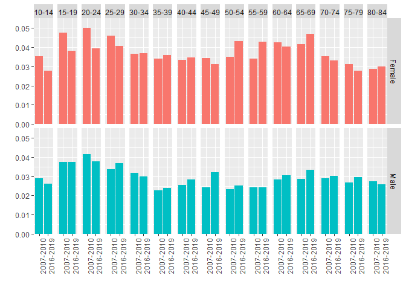

Dansih Distribution
================

<details>

<summary>Packages</summary>

<p>

``` r
want = c("emo",
         "dplyr",
         "ggplot2",
         "tidyr")

have = want %in% rownames(installed.packages())

# Install the packages that we miss
if ( any(!have) ) { install.packages( want[!have] ) }

# Load the packages
junk <- lapply(want, library, character.only = T)

# Remove the objects we created
rm(have, want, junk)
```

</details>

# Scenario Danish model by 2050

## The Danish cycling culture

In addition to the increase in total walking and cycling volumne, we
believe that the distribution of kilometres walked and biked among
population age classes will evolute as well. Scenarios of energy
transition anticipate an overall increase in total cycling volume, but
understanding how the total amount of kilometers is distributed among
the population is crucial as mortality reduction fluctutaes depending on
age and gender. Therefore, we decided to gradually change to current
French mileage distribution to reach the Danish one by 2050. The cyling
culture in Denmark is one of th best in the world. On average, Danes
cycle 1.6km per day,<sup>1</sup> which results to a volume of 42 minutes
a week (using an average cycling speed of 16km/h ). In the capital city
Copenhagen, it is almost as doubled as individuals cycle about 79 miutes
per week. The appealing aspect of using the Danish model as an objective
is its evolution over the past decades. Similarly to the exeptional
increase in bike usage that has started with the COVID-19 pandemic, the
cycling revolution in Denmark started with a global crisis with the
first oil shock in the 1970’s<sup>1</sup> Then with the help of
succesful public policies, the increae in bike usage among the Danes has
kept increasing over the years

## Total mileage distribution 🇩🇰

The data on mobility in Denmark were collected through the Danish
National Travel Survey (TU), and processed by Center for Transport
Analytics at the Technical University of Denmark.

Similarly to the French Tranportaion survey, the TU takes into account
trips purposed for leisure activity. We believe that those trips can
bias our results as the change in using bycicles for leisure is less
affected by public policies in comparion as cycling for commuting.
Combining all modes of transportation, lesisure activty accounts ofr 41%
of all 2018 mileage , and for cycling, it represents 36% of all trip
purposes.

We used the collection of the annual surveys from 2016 to 2019 to
increase the representativeness of the Danish population. The data is
presented below:

### Visualization

#### Cycling


#### Walking


### Evolution of the distribution

2007-2010 ⟶ 2016-2019

#### Cycling


#### Walking



# reference

<div id="refs" class="references">

<div id="ref-thecyclingembassyofdenmarkDanishCyclingCulture">

1\. The Cycling Embassy of Denmark. The Danish cycling culture | Read
why Danes bike everywhere.
<https://denmark.dk/people-and-culture/biking>.

</div>

</div>
