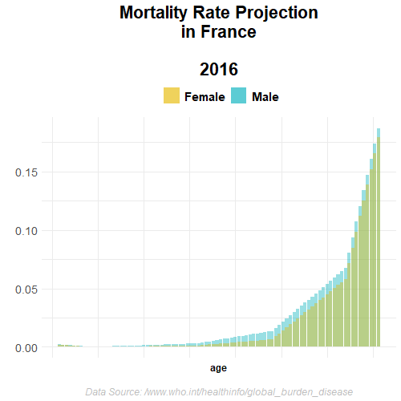

Mortality rate
================

<details>

<summary>Packages</summary>

<p>

``` r
want = c("dplyr",
         "stringr",
         "rmarkdown",
         "stats", 
         "tidyverse",
         "zoo", 
         "gganimate")

have = want %in% rownames(installed.packages())

# Install the packages that we miss
if ( any(!have) ) { install.packages( want[!have] ) }

# Load the packages
junk <- lapply(want, library, character.only = T)

# Remove the objects we created
rm(have, want, junk)
```

</details>

# Introduction

# Mortality

## Mortality rate projection

Regional projections of mortality for years 2016-2060.

(Source:
[WHO](https://www.who.int/healthinfo/global_burden_disease/projections/en/)
)

<details>

<summary>Codes</summary>

<p>

</details>

### Mortality rate projection for euro zone

<div data-pagedtable="false">

<script data-pagedtable-source type="application/json">
{"columns":[{"label":["sexe"],"name":[1],"type":["chr"],"align":["left"]},{"label":["age_grp"],"name":[2],"type":["chr"],"align":["left"]},{"label":["Y2016"],"name":[3],"type":["dbl"],"align":["right"]},{"label":["Y2030"],"name":[4],"type":["dbl"],"align":["right"]},{"label":["Y2045"],"name":[5],"type":["dbl"],"align":["right"]},{"label":["Y2060"],"name":[6],"type":["dbl"],"align":["right"]}],"data":[{"1":"Male","2":"00-04","3":"0.00205","4":"0.00127","5":"0.00087","6":"0.00065"},{"1":"Male","2":"05-14","3":"0.00020","4":"0.00016","5":"0.00013","6":"0.00012"},{"1":"Male","2":"15-29","3":"0.00103","4":"0.00079","5":"0.00074","6":"0.00067"},{"1":"Male","2":"30-49","3":"0.00315","4":"0.00266","5":"0.00203","6":"0.00188"},{"1":"Male","2":"50-69","3":"0.01368","4":"0.01076","5":"0.00902","6":"0.00714"},{"1":"Male","2":"80","3":"0.06716","4":"0.06051","5":"0.05864","6":"0.05645"},{"1":"Female","2":"00-04","3":"0.00174","4":"0.00108","5":"0.00075","6":"0.00057"},{"1":"Female","2":"05-14","3":"0.00015","4":"0.00012","5":"0.00010","6":"0.00009"},{"1":"Female","2":"15-29","3":"0.00042","4":"0.00034","5":"0.00030","6":"0.00027"},{"1":"Female","2":"30-49","3":"0.00131","4":"0.00118","5":"0.00092","6":"0.00084"},{"1":"Female","2":"50-69","3":"0.00643","4":"0.00588","5":"0.00514","6":"0.00440"},{"1":"Female","2":"80","3":"0.05791","4":"0.04796","5":"0.04965","6":"0.04833"},{"1":"Male","2":"150","3":"1.00000","4":"1.00000","5":"1.00000","6":"1.00000"},{"1":"Female","2":"150","3":"1.00000","4":"1.00000","5":"1.00000","6":"1.00000"}],"options":{"columns":{"min":{},"max":[10]},"rows":{"min":[10],"max":[10]},"pages":{}}}
  </script>

</div>

<details>

<summary>Codes</summary>

<p>

### Percentage change

</details>

<details>

<summary>Codes</summary>

<p>

``` r
animate(Mortality.rate.plot,
        fps = 24,
        duration = 30,
        width = 500,
        height = 500,
        renderer = gifski_renderer("Mortality.rate.plot.gif"))
```



</details>

# reference
