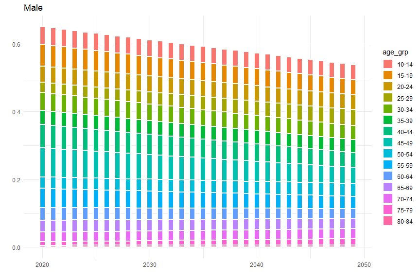
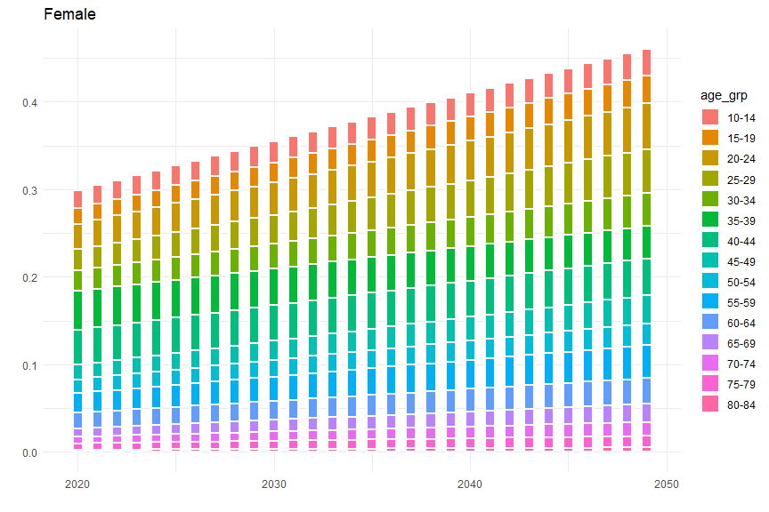

Scenario I: Danish Distribution by 2050
================

<details>

<summary>Packages</summary>

<p>

``` r
want = c("dplyr",
         "tidyr",
         "ggplot2",
         "kableExtra")

have = want %in% rownames(installed.packages())

# Install the packages that we miss
if ( any(!have) ) { install.packages( want[!have] ) }

# Load the packages
junk <- lapply(want, library, character.only = T)

# Remove the objects we created
rm(have, want, junk)
```

</details>

# Introduction

<details>

<summary>Codes</summary>

<p>

``` r
Dpl.data.active = readRDS("Dpl.data.active.rds")
Data.Denmark.distribution = readRDS("Data.Denmark.distribution.rds")
negaWatt.data = readRDS("negaWatt.data.rds")

Scenario.DenI = Dpl.data.active %>% 
  group_by(v2_mtp) %>%
  mutate(Sexe = ifelse(sexe == 1, "Male", "Female"),
         Type = ifelse(v2_mtp == 1.1, "Walking", "Total_Cycling"),
         Y.2008 = freq) %>% 
  select(age_grp,Sexe, Type, Y.2008) %>%
  merge(Data.Denmark.distribution,
        by.x = c("age_grp", "Type", "Sexe"),
        by.y = c("age_grp", "type", "Sexe"))%>%
  filter(Period == 2) %>%
  mutate(Y.2050 = freq) %>%
  select(!c(freq))%>%
 pivot_longer(cols = starts_with("Y"),
              names_to = "Year",
              values_to = "freq") %>%
  mutate(Year = gsub("Y.","", Year),
         Year = as.numeric(Year)) %>%
  select(age_grp, Type, Sexe, Year, freq) %>%
  group_by(age_grp, Sexe, Type) %>%
  slice(rep(1:n(), each = 42)) %>%
  mutate(id = row_number(),
         id = Year - 1 + id,
         id = ifelse(Year == 2050, 2050, id),
         freq = ifelse(Year != id, NA, freq),
         Year = id) %>%
  select(-id) %>%
  distinct() %>%
  filter(Year <= 2050) %>%
  mutate(Hypo = first(freq) + (last(freq) - first(freq))*( (Year - first(Year)) / (last(Year) - first(Year)) ))%>%
  merge(negaWatt.data, by = c("Year", "Type")) %>%
  mutate(Adjusted.distri = Hypo * value)
```

</details>

### Pojection

#### Walking

``` r
Scenario.DenI %>% 
  filter(Type == "Walking" & Year >= 2020 & Sexe == "Male") %>%
  group_by(age_grp, Year) %>%
  ggplot() + 
  geom_bar(aes(x = Year,
               y = Hypo,
               fill = age_grp),
           position="stack",
           stat="identity",
                  width = 0.5,
           lwd = 1,
           colour = "white") +
    labs(title = "Male") +
  xlab("") +
  ylab("") +
  theme_minimal()+
  theme(legend.position="right")
```


``` r
Scenario.DenI %>% 
  filter(Type == "Walking" & Year >= 2020 & Sexe == "Female") %>%
  group_by(age_grp, Year) %>%
  ggplot() + 
  geom_bar(aes(x = Year,
               y = Hypo,
               fill = age_grp),
           position="stack",
           stat="identity",
                  width = 0.5,
           lwd = 1,
           colour = "white") +
    labs(title = "Female") +
  xlab("") +
  ylab("") +
  theme_minimal()+
  theme(legend.position="right")
```


#### Cycling

``` r
Scenario.DenI %>% 
  filter(Type == "Total_Cycling" & Year >= 2020 & Sexe == "Male") %>%
  group_by(age_grp, Year) %>%
  ggplot() + 
  geom_bar(aes(x = Year,
               y = Hypo,
               fill = age_grp),
           position="stack",
           stat="identity",
                  width = 0.5,
           lwd = 1,
           colour = "white") +
    labs(title = "Male") +
  xlab("") +
  ylab("") +
  theme_minimal()+
  theme(legend.position="right")
```



``` r
Scenario.DenI %>% 
  filter(Type == "Total_Cycling" & Year >= 2020 & Sexe == "Female") %>%
  group_by(age_grp, Year) %>%
  ggplot() + 
  geom_bar(aes(x = Year,
               y = Hypo,
               fill = age_grp),
           position="stack",
           stat="identity",
                  width = 0.5,
           lwd = 1,
           colour = "white") +
    labs(title = "Female") +
  xlab("") +
  ylab("") +
  theme_minimal()+
  theme(legend.position="right")
```


\#\# HEAT

``` r
Pop.proj =  readRDS("Pop.proj.rds")

All.data.DenI = Pop.proj %>% 
  mutate(age_grp.FACTOR = cut( age, breaks = seq(0,150, by = 5), include.lowest = T, right = F),
         age_grp = as.character(age_grp.FACTOR), 
         age_grp = gsub("\\[|\\]|\\(|\\)", "", age_grp),
         age_grp = gsub(",", "-", age_grp),
         post = sub(".*-","",age_grp),
         age_grp = sub("-.*", "", age_grp),
         age_grp = paste0(age_grp,"-", as.numeric(post)-1),
         order = as.numeric(substr(age_grp,1,regexpr("-",age_grp)-1)))%>%
  merge(Scenario.DenI,
        by.x = c("sexe", "age_grp", "year"),
        by.y = c("Sexe", "age_grp", "Year")) %>% 
  group_by(sexe, age_grp, year, Mortality.rate, Type,Adjusted.distri ) %>% 
  summarise(Pop = sum(Pop))%>%
  select(sexe, age_grp, year, Mortality.rate, Pop, Type, Adjusted.distri)%>% 
  mutate(Type = ifelse(Type == "Total_Cycling", "cycling", "walking"),
         volume =  Adjusted.distri,
    HEAT =  HEAT_country(type = Type,
             volume = volume,
             Population = Pop,
             Mortality_Rate = Mortality.rate))
```

    ## [1] 0
    ## [1] 0
    ## [1] 0
    ## [1] 0
    ## [1] 0
    ## [1] 0
    ## [1] 0
    ## [1] 0
    ## [1] 0
    ## [1] 0
    ## [1] 0
    ## [1] 0
    ## [1] 0
    ## [1] 0
    ## [1] 0
    ## [1] 0
    ## [1] 0
    ## [1] 0
    ## [1] 0
    ## [1] 0
    ## [1] 0
    ## [1] 0
    ## [1] 0
    ## [1] 0
    ## [1] 0
    ## [1] 0
    ## [1] 0
    ## [1] 0
    ## [1] 0
    ## [1] 0
    ## [1] 0
    ## [1] 0
    ## [1] 0
    ## [1] 0
    ## [1] 0
    ## [1] 0
    ## [1] 0
    ## [1] 0
    ## [1] 0
    ## [1] 0
    ## [1] 0
    ## [1] 0
    ## [1] 0
    ## [1] 0
    ## [1] 0
    ## [1] 0
    ## [1] 0
    ## [1] 0
    ## [1] 0
    ## [1] 0
    ## [1] 0
    ## [1] 0
    ## [1] 0
    ## [1] 0
    ## [1] 0
    ## [1] 0
    ## [1] 0
    ## [1] 0
    ## [1] 0
    ## [1] 0
    ## [1] 0
    ## [1] 0
    ## [1] 0
    ## [1] 0
    ## [1] 0
    ## [1] 0
    ## [1] 0
    ## [1] 0
    ## [1] 0
    ## [1] 0
    ## [1] 0
    ## [1] 0
    ## [1] 0
    ## [1] 0
    ## [1] 0
    ## [1] 0
    ## [1] 0
    ## [1] 0
    ## [1] 0
    ## [1] 0
    ## [1] 0
    ## [1] 0
    ## [1] 0
    ## [1] 0
    ## [1] 0
    ## [1] 0
    ## [1] 0
    ## [1] 0
    ## [1] 0
    ## [1] 0
    ## [1] 0
    ## [1] 0
    ## [1] 0
    ## [1] 0
    ## [1] 0
    ## [1] 0
    ## [1] 0
    ## [1] 0
    ## [1] 0
    ## [1] 0
    ## [1] 0
    ## [1] 0
    ## [1] 0
    ## [1] 0
    ## [1] 0
    ## [1] 0
    ## [1] 0
    ## [1] 0
    ## [1] 0
    ## [1] 0
    ## [1] 0
    ## [1] 0
    ## [1] 0
    ## [1] 0
    ## [1] 0
    ## [1] 0
    ## [1] 0
    ## [1] 0
    ## [1] 0
    ## [1] 0
    ## [1] 0
    ## [1] 0
    ## [1] 0
    ## [1] 0
    ## [1] 0
    ## [1] 0
    ## [1] 0
    ## [1] 0
    ## [1] 0
    ## [1] 0
    ## [1] 0
    ## [1] 0
    ## [1] 0
    ## [1] 0
    ## [1] 0
    ## [1] 0
    ## [1] 0
    ## [1] 0
    ## [1] 0
    ## [1] 0
    ## [1] 0
    ## [1] 0
    ## [1] 0
    ## [1] 0
    ## [1] 0
    ## [1] 0
    ## [1] 0
    ## [1] 0
    ## [1] 0
    ## [1] 0
    ## [1] 0
    ## [1] 0
    ## [1] 0
    ## [1] 0
    ## [1] 0
    ## [1] 0
    ## [1] 0
    ## [1] 0
    ## [1] 0
    ## [1] 0
    ## [1] 0
    ## [1] 0
    ## [1] 0
    ## [1] 0
    ## [1] 0
    ## [1] 0
    ## [1] 0
    ## [1] 0
    ## [1] 0
    ## [1] 0
    ## [1] 0
    ## [1] 0
    ## [1] 0
    ## [1] 0
    ## [1] 0
    ## [1] 0
    ## [1] 0
    ## [1] 0
    ## [1] 0
    ## [1] 0
    ## [1] 0
    ## [1] 0
    ## [1] 0
    ## [1] 0
    ## [1] 0
    ## [1] 0
    ## [1] 0
    ## [1] 0
    ## [1] 0
    ## [1] 0
    ## [1] 0
    ## [1] 0
    ## [1] 0
    ## [1] 0
    ## [1] 0
    ## [1] 0
    ## [1] 0
    ## [1] 0
    ## [1] 0
    ## [1] 0
    ## [1] 0
    ## [1] 0
    ## [1] 0
    ## [1] 0
    ## [1] 0
    ## [1] 0
    ## [1] 0
    ## [1] 0
    ## [1] 0
    ## [1] 0
    ## [1] 0
    ## [1] 0
    ## [1] 0
    ## [1] 0
    ## [1] 0
    ## [1] 0
    ## [1] 0
    ## [1] 0
    ## [1] 0
    ## [1] 0
    ## [1] 0
    ## [1] 0
    ## [1] 0
    ## [1] 0
    ## [1] 0
    ## [1] 0
    ## [1] 0
    ## [1] 0
    ## [1] 0
    ## [1] 0
    ## [1] 0
    ## [1] 0
    ## [1] 0
    ## [1] 0
    ## [1] 0
    ## [1] 0
    ## [1] 0
    ## [1] 0
    ## [1] 0
    ## [1] 0
    ## [1] 0
    ## [1] 0
    ## [1] 0
    ## [1] 0
    ## [1] 0
    ## [1] 0
    ## [1] 0
    ## [1] 0
    ## [1] 0
    ## [1] 0
    ## [1] 0
    ## [1] 0
    ## [1] 0
    ## [1] 0
    ## [1] 0
    ## [1] 0
    ## [1] 0
    ## [1] 0
    ## [1] 0
    ## [1] 0
    ## [1] 0
    ## [1] 0
    ## [1] 0
    ## [1] 0
    ## [1] 0
    ## [1] 0
    ## [1] 0
    ## [1] 0
    ## [1] 0
    ## [1] 0
    ## [1] 0
    ## [1] 0
    ## [1] 0
    ## [1] 0
    ## [1] 0
    ## [1] 0
    ## [1] 0
    ## [1] 0
    ## [1] 0
    ## [1] 0
    ## [1] 0
    ## [1] 0
    ## [1] 0
    ## [1] 0
    ## [1] 0
    ## [1] 0
    ## [1] 0
    ## [1] 0
    ## [1] 0
    ## [1] 0
    ## [1] 0
    ## [1] 0
    ## [1] 0
    ## [1] 0
    ## [1] 0
    ## [1] 0
    ## [1] 0
    ## [1] 0
    ## [1] 0
    ## [1] 0
    ## [1] 0
    ## [1] 0
    ## [1] 0
    ## [1] 0
    ## [1] 0
    ## [1] 0
    ## [1] 0
    ## [1] 0
    ## [1] 0
    ## [1] 0
    ## [1] 0
    ## [1] 0
    ## [1] 0
    ## [1] 0
    ## [1] 0
    ## [1] 0
    ## [1] 0
    ## [1] 0
    ## [1] 0
    ## [1] 0
    ## [1] 0
    ## [1] 0
    ## [1] 0
    ## [1] 0
    ## [1] 0
    ## [1] 0
    ## [1] 0
    ## [1] 0
    ## [1] 0
    ## [1] 0
    ## [1] 0
    ## [1] 0
    ## [1] 0
    ## [1] 0
    ## [1] 0
    ## [1] 0
    ## [1] 0
    ## [1] 0
    ## [1] 0
    ## [1] 0
    ## [1] 0
    ## [1] 0
    ## [1] 0
    ## [1] 0
    ## [1] 0
    ## [1] 0
    ## [1] 0
    ## [1] 0
    ## [1] 0
    ## [1] 0
    ## [1] 0
    ## [1] 0
    ## [1] 0
    ## [1] 0
    ## [1] 0
    ## [1] -1
    ## [1] 0
    ## [1] -1
    ## [1] 0
    ## [1] -1
    ## [1] 0
    ## [1] 0
    ## [1] 0
    ## [1] 0
    ## [1] 0
    ## [1] -1
    ## [1] 0
    ## [1] -1
    ## [1] 0
    ## [1] -1
    ## [1] 0
    ## [1] 0
    ## [1] 0
    ## [1] 0
    ## [1] 0
    ## [1] -1
    ## [1] 0
    ## [1] -1
    ## [1] 0
    ## [1] -1
    ## [1] 0
    ## [1] 0
    ## [1] 0
    ## [1] 0
    ## [1] 0
    ## [1] -1
    ## [1] 0
    ## [1] -1
    ## [1] 0
    ## [1] -1
    ## [1] 0
    ## [1] 0
    ## [1] 0
    ## [1] 0
    ## [1] 0
    ## [1] -1
    ## [1] 0
    ## [1] -1
    ## [1] 0
    ## [1] -1
    ## [1] 0
    ## [1] 0
    ## [1] 0
    ## [1] 0
    ## [1] 0
    ## [1] -1
    ## [1] 0
    ## [1] -1
    ## [1] 0
    ## [1] -1
    ## [1] 0
    ## [1] 0
    ## [1] 0
    ## [1] 0
    ## [1] 0
    ## [1] -1
    ## [1] 0
    ## [1] -1
    ## [1] 0
    ## [1] -1
    ## [1] 0
    ## [1] 0
    ## [1] 0
    ## [1] 0
    ## [1] 0
    ## [1] -1
    ## [1] 0
    ## [1] -1
    ## [1] 0
    ## [1] -1
    ## [1] 0
    ## [1] 0
    ## [1] 0
    ## [1] 0
    ## [1] 0
    ## [1] -1
    ## [1] 0
    ## [1] -1
    ## [1] 0
    ## [1] -1
    ## [1] 0
    ## [1] 0
    ## [1] 0
    ## [1] 0
    ## [1] 0
    ## [1] -1
    ## [1] 0
    ## [1] -1
    ## [1] 0
    ## [1] -1
    ## [1] 0
    ## [1] 0
    ## [1] 0
    ## [1] 0
    ## [1] 0
    ## [1] -1
    ## [1] 0
    ## [1] -1
    ## [1] -1
    ## [1] -1
    ## [1] 0
    ## [1] 0
    ## [1] 0
    ## [1] 0
    ## [1] 0
    ## [1] 0
    ## [1] -1
    ## [1] -1
    ## [1] -1
    ## [1] -1
    ## [1] 0
    ## [1] 0
    ## [1] 0
    ## [1] 0
    ## [1] -1
    ## [1] 0
    ## [1] -1
    ## [1] -1
    ## [1] -1
    ## [1] -1
    ## [1] 0
    ## [1] 0
    ## [1] 0
    ## [1] 0
    ## [1] -1
    ## [1] 0
    ## [1] -1
    ## [1] -1
    ## [1] -1
    ## [1] -1
    ## [1] 0
    ## [1] 0
    ## [1] 0
    ## [1] 0
    ## [1] -1
    ## [1] 0
    ## [1] -1
    ## [1] -1
    ## [1] -1
    ## [1] -1
    ## [1] 0
    ## [1] 0
    ## [1] 0
    ## [1] 0
    ## [1] -1
    ## [1] 0
    ## [1] -1
    ## [1] -1
    ## [1] -1
    ## [1] -1
    ## [1] 0
    ## [1] 0
    ## [1] 0
    ## [1] 0
    ## [1] -1
    ## [1] 0
    ## [1] -1
    ## [1] 0
    ## [1] -1
    ## [1] -1
    ## [1] 0
    ## [1] 0
    ## [1] -1
    ## [1] 0
    ## [1] -1
    ## [1] 0
    ## [1] -1
    ## [1] 0
    ## [1] -1
    ## [1] -1
    ## [1] 0
    ## [1] 0
    ## [1] -1
    ## [1] 0
    ## [1] -1
    ## [1] 0
    ## [1] -1
    ## [1] 0
    ## [1] -1
    ## [1] -1
    ## [1] 0
    ## [1] 0
    ## [1] -1
    ## [1] 0
    ## [1] -1
    ## [1] 0
    ## [1] -1
    ## [1] 0
    ## [1] -1
    ## [1] -1
    ## [1] 0
    ## [1] 0
    ## [1] -1
    ## [1] 0
    ## [1] -1
    ## [1] 0
    ## [1] -1
    ## [1] 0
    ## [1] -1
    ## [1] -1
    ## [1] 0
    ## [1] 0
    ## [1] -1
    ## [1] 0
    ## [1] -1
    ## [1] 0
    ## [1] -1
    ## [1] 0
    ## [1] -1
    ## [1] -1
    ## [1] 0
    ## [1] 0
    ## [1] -1
    ## [1] 0
    ## [1] -1
    ## [1] 0
    ## [1] -1
    ## [1] 0
    ## [1] -1
    ## [1] 0
    ## [1] -1
    ## [1] 0
    ## [1] -1
    ## [1] 0
    ## [1] -1
    ## [1] 0
    ## [1] -1
    ## [1] 0
    ## [1] -1
    ## [1] 0
    ## [1] -1
    ## [1] 0
    ## [1] -1
    ## [1] 0
    ## [1] -1
    ## [1] 0
    ## [1] -1
    ## [1] 0
    ## [1] -1
    ## [1] 0
    ## [1] -1
    ## [1] 0
    ## [1] -1
    ## [1] 0
    ## [1] -1
    ## [1] 0
    ## [1] -1
    ## [1] 0
    ## [1] -1
    ## [1] 0
    ## [1] -1
    ## [1] 0
    ## [1] -1
    ## [1] 0
    ## [1] -1
    ## [1] 0
    ## [1] -1
    ## [1] 0
    ## [1] -1
    ## [1] 0
    ## [1] -1
    ## [1] 0
    ## [1] -1
    ## [1] 0
    ## [1] -1
    ## [1] 0
    ## [1] -1
    ## [1] 0
    ## [1] -1
    ## [1] 0
    ## [1] -1
    ## [1] 0
    ## [1] -1
    ## [1] 0
    ## [1] -1
    ## [1] 0
    ## [1] -1
    ## [1] 0
    ## [1] -1
    ## [1] 0
    ## [1] -1
    ## [1] 0
    ## [1] -1
    ## [1] 0
    ## [1] -1
    ## [1] 0
    ## [1] -1
    ## [1] 0
    ## [1] -1
    ## [1] 0
    ## [1] -1
    ## [1] 0
    ## [1] -1
    ## [1] 0
    ## [1] -1
    ## [1] 0
    ## [1] -1
    ## [1] 0
    ## [1] -1
    ## [1] 0
    ## [1] -1
    ## [1] 0
    ## [1] -1
    ## [1] 0
    ## [1] -1
    ## [1] 0
    ## [1] -1
    ## [1] 0
    ## [1] -1
    ## [1] 0
    ## [1] -1
    ## [1] 0
    ## [1] -1
    ## [1] 0
    ## [1] -1
    ## [1] 0
    ## [1] -1
    ## [1] 0
    ## [1] -1
    ## [1] 0
    ## [1] -1
    ## [1] 0
    ## [1] -1
    ## [1] 0
    ## [1] -1
    ## [1] 0
    ## [1] -1
    ## [1] 0
    ## [1] -1
    ## [1] 0
    ## [1] -1
    ## [1] 0
    ## [1] -1
    ## [1] 0
    ## [1] -1
    ## [1] 0
    ## [1] -1
    ## [1] 0
    ## [1] -1
    ## [1] 0
    ## [1] 0
    ## [1] -1
    ## [1] 0
    ## [1] -1
    ## [1] 0
    ## [1] -1
    ## [1] 0
    ## [1] -1
    ## [1] 0
    ## [1] -1
    ## [1] 0
    ## [1] -1
    ## [1] 0
    ## [1] -1
    ## [1] 0
    ## [1] -1
    ## [1] 0
    ## [1] -1
    ## [1] 0
    ## [1] -1
    ## [1] 0
    ## [1] -1
    ## [1] 0
    ## [1] -1
    ## [1] 0
    ## [1] -1
    ## [1] 0
    ## [1] -1
    ## [1] 0
    ## [1] -1
    ## [1] 0
    ## [1] -1
    ## [1] 0
    ## [1] -1
    ## [1] 0
    ## [1] -1
    ## [1] 0
    ## [1] -1
    ## [1] 0
    ## [1] -1
    ## [1] 0
    ## [1] -1
    ## [1] 0
    ## [1] -1
    ## [1] 0
    ## [1] -1
    ## [1] 0
    ## [1] -1
    ## [1] 0
    ## [1] -1
    ## [1] 0
    ## [1] -1
    ## [1] 0
    ## [1] -1
    ## [1] 0
    ## [1] -1
    ## [1] 0
    ## [1] -1
    ## [1] 0
    ## [1] -1
    ## [1] 0
    ## [1] -1
    ## [1] 0
    ## [1] -1
    ## [1] 0
    ## [1] -1
    ## [1] 0
    ## [1] -1
    ## [1] 0
    ## [1] -1
    ## [1] -1
    ## [1] -1
    ## [1] -1
    ## [1] -1
    ## [1] -1
    ## [1] -1
    ## [1] -1
    ## [1] -1
    ## [1] -1
    ## [1] -1
    ## [1] -1
    ## [1] -1
    ## [1] -1
    ## [1] -1
    ## [1] -1
    ## [1] -1
    ## [1] -1
    ## [1] -1
    ## [1] -1
    ## [1] -1
    ## [1] -1
    ## [1] -1
    ## [1] -1
    ## [1] -1
    ## [1] -1
    ## [1] -1
    ## [1] -1
    ## [1] -1
    ## [1] -1
    ## [1] -1
    ## [1] -1
    ## [1] -1
    ## [1] -1
    ## [1] -1
    ## [1] -1
    ## [1] -1
    ## [1] -1
    ## [1] -1
    ## [1] -1
    ## [1] -1
    ## [1] -1
    ## [1] -1
    ## [1] -1
    ## [1] -1
    ## [1] -1
    ## [1] -1
    ## [1] -1
    ## [1] -1
    ## [1] -1
    ## [1] -1
    ## [1] -1
    ## [1] -1
    ## [1] -1
    ## [1] -1
    ## [1] -1
    ## [1] -1
    ## [1] -1
    ## [1] -1
    ## [1] -1
    ## [1] -1
    ## [1] -1
    ## [1] -1
    ## [1] -1
    ## [1] -1
    ## [1] -1
    ## [1] -1
    ## [1] -1
    ## [1] -1
    ## [1] -1
    ## [1] -1
    ## [1] -1
    ## [1] -1
    ## [1] -1
    ## [1] -1
    ## [1] -1
    ## [1] -1
    ## [1] -1
    ## [1] -1
    ## [1] -1
    ## [1] -1
    ## [1] -1
    ## [1] -1
    ## [1] -1
    ## [1] -1
    ## [1] -1
    ## [1] -1
    ## [1] -1
    ## [1] -1
    ## [1] -1
    ## [1] -1
    ## [1] -2
    ## [1] -1
    ## [1] -1
    ## [1] -1
    ## [1] -1
    ## [1] -1
    ## [1] -2
    ## [1] -1
    ## [1] -2
    ## [1] -1
    ## [1] -2
    ## [1] -1
    ## [1] -2
    ## [1] -1
    ## [1] -2
    ## [1] -1
    ## [1] -2
    ## [1] -1
    ## [1] -2
    ## [1] -1
    ## [1] -2
    ## [1] -1
    ## [1] -2
    ## [1] -1
    ## [1] -2
    ## [1] -1
    ## [1] -2
    ## [1] -1
    ## [1] -2
    ## [1] -1
    ## [1] -2
    ## [1] -1
    ## [1] -2
    ## [1] -1
    ## [1] -2
    ## [1] -1
    ## [1] -2
    ## [1] -1
    ## [1] -2
    ## [1] -1
    ## [1] -2
    ## [1] -1
    ## [1] -2
    ## [1] -1
    ## [1] -2
    ## [1] -1
    ## [1] -2
    ## [1] -1
    ## [1] -2
    ## [1] -1
    ## [1] -2
    ## [1] -1
    ## [1] -2
    ## [1] -1
    ## [1] -2
    ## [1] -1
    ## [1] -2
    ## [1] -1
    ## [1] -2
    ## [1] -1
    ## [1] -2
    ## [1] -1
    ## [1] -2
    ## [1] -1
    ## [1] -2
    ## [1] -1
    ## [1] -2
    ## [1] -1
    ## [1] -2
    ## [1] -1
    ## [1] -2
    ## [1] 0
    ## [1] -2
    ## [1] 0
    ## [1] -2
    ## [1] -1
    ## [1] -2
    ## [1] -1
    ## [1] -2
    ## [1] -1
    ## [1] -2
    ## [1] 0
    ## [1] -2
    ## [1] 0
    ## [1] -2
    ## [1] 0
    ## [1] -2
    ## [1] 0
    ## [1] -2
    ## [1] 0
    ## [1] -2
    ## [1] 0
    ## [1] -2
    ## [1] 0
    ## [1] -2
    ## [1] 0
    ## [1] -2
    ## [1] 0
    ## [1] -2
    ## [1] 0
    ## [1] -2
    ## [1] 0
    ## [1] -2
    ## [1] 0
    ## [1] -2
    ## [1] 0
    ## [1] -2
    ## [1] 0
    ## [1] -2
    ## [1] 0
    ## [1] -2
    ## [1] 0
    ## [1] -2
    ## [1] 0
    ## [1] -2
    ## [1] 0
    ## [1] -2
    ## [1] 0
    ## [1] -2
    ## [1] 0
    ## [1] -2
    ## [1] 0
    ## [1] -2
    ## [1] 0
    ## [1] -2
    ## [1] 0
    ## [1] -2
    ## [1] 0
    ## [1] -2
    ## [1] 0
    ## [1] -2
    ## [1] 0
    ## [1] -2
    ## [1] 0
    ## [1] -2
    ## [1] 0
    ## [1] -2
    ## [1] 0
    ## [1] -2
    ## [1] 0
    ## [1] -2
    ## [1] 0
    ## [1] -2
    ## [1] 0
    ## [1] -2
    ## [1] 0
    ## [1] -2
    ## [1] 0
    ## [1] -2
    ## [1] 0
    ## [1] -2
    ## [1] 0
    ## [1] -2
    ## [1] 0
    ## [1] -2
    ## [1] 0
    ## [1] -2
    ## [1] 0
    ## [1] -2
    ## [1] 0
    ## [1] -2
    ## [1] 0
    ## [1] -2
    ## [1] 0
    ## [1] -2
    ## [1] 0
    ## [1] -2
    ## [1] 0
    ## [1] -2
    ## [1] 0
    ## [1] -2
    ## [1] 0
    ## [1] -2
    ## [1] 0
    ## [1] -2
    ## [1] 0
    ## [1] -2
    ## [1] 0
    ## [1] -2
    ## [1] 0
    ## [1] -2
    ## [1] 0
    ## [1] -2
    ## [1] 0
    ## [1] -2
    ## [1] 0
    ## [1] -2
    ## [1] 0
    ## [1] -2
    ## [1] 0
    ## [1] 0
    ## [1] -1
    ## [1] 0
    ## [1] -1
    ## [1] 0
    ## [1] -1
    ## [1] 0
    ## [1] -1
    ## [1] 0
    ## [1] -1
    ## [1] 0
    ## [1] -1
    ## [1] 0
    ## [1] -1
    ## [1] 0
    ## [1] -1
    ## [1] 0
    ## [1] -1
    ## [1] 0
    ## [1] -1
    ## [1] 0
    ## [1] -1
    ## [1] 0
    ## [1] -1
    ## [1] 0
    ## [1] -1
    ## [1] 0
    ## [1] -1
    ## [1] 0
    ## [1] -1
    ## [1] 0
    ## [1] -1
    ## [1] 0
    ## [1] -1
    ## [1] 0
    ## [1] -1
    ## [1] 0
    ## [1] -1
    ## [1] 0
    ## [1] -1
    ## [1] 0
    ## [1] -1
    ## [1] 0
    ## [1] -1
    ## [1] 0
    ## [1] -1
    ## [1] 0
    ## [1] -1
    ## [1] 0
    ## [1] -1
    ## [1] 0
    ## [1] -1
    ## [1] 0
    ## [1] -1
    ## [1] 0
    ## [1] -1
    ## [1] 0
    ## [1] -1
    ## [1] 0
    ## [1] -1
    ## [1] 0
    ## [1] -1
    ## [1] 0
    ## [1] -1
    ## [1] 0
    ## [1] -1
    ## [1] 0
    ## [1] -1
    ## [1] 0
    ## [1] -1
    ## [1] 0
    ## [1] -1
    ## [1] 0
    ## [1] -1
    ## [1] 0
    ## [1] -1
    ## [1] 0
    ## [1] -1
    ## [1] 0
    ## [1] -1
    ## [1] -1
    ## [1] -1
    ## [1] -1
    ## [1] -1
    ## [1] -1
    ## [1] -1
    ## [1] -1
    ## [1] -1
    ## [1] -1
    ## [1] -1
    ## [1] -1
    ## [1] -1
    ## [1] -1
    ## [1] -1
    ## [1] -1
    ## [1] -1
    ## [1] -1
    ## [1] -1
    ## [1] -1
    ## [1] -1
    ## [1] -1
    ## [1] -1
    ## [1] -1
    ## [1] -1
    ## [1] -1
    ## [1] -1
    ## [1] -1
    ## [1] -1
    ## [1] -1
    ## [1] -1
    ## [1] -1
    ## [1] -1
    ## [1] -1
    ## [1] -1
    ## [1] -1
    ## [1] -1
    ## [1] -1
    ## [1] -1
    ## [1] -1
    ## [1] -1
    ## [1] -1
    ## [1] -1
    ## [1] -1
    ## [1] -1
    ## [1] -1
    ## [1] -1
    ## [1] -1
    ## [1] -1
    ## [1] -1
    ## [1] -1
    ## [1] -1
    ## [1] -1
    ## [1] -1
    ## [1] -1
    ## [1] -1
    ## [1] -1
    ## [1] -1
    ## [1] -1
    ## [1] -1
    ## [1] -1
    ## [1] -1
    ## [1] -1
    ## [1] -1
    ## [1] -1
    ## [1] -1
    ## [1] -1
    ## [1] -1
    ## [1] -1
    ## [1] -1
    ## [1] -1
    ## [1] -1
    ## [1] -1
    ## [1] -1
    ## [1] -1
    ## [1] -1
    ## [1] -1
    ## [1] -1
    ## [1] -1
    ## [1] -2
    ## [1] -1
    ## [1] -1
    ## [1] -1
    ## [1] -1
    ## [1] -1
    ## [1] -1
    ## [1] -1
    ## [1] -2
    ## [1] -1
    ## [1] -2
    ## [1] -1
    ## [1] -2
    ## [1] -1
    ## [1] -1
    ## [1] -1
    ## [1] -2
    ## [1] -1
    ## [1] -2
    ## [1] -1
    ## [1] -2
    ## [1] -1
    ## [1] -2
    ## [1] -1
    ## [1] -2
    ## [1] -1
    ## [1] -2
    ## [1] -1
    ## [1] -2
    ## [1] -1
    ## [1] -2
    ## [1] -1
    ## [1] -2
    ## [1] -1
    ## [1] -2
    ## [1] -1
    ## [1] -2
    ## [1] -1
    ## [1] -2
    ## [1] -1
    ## [1] -2
    ## [1] -1
    ## [1] -2
    ## [1] -1
    ## [1] -2
    ## [1] -1
    ## [1] -2
    ## [1] -1
    ## [1] -2
    ## [1] -1
    ## [1] -2
    ## [1] -1
    ## [1] -2
    ## [1] -1
    ## [1] -2
    ## [1] -1
    ## [1] -2
    ## [1] -1
    ## [1] -2
    ## [1] -1
    ## [1] -2
    ## [1] -1
    ## [1] -2
    ## [1] -1
    ## [1] -2
    ## [1] -1
    ## [1] -2
    ## [1] -1
    ## [1] -2
    ## [1] -1
    ## [1] -2
    ## [1] -1
    ## [1] -2
    ## [1] -1
    ## [1] -2
    ## [1] -1
    ## [1] -2
    ## [1] -1
    ## [1] -2
    ## [1] -1
    ## [1] -2
    ## [1] -1
    ## [1] -2
    ## [1] -1
    ## [1] -2
    ## [1] -1
    ## [1] -2
    ## [1] -1
    ## [1] -2
    ## [1] -1
    ## [1] -2
    ## [1] -1
    ## [1] -2
    ## [1] -1
    ## [1] -2
    ## [1] -1
    ## [1] -2
    ## [1] -1
    ## [1] -2
    ## [1] -1
    ## [1] -3
    ## [1] -1
    ## [1] -2
    ## [1] 0
    ## [1] -2
    ## [1] -1
    ## [1] -2
    ## [1] -1
    ## [1] -2
    ## [1] -1
    ## [1] -3
    ## [1] -1
    ## [1] -2
    ## [1] 0
    ## [1] -2
    ## [1] 0
    ## [1] -2
    ## [1] -1
    ## [1] -2
    ## [1] -1
    ## [1] -3
    ## [1] -1
    ## [1] -2
    ## [1] 0
    ## [1] -2
    ## [1] 0
    ## [1] -2
    ## [1] -1
    ## [1] -2
    ## [1] -1
    ## [1] -3
    ## [1] -1
    ## [1] -2
    ## [1] 0
    ## [1] -2
    ## [1] 0
    ## [1] -2
    ## [1] 0
    ## [1] -2
    ## [1] -1
    ## [1] -3
    ## [1] -1
    ## [1] -2
    ## [1] 0
    ## [1] -2
    ## [1] 0
    ## [1] -2
    ## [1] 0
    ## [1] -2
    ## [1] -1
    ## [1] -3
    ## [1] -1
    ## [1] -2
    ## [1] 0
    ## [1] -2
    ## [1] 0
    ## [1] -2
    ## [1] 0
    ## [1] -2
    ## [1] 0
    ## [1] -3
    ## [1] -1
    ## [1] -2
    ## [1] 0
    ## [1] -2
    ## [1] 0
    ## [1] -2
    ## [1] 0
    ## [1] -2
    ## [1] 0
    ## [1] -3
    ## [1] -1
    ## [1] -2
    ## [1] 0
    ## [1] -2
    ## [1] 0
    ## [1] -2
    ## [1] 0
    ## [1] -2
    ## [1] 0
    ## [1] -3
    ## [1] -1
    ## [1] -2
    ## [1] 0
    ## [1] -2
    ## [1] 0
    ## [1] -2
    ## [1] 0
    ## [1] -2
    ## [1] 0
    ## [1] -3
    ## [1] -1
    ## [1] 0
    ## [1] -1
    ## [1] 0
    ## [1] -1
    ## [1] 0
    ## [1] -1
    ## [1] 0
    ## [1] -1
    ## [1] 0
    ## [1] -1
    ## [1] 0
    ## [1] -1
    ## [1] 0
    ## [1] -1
    ## [1] 0
    ## [1] -1
    ## [1] 0
    ## [1] -1
    ## [1] 0
    ## [1] -1
    ## [1] 0
    ## [1] -1
    ## [1] 0
    ## [1] -1
    ## [1] 0
    ## [1] -1
    ## [1] 0
    ## [1] -1
    ## [1] 0
    ## [1] -1
    ## [1] 0
    ## [1] -1
    ## [1] 0
    ## [1] -1
    ## [1] 0
    ## [1] -1
    ## [1] 0
    ## [1] -1
    ## [1] 0
    ## [1] -1
    ## [1] 0
    ## [1] -1
    ## [1] 0
    ## [1] -1
    ## [1] 0
    ## [1] -1
    ## [1] 0
    ## [1] -1
    ## [1] 0
    ## [1] -1
    ## [1] 0
    ## [1] -1
    ## [1] 0
    ## [1] -1
    ## [1] 0
    ## [1] -1
    ## [1] 0
    ## [1] -1
    ## [1] 0
    ## [1] -1
    ## [1] 0
    ## [1] -1
    ## [1] 0
    ## [1] -1
    ## [1] 0
    ## [1] -1
    ## [1] 0
    ## [1] -1
    ## [1] 0
    ## [1] -1
    ## [1] -1
    ## [1] -1
    ## [1] -1
    ## [1] -1
    ## [1] -1
    ## [1] -1
    ## [1] -1
    ## [1] -1
    ## [1] -1
    ## [1] -1
    ## [1] -1
    ## [1] -1
    ## [1] -1
    ## [1] -1
    ## [1] -1
    ## [1] -1
    ## [1] -1
    ## [1] -1
    ## [1] -1
    ## [1] -1
    ## [1] -1
    ## [1] -1
    ## [1] -1
    ## [1] -1
    ## [1] -1
    ## [1] -1
    ## [1] -1
    ## [1] -1
    ## [1] -1
    ## [1] -1
    ## [1] -1
    ## [1] -1
    ## [1] -1
    ## [1] -1
    ## [1] -1
    ## [1] -1
    ## [1] -1
    ## [1] -1
    ## [1] -1
    ## [1] -1
    ## [1] -1
    ## [1] -1
    ## [1] -1
    ## [1] -1
    ## [1] -1
    ## [1] -1
    ## [1] -1
    ## [1] -1
    ## [1] -1
    ## [1] -1
    ## [1] -1
    ## [1] -1
    ## [1] -1
    ## [1] -1
    ## [1] -1
    ## [1] -1
    ## [1] -1
    ## [1] -1
    ## [1] -1
    ## [1] -1
    ## [1] -1
    ## [1] -1
    ## [1] -1
    ## [1] -1
    ## [1] -1
    ## [1] -1
    ## [1] -1
    ## [1] -1
    ## [1] -2
    ## [1] -1
    ## [1] -1
    ## [1] -1
    ## [1] -1
    ## [1] -1
    ## [1] -1
    ## [1] -1
    ## [1] -2
    ## [1] -1
    ## [1] -2
    ## [1] -1
    ## [1] -1
    ## [1] -1
    ## [1] -1
    ## [1] -1
    ## [1] -2
    ## [1] -1
    ## [1] -2
    ## [1] -1
    ## [1] -2
    ## [1] -1
    ## [1] -1
    ## [1] -1
    ## [1] -2
    ## [1] -1
    ## [1] -2
    ## [1] -1
    ## [1] -2
    ## [1] -1
    ## [1] -2
    ## [1] -1
    ## [1] -2
    ## [1] -1
    ## [1] -2
    ## [1] -1
    ## [1] -2
    ## [1] -1
    ## [1] -2
    ## [1] -1
    ## [1] -2
    ## [1] -1
    ## [1] -2
    ## [1] -1
    ## [1] -2
    ## [1] -1
    ## [1] -2
    ## [1] -1
    ## [1] -2
    ## [1] -1
    ## [1] -2
    ## [1] -1
    ## [1] -2
    ## [1] -1
    ## [1] -2
    ## [1] -1
    ## [1] -2
    ## [1] -1
    ## [1] -2
    ## [1] -1
    ## [1] -3
    ## [1] -1
    ## [1] -2
    ## [1] -1
    ## [1] -2
    ## [1] -1
    ## [1] -2
    ## [1] -1
    ## [1] -2
    ## [1] -1
    ## [1] -3
    ## [1] -1
    ## [1] -2
    ## [1] -1
    ## [1] -2
    ## [1] -1
    ## [1] -2
    ## [1] -1
    ## [1] -3
    ## [1] -1
    ## [1] -3
    ## [1] -1
    ## [1] -2
    ## [1] -1
    ## [1] -2
    ## [1] -1
    ## [1] -2
    ## [1] -1
    ## [1] -3
    ## [1] -1
    ## [1] -3
    ## [1] -1
    ## [1] -2
    ## [1] -1
    ## [1] -2
    ## [1] -1
    ## [1] -2
    ## [1] -1
    ## [1] -3
    ## [1] -1
    ## [1] -3
    ## [1] -1
    ## [1] -2
    ## [1] -1
    ## [1] -2
    ## [1] -1
    ## [1] -2
    ## [1] -1
    ## [1] -3
    ## [1] -1
    ## [1] -3
    ## [1] -1
    ## [1] -2
    ## [1] -1
    ## [1] -2
    ## [1] -1
    ## [1] -3
    ## [1] -1
    ## [1] -3
    ## [1] -1
    ## [1] -3
    ## [1] -1
    ## [1] -2
    ## [1] -1
    ## [1] -2
    ## [1] -1
    ## [1] -3
    ## [1] -1
    ## [1] -3
    ## [1] -1
    ## [1] -3
    ## [1] -1
    ## [1] -2
    ## [1] -1
    ## [1] -2
    ## [1] -1
    ## [1] -3
    ## [1] -1
    ## [1] -3
    ## [1] -1
    ## [1] -3
    ## [1] -1
    ## [1] -2
    ## [1] -1
    ## [1] -2
    ## [1] -1
    ## [1] -2
    ## [1] -1
    ## [1] -3
    ## [1] -1
    ## [1] -3
    ## [1] -1
    ## [1] -2
    ## [1] -1
    ## [1] -2
    ## [1] -1
    ## [1] -2
    ## [1] -1
    ## [1] -3
    ## [1] -1
    ## [1] -3
    ## [1] -1
    ## [1] -2
    ## [1] -1
    ## [1] -2
    ## [1] -1
    ## [1] -2
    ## [1] -1
    ## [1] -3
    ## [1] -1
    ## [1] -3
    ## [1] -1
    ## [1] -2
    ## [1] 0
    ## [1] -2
    ## [1] -1
    ## [1] -2
    ## [1] -1
    ## [1] -3
    ## [1] -1
    ## [1] -3
    ## [1] -1
    ## [1] -2
    ## [1] 0
    ## [1] -2
    ## [1] -1
    ## [1] -2
    ## [1] -1
    ## [1] -3
    ## [1] -1
    ## [1] -3
    ## [1] -1
    ## [1] -2
    ## [1] 0
    ## [1] -2
    ## [1] -1
    ## [1] -2
    ## [1] -1
    ## [1] -3
    ## [1] -1
    ## [1] -3
    ## [1] -1
    ## [1] -2
    ## [1] 0
    ## [1] -2
    ## [1] -1
    ## [1] -2
    ## [1] -1
    ## [1] -3
    ## [1] -1
    ## [1] -3
    ## [1] -1
    ## [1] -1
    ## [1] -2
    ## [1] -1
    ## [1] -2
    ## [1] -1
    ## [1] -2
    ## [1] -1
    ## [1] -2
    ## [1] -1
    ## [1] -2
    ## [1] -1
    ## [1] -2
    ## [1] -1
    ## [1] -2
    ## [1] -1
    ## [1] -2
    ## [1] -1
    ## [1] -2
    ## [1] -1
    ## [1] -3
    ## [1] -1
    ## [1] -2
    ## [1] -1
    ## [1] -2
    ## [1] -1
    ## [1] -2
    ## [1] -1
    ## [1] -2
    ## [1] -1
    ## [1] -2
    ## [1] -1
    ## [1] -1
    ## [1] -1
    ## [1] -2
    ## [1] -1
    ## [1] -2
    ## [1] -1
    ## [1] -2
    ## [1] -1
    ## [1] -2
    ## [1] -1
    ## [1] -1
    ## [1] -1
    ## [1] -2
    ## [1] -1
    ## [1] -2
    ## [1] -1
    ## [1] -2
    ## [1] -2
    ## [1] -3
    ## [1] -1
    ## [1] -1
    ## [1] -1
    ## [1] -2
    ## [1] -1
    ## [1] -2
    ## [1] -1
    ## [1] -2
    ## [1] -2
    ## [1] -3
    ## [1] -1
    ## [1] -1
    ## [1] -1
    ## [1] -2
    ## [1] -1
    ## [1] -2
    ## [1] -1
    ## [1] -2
    ## [1] -2
    ## [1] -2
    ## [1] -2
    ## [1] -1
    ## [1] -2
    ## [1] -2
    ## [1] -2
    ## [1] -2
    ## [1] -2
    ## [1] -2
    ## [1] -3
    ## [1] -2
    ## [1] -2
    ## [1] -1
    ## [1] -2
    ## [1] -2
    ## [1] -2
    ## [1] -2
    ## [1] -3
    ## [1] -2
    ## [1] -3
    ## [1] -2
    ## [1] -2
    ## [1] -1
    ## [1] -2
    ## [1] -2
    ## [1] -3
    ## [1] -2
    ## [1] -3
    ## [1] -2
    ## [1] -4
    ## [1] -2
    ## [1] -2
    ## [1] -1
    ## [1] -3
    ## [1] -2
    ## [1] -3
    ## [1] -2
    ## [1] -3
    ## [1] -2
    ## [1] -4
    ## [1] -2
    ## [1] -3
    ## [1] -1
    ## [1] -3
    ## [1] -1
    ## [1] -3
    ## [1] -2
    ## [1] -4
    ## [1] -2
    ## [1] -5
    ## [1] -2
    ## [1] -3
    ## [1] -1
    ## [1] -3
    ## [1] -1
    ## [1] -4
    ## [1] -2
    ## [1] -4
    ## [1] -2
    ## [1] -5
    ## [1] -2
    ## [1] -3
    ## [1] -1
    ## [1] -3
    ## [1] -1
    ## [1] -4
    ## [1] -2
    ## [1] -4
    ## [1] -2
    ## [1] -5
    ## [1] -2
    ## [1] -3
    ## [1] -1
    ## [1] -3
    ## [1] -1
    ## [1] -4
    ## [1] -2
    ## [1] -5
    ## [1] -2
    ## [1] -6
    ## [1] -2
    ## [1] -3
    ## [1] -1
    ## [1] -4
    ## [1] -1
    ## [1] -4
    ## [1] -1
    ## [1] -5
    ## [1] -2
    ## [1] -6
    ## [1] -2
    ## [1] -3
    ## [1] -1
    ## [1] -4
    ## [1] -1
    ## [1] -4
    ## [1] -1
    ## [1] -5
    ## [1] -2
    ## [1] -6
    ## [1] -2
    ## [1] -4
    ## [1] -1
    ## [1] -4
    ## [1] -1
    ## [1] -5
    ## [1] -1
    ## [1] -5
    ## [1] -2
    ## [1] -6
    ## [1] -2
    ## [1] -4
    ## [1] -1
    ## [1] -4
    ## [1] -1
    ## [1] -5
    ## [1] -1
    ## [1] -5
    ## [1] -2
    ## [1] -6
    ## [1] -2
    ## [1] -4
    ## [1] -1
    ## [1] -4
    ## [1] -1
    ## [1] -5
    ## [1] -1
    ## [1] -6
    ## [1] -2
    ## [1] -7
    ## [1] -2
    ## [1] -4
    ## [1] -1
    ## [1] -5
    ## [1] -1
    ## [1] -5
    ## [1] -1
    ## [1] -6
    ## [1] -2
    ## [1] -7
    ## [1] -2
    ## [1] -4
    ## [1] -1
    ## [1] -5
    ## [1] -1
    ## [1] -5
    ## [1] -1
    ## [1] -6
    ## [1] -2
    ## [1] -7
    ## [1] -2
    ## [1] -4
    ## [1] -1
    ## [1] -5
    ## [1] -1
    ## [1] -6
    ## [1] -1
    ## [1] -6
    ## [1] -2
    ## [1] -7
    ## [1] -2
    ## [1] -4
    ## [1] -1
    ## [1] -5
    ## [1] -1
    ## [1] -6
    ## [1] -1
    ## [1] -7
    ## [1] -2
    ## [1] -8
    ## [1] -2
    ## [1] -4
    ## [1] -1
    ## [1] -5
    ## [1] -1
    ## [1] -6
    ## [1] -1
    ## [1] -7
    ## [1] -2
    ## [1] -8
    ## [1] -2
    ## [1] -5
    ## [1] -1
    ## [1] -5
    ## [1] -1
    ## [1] -6
    ## [1] -1
    ## [1] -7
    ## [1] -2
    ## [1] -8
    ## [1] -2
    ## [1] -4
    ## [1] -1
    ## [1] -5
    ## [1] -1
    ## [1] -6
    ## [1] -1
    ## [1] -7
    ## [1] -2
    ## [1] -8
    ## [1] -2
    ## [1] -4
    ## [1] -1
    ## [1] -5
    ## [1] -1
    ## [1] -6
    ## [1] -1
    ## [1] -7
    ## [1] -2
    ## [1] -8
    ## [1] -2
    ## [1] -4
    ## [1] -1
    ## [1] -5
    ## [1] -1
    ## [1] -6
    ## [1] -1
    ## [1] -7
    ## [1] -2
    ## [1] -8
    ## [1] -2
    ## [1] -4
    ## [1] -1
    ## [1] -5
    ## [1] -1
    ## [1] -6
    ## [1] -1
    ## [1] -6
    ## [1] -1
    ## [1] -8
    ## [1] -2
    ## [1] -4
    ## [1] -1
    ## [1] -5
    ## [1] -1
    ## [1] -5
    ## [1] -1
    ## [1] -6
    ## [1] -1
    ## [1] -8
    ## [1] -2
    ## [1] -4
    ## [1] -1
    ## [1] -4
    ## [1] -1
    ## [1] -5
    ## [1] -1
    ## [1] -6
    ## [1] -1
    ## [1] -7
    ## [1] -2
    ## [1] -4
    ## [1] -1
    ## [1] -4
    ## [1] -1
    ## [1] -5
    ## [1] -1
    ## [1] -6
    ## [1] -1
    ## [1] -7
    ## [1] -2
    ## [1] -4
    ## [1] -1
    ## [1] -4
    ## [1] -1
    ## [1] -5
    ## [1] -1
    ## [1] -6
    ## [1] -1
    ## [1] -7
    ## [1] -2
    ## [1] -4
    ## [1] -1
    ## [1] -4
    ## [1] -1
    ## [1] -5
    ## [1] -1
    ## [1] -6
    ## [1] -1
    ## [1] -7
    ## [1] -2
    ## [1] -1
    ## [1] -3
    ## [1] -1
    ## [1] -3
    ## [1] -2
    ## [1] -3
    ## [1] -2
    ## [1] -4
    ## [1] -2
    ## [1] -4
    ## [1] -1
    ## [1] -3
    ## [1] -1
    ## [1] -2
    ## [1] -2
    ## [1] -3
    ## [1] -2
    ## [1] -3
    ## [1] -2
    ## [1] -4
    ## [1] -1
    ## [1] -3
    ## [1] -1
    ## [1] -2
    ## [1] -2
    ## [1] -3
    ## [1] -2
    ## [1] -3
    ## [1] -2
    ## [1] -4
    ## [1] -1
    ## [1] -2
    ## [1] -1
    ## [1] -3
    ## [1] -2
    ## [1] -3
    ## [1] -2
    ## [1] -3
    ## [1] -2
    ## [1] -4
    ## [1] -2
    ## [1] -2
    ## [1] -2
    ## [1] -3
    ## [1] -2
    ## [1] -3
    ## [1] -2
    ## [1] -3
    ## [1] -2
    ## [1] -4
    ## [1] -2
    ## [1] -3
    ## [1] -2
    ## [1] -3
    ## [1] -2
    ## [1] -3
    ## [1] -2
    ## [1] -3
    ## [1] -2
    ## [1] -4
    ## [1] -2
    ## [1] -3
    ## [1] -2
    ## [1] -3
    ## [1] -2
    ## [1] -3
    ## [1] -2
    ## [1] -3
    ## [1] -3
    ## [1] -4
    ## [1] -3
    ## [1] -3
    ## [1] -3
    ## [1] -3
    ## [1] -3
    ## [1] -3
    ## [1] -3
    ## [1] -3
    ## [1] -4
    ## [1] -4
    ## [1] -3
    ## [1] -2
    ## [1] -4
    ## [1] -3
    ## [1] -4
    ## [1] -3
    ## [1] -4
    ## [1] -3
    ## [1] -5
    ## [1] -4
    ## [1] -4
    ## [1] -2
    ## [1] -4
    ## [1] -2
    ## [1] -5
    ## [1] -3
    ## [1] -5
    ## [1] -3
    ## [1] -6
    ## [1] -4
    ## [1] -4
    ## [1] -2
    ## [1] -5
    ## [1] -2
    ## [1] -5
    ## [1] -3
    ## [1] -6
    ## [1] -3
    ## [1] -7
    ## [1] -4
    ## [1] -5
    ## [1] -2
    ## [1] -5
    ## [1] -2
    ## [1] -6
    ## [1] -3
    ## [1] -6
    ## [1] -3
    ## [1] -8
    ## [1] -4
    ## [1] -5
    ## [1] -2
    ## [1] -6
    ## [1] -2
    ## [1] -6
    ## [1] -3
    ## [1] -7
    ## [1] -3
    ## [1] -8
    ## [1] -4
    ## [1] -6
    ## [1] -2
    ## [1] -6
    ## [1] -2
    ## [1] -7
    ## [1] -3
    ## [1] -7
    ## [1] -3
    ## [1] -9
    ## [1] -4
    ## [1] -6
    ## [1] -2
    ## [1] -7
    ## [1] -2
    ## [1] -7
    ## [1] -3
    ## [1] -8
    ## [1] -3
    ## [1] -10
    ## [1] -4
    ## [1] -7
    ## [1] -2
    ## [1] -7
    ## [1] -2
    ## [1] -8
    ## [1] -3
    ## [1] -9
    ## [1] -3
    ## [1] -11
    ## [1] -4
    ## [1] -7
    ## [1] -2
    ## [1] -7
    ## [1] -2
    ## [1] -8
    ## [1] -3
    ## [1] -9
    ## [1] -3
    ## [1] -11
    ## [1] -4
    ## [1] -7
    ## [1] -2
    ## [1] -8
    ## [1] -2
    ## [1] -9
    ## [1] -3
    ## [1] -10
    ## [1] -3
    ## [1] -12
    ## [1] -4
    ## [1] -7
    ## [1] -2
    ## [1] -8
    ## [1] -2
    ## [1] -9
    ## [1] -3
    ## [1] -10
    ## [1] -3
    ## [1] -13
    ## [1] -4
    ## [1] -8
    ## [1] -2
    ## [1] -8
    ## [1] -2
    ## [1] -10
    ## [1] -3
    ## [1] -10
    ## [1] -3
    ## [1] -13
    ## [1] -3
    ## [1] -8
    ## [1] -2
    ## [1] -9
    ## [1] -2
    ## [1] -10
    ## [1] -2
    ## [1] -11
    ## [1] -3
    ## [1] -13
    ## [1] -3
    ## [1] -9
    ## [1] -2
    ## [1] -9
    ## [1] -2
    ## [1] -10
    ## [1] -2
    ## [1] -11
    ## [1] -3
    ## [1] -14
    ## [1] -3
    ## [1] -9
    ## [1] -2
    ## [1] -9
    ## [1] -2
    ## [1] -11
    ## [1] -2
    ## [1] -11
    ## [1] -3
    ## [1] -14
    ## [1] -3
    ## [1] -9
    ## [1] -2
    ## [1] -10
    ## [1] -2
    ## [1] -11
    ## [1] -2
    ## [1] -12
    ## [1] -3
    ## [1] -14
    ## [1] -3
    ## [1] -10
    ## [1] -2
    ## [1] -10
    ## [1] -2
    ## [1] -11
    ## [1] -2
    ## [1] -12
    ## [1] -3
    ## [1] -15
    ## [1] -3
    ## [1] -10
    ## [1] -2
    ## [1] -11
    ## [1] -2
    ## [1] -12
    ## [1] -2
    ## [1] -12
    ## [1] -3
    ## [1] -16
    ## [1] -3
    ## [1] -10
    ## [1] -2
    ## [1] -11
    ## [1] -2
    ## [1] -12
    ## [1] -2
    ## [1] -13
    ## [1] -3
    ## [1] -15
    ## [1] -3
    ## [1] -10
    ## [1] -2
    ## [1] -11
    ## [1] -2
    ## [1] -12
    ## [1] -3
    ## [1] -13
    ## [1] -3
    ## [1] -16
    ## [1] -3
    ## [1] -10
    ## [1] -2
    ## [1] -11
    ## [1] -2
    ## [1] -12
    ## [1] -2
    ## [1] -13
    ## [1] -3
    ## [1] -16
    ## [1] -3
    ## [1] -10
    ## [1] -2
    ## [1] -11
    ## [1] -2
    ## [1] -12
    ## [1] -2
    ## [1] -13
    ## [1] -3
    ## [1] -16
    ## [1] -3
    ## [1] -10
    ## [1] -2
    ## [1] -11
    ## [1] -2
    ## [1] -12
    ## [1] -2
    ## [1] -13
    ## [1] -3
    ## [1] -16
    ## [1] -3
    ## [1] -10
    ## [1] -2
    ## [1] -11
    ## [1] -2
    ## [1] -12
    ## [1] -2
    ## [1] -13
    ## [1] -3
    ## [1] -16
    ## [1] -3
    ## [1] -10
    ## [1] -2
    ## [1] -10
    ## [1] -2
    ## [1] -12
    ## [1] -2
    ## [1] -13
    ## [1] -3
    ## [1] -16
    ## [1] -3
    ## [1] -9
    ## [1] -2
    ## [1] -10
    ## [1] -2
    ## [1] -12
    ## [1] -2
    ## [1] -13
    ## [1] -3
    ## [1] -16
    ## [1] -3
    ## [1] -9
    ## [1] -2
    ## [1] -10
    ## [1] -2
    ## [1] -11
    ## [1] -2
    ## [1] -12
    ## [1] -3
    ## [1] -15
    ## [1] -3
    ## [1] -1
    ## [1] -4
    ## [1] -1
    ## [1] -5
    ## [1] -1
    ## [1] -5
    ## [1] -1
    ## [1] -5
    ## [1] -1
    ## [1] -6
    ## [1] -1
    ## [1] -4
    ## [1] -1
    ## [1] -5
    ## [1] -1
    ## [1] -5
    ## [1] -1
    ## [1] -5
    ## [1] -1
    ## [1] -6
    ## [1] -1
    ## [1] -4
    ## [1] -1
    ## [1] -5
    ## [1] -1
    ## [1] -5
    ## [1] -1
    ## [1] -5
    ## [1] -1
    ## [1] -6
    ## [1] -1
    ## [1] -4
    ## [1] -1
    ## [1] -5
    ## [1] -1
    ## [1] -5
    ## [1] -1
    ## [1] -5
    ## [1] -1
    ## [1] -6
    ## [1] -1
    ## [1] -4
    ## [1] -1
    ## [1] -5
    ## [1] -1
    ## [1] -5
    ## [1] -1
    ## [1] -5
    ## [1] -1
    ## [1] -5
    ## [1] -1
    ## [1] -4
    ## [1] -1
    ## [1] -4
    ## [1] -1
    ## [1] -5
    ## [1] -1
    ## [1] -5
    ## [1] -2
    ## [1] -6
    ## [1] -1
    ## [1] -3
    ## [1] -1
    ## [1] -4
    ## [1] -1
    ## [1] -4
    ## [1] -2
    ## [1] -5
    ## [1] -2
    ## [1] -5
    ## [1] -2
    ## [1] -4
    ## [1] -2
    ## [1] -4
    ## [1] -2
    ## [1] -4
    ## [1] -3
    ## [1] -5
    ## [1] -3
    ## [1] -5
    ## [1] -2
    ## [1] -3
    ## [1] -3
    ## [1] -4
    ## [1] -3
    ## [1] -4
    ## [1] -3
    ## [1] -4
    ## [1] -3
    ## [1] -5
    ## [1] -3
    ## [1] -4
    ## [1] -3
    ## [1] -4
    ## [1] -3
    ## [1] -4
    ## [1] -3
    ## [1] -4
    ## [1] -4
    ## [1] -5
    ## [1] -3
    ## [1] -4
    ## [1] -4
    ## [1] -4
    ## [1] -4
    ## [1] -4
    ## [1] -4
    ## [1] -4
    ## [1] -4
    ## [1] -4
    ## [1] -4
    ## [1] -4
    ## [1] -5
    ## [1] -4
    ## [1] -4
    ## [1] -4
    ## [1] -5
    ## [1] -4
    ## [1] -5
    ## [1] -5
    ## [1] -4
    ## [1] -4
    ## [1] -5
    ## [1] -4
    ## [1] -5
    ## [1] -4
    ## [1] -5
    ## [1] -4
    ## [1] -6
    ## [1] -4
    ## [1] -5
    ## [1] -3
    ## [1] -6
    ## [1] -4
    ## [1] -6
    ## [1] -4
    ## [1] -6
    ## [1] -5
    ## [1] -6
    ## [1] -5
    ## [1] -5
    ## [1] -3
    ## [1] -6
    ## [1] -4
    ## [1] -6
    ## [1] -4
    ## [1] -7
    ## [1] -5
    ## [1] -7
    ## [1] -5
    ## [1] -6
    ## [1] -3
    ## [1] -7
    ## [1] -4
    ## [1] -6
    ## [1] -4
    ## [1] -8
    ## [1] -4
    ## [1] -8
    ## [1] -5
    ## [1] -6
    ## [1] -3
    ## [1] -7
    ## [1] -4
    ## [1] -7
    ## [1] -4
    ## [1] -8
    ## [1] -4
    ## [1] -9
    ## [1] -5
    ## [1] -7
    ## [1] -3
    ## [1] -8
    ## [1] -4
    ## [1] -8
    ## [1] -4
    ## [1] -9
    ## [1] -4
    ## [1] -9
    ## [1] -4
    ## [1] -7
    ## [1] -3
    ## [1] -8
    ## [1] -4
    ## [1] -9
    ## [1] -4
    ## [1] -9
    ## [1] -4
    ## [1] -10
    ## [1] -4
    ## [1] -8
    ## [1] -3
    ## [1] -9
    ## [1] -4
    ## [1] -9
    ## [1] -4
    ## [1] -10
    ## [1] -4
    ## [1] -10
    ## [1] -4
    ## [1] -8
    ## [1] -3
    ## [1] -10
    ## [1] -4
    ## [1] -10
    ## [1] -4
    ## [1] -11
    ## [1] -4
    ## [1] -11
    ## [1] -4
    ## [1] -9
    ## [1] -3
    ## [1] -10
    ## [1] -4
    ## [1] -10
    ## [1] -4
    ## [1] -11
    ## [1] -4
    ## [1] -12
    ## [1] -4
    ## [1] -9
    ## [1] -3
    ## [1] -11
    ## [1] -4
    ## [1] -11
    ## [1] -4
    ## [1] -12
    ## [1] -4
    ## [1] -12
    ## [1] -4
    ## [1] -9
    ## [1] -3
    ## [1] -11
    ## [1] -4
    ## [1] -11
    ## [1] -4
    ## [1] -13
    ## [1] -4
    ## [1] -13
    ## [1] -4
    ## [1] -10
    ## [1] -3
    ## [1] -11
    ## [1] -3
    ## [1] -12
    ## [1] -4
    ## [1] -13
    ## [1] -4
    ## [1] -14
    ## [1] -4
    ## [1] -11
    ## [1] -3
    ## [1] -12
    ## [1] -3
    ## [1] -12
    ## [1] -3
    ## [1] -14
    ## [1] -4
    ## [1] -14
    ## [1] -4
    ## [1] -11
    ## [1] -3
    ## [1] -12
    ## [1] -3
    ## [1] -12
    ## [1] -3
    ## [1] -13
    ## [1] -4
    ## [1] -14
    ## [1] -4
    ## [1] -11
    ## [1] -3
    ## [1] -12
    ## [1] -3
    ## [1] -13
    ## [1] -3
    ## [1] -14
    ## [1] -4
    ## [1] -13
    ## [1] -4
    ## [1] -11
    ## [1] -3
    ## [1] -12
    ## [1] -3
    ## [1] -13
    ## [1] -3
    ## [1] -14
    ## [1] -4
    ## [1] -14
    ## [1] -4
    ## [1] -12
    ## [1] -3
    ## [1] -13
    ## [1] -3
    ## [1] -13
    ## [1] -3
    ## [1] -14
    ## [1] -4
    ## [1] -14
    ## [1] -4
    ## [1] -12
    ## [1] -3
    ## [1] -13
    ## [1] -3
    ## [1] -13
    ## [1] -3
    ## [1] -14
    ## [1] -4
    ## [1] -15
    ## [1] -4
    ## [1] -12
    ## [1] -3
    ## [1] -14
    ## [1] -3
    ## [1] -14
    ## [1] -3
    ## [1] -15
    ## [1] -4
    ## [1] -15
    ## [1] -4
    ## [1] -12
    ## [1] -3
    ## [1] -14
    ## [1] -3
    ## [1] -14
    ## [1] -4
    ## [1] -15
    ## [1] -4
    ## [1] -15
    ## [1] -4
    ## [1] -12
    ## [1] -3
    ## [1] -14
    ## [1] -3
    ## [1] -14
    ## [1] -3
    ## [1] -15
    ## [1] -4
    ## [1] -15
    ## [1] -4
    ## [1] -12
    ## [1] -3
    ## [1] -14
    ## [1] -3
    ## [1] -14
    ## [1] -3
    ## [1] -15
    ## [1] -4
    ## [1] -16
    ## [1] -4
    ## [1] -1
    ## [1] -7
    ## [1] -1
    ## [1] -7
    ## [1] -1
    ## [1] -8
    ## [1] -1
    ## [1] -8
    ## [1] -2
    ## [1] -9
    ## [1] -1
    ## [1] -7
    ## [1] -1
    ## [1] -7
    ## [1] -1
    ## [1] -8
    ## [1] -1
    ## [1] -8
    ## [1] -2
    ## [1] -8
    ## [1] -1
    ## [1] -6
    ## [1] -1
    ## [1] -7
    ## [1] -1
    ## [1] -7
    ## [1] -2
    ## [1] -8
    ## [1] -2
    ## [1] -8
    ## [1] -1
    ## [1] -6
    ## [1] -1
    ## [1] -7
    ## [1] -2
    ## [1] -7
    ## [1] -2
    ## [1] -8
    ## [1] -2
    ## [1] -9
    ## [1] -1
    ## [1] -6
    ## [1] -2
    ## [1] -7
    ## [1] -2
    ## [1] -7
    ## [1] -2
    ## [1] -8
    ## [1] -2
    ## [1] -8
    ## [1] -2
    ## [1] -6
    ## [1] -2
    ## [1] -7
    ## [1] -2
    ## [1] -7
    ## [1] -2
    ## [1] -7
    ## [1] -2
    ## [1] -8
    ## [1] -2
    ## [1] -7
    ## [1] -2
    ## [1] -7
    ## [1] -2
    ## [1] -7
    ## [1] -2
    ## [1] -7
    ## [1] -2
    ## [1] -8
    ## [1] -3
    ## [1] -7
    ## [1] -3
    ## [1] -7
    ## [1] -3
    ## [1] -7
    ## [1] -3
    ## [1] -7
    ## [1] -3
    ## [1] -8
    ## [1] -3
    ## [1] -6
    ## [1] -4
    ## [1] -7
    ## [1] -4
    ## [1] -7
    ## [1] -4
    ## [1] -7
    ## [1] -4
    ## [1] -8
    ## [1] -4
    ## [1] -6
    ## [1] -4
    ## [1] -7
    ## [1] -5
    ## [1] -7
    ## [1] -5
    ## [1] -7
    ## [1] -5
    ## [1] -8
    ## [1] -4
    ## [1] -6
    ## [1] -5
    ## [1] -6
    ## [1] -5
    ## [1] -7
    ## [1] -6
    ## [1] -7
    ## [1] -6
    ## [1] -8
    ## [1] -5
    ## [1] -5
    ## [1] -5
    ## [1] -6
    ## [1] -5
    ## [1] -6
    ## [1] -6
    ## [1] -7
    ## [1] -7
    ## [1] -8
    ## [1] -5
    ## [1] -6
    ## [1] -6
    ## [1] -6
    ## [1] -5
    ## [1] -6
    ## [1] -6
    ## [1] -7
    ## [1] -7
    ## [1] -8
    ## [1] -6
    ## [1] -6
    ## [1] -6
    ## [1] -6
    ## [1] -6
    ## [1] -6
    ## [1] -7
    ## [1] -6
    ## [1] -8
    ## [1] -7
    ## [1] -6
    ## [1] -6
    ## [1] -7
    ## [1] -6
    ## [1] -7
    ## [1] -6
    ## [1] -7
    ## [1] -6
    ## [1] -8
    ## [1] -7
    ## [1] -7
    ## [1] -6
    ## [1] -7
    ## [1] -6
    ## [1] -7
    ## [1] -6
    ## [1] -8
    ## [1] -6
    ## [1] -8
    ## [1] -7
    ## [1] -8
    ## [1] -6
    ## [1] -8
    ## [1] -6
    ## [1] -8
    ## [1] -6
    ## [1] -8
    ## [1] -6
    ## [1] -9
    ## [1] -7
    ## [1] -8
    ## [1] -6
    ## [1] -9
    ## [1] -6
    ## [1] -9
    ## [1] -6
    ## [1] -9
    ## [1] -6
    ## [1] -10
    ## [1] -7
    ## [1] -8
    ## [1] -5
    ## [1] -9
    ## [1] -6
    ## [1] -10
    ## [1] -6
    ## [1] -10
    ## [1] -7
    ## [1] -11
    ## [1] -7
    ## [1] -9
    ## [1] -6
    ## [1] -9
    ## [1] -6
    ## [1] -10
    ## [1] -6
    ## [1] -11
    ## [1] -7
    ## [1] -12
    ## [1] -7
    ## [1] -10
    ## [1] -6
    ## [1] -10
    ## [1] -6
    ## [1] -10
    ## [1] -6
    ## [1] -11
    ## [1] -7
    ## [1] -12
    ## [1] -7
    ## [1] -10
    ## [1] -6
    ## [1] -11
    ## [1] -6
    ## [1] -11
    ## [1] -6
    ## [1] -11
    ## [1] -6
    ## [1] -13
    ## [1] -7
    ## [1] -11
    ## [1] -6
    ## [1] -11
    ## [1] -6
    ## [1] -11
    ## [1] -6
    ## [1] -12
    ## [1] -6
    ## [1] -13
    ## [1] -7
    ## [1] -11
    ## [1] -6
    ## [1] -12
    ## [1] -6
    ## [1] -12
    ## [1] -6
    ## [1] -13
    ## [1] -6
    ## [1] -14
    ## [1] -7
    ## [1] -12
    ## [1] -5
    ## [1] -12
    ## [1] -6
    ## [1] -13
    ## [1] -6
    ## [1] -13
    ## [1] -6
    ## [1] -14
    ## [1] -7
    ## [1] -12
    ## [1] -5
    ## [1] -13
    ## [1] -6
    ## [1] -13
    ## [1] -6
    ## [1] -14
    ## [1] -6
    ## [1] -15
    ## [1] -7
    ## [1] -12
    ## [1] -5
    ## [1] -13
    ## [1] -6
    ## [1] -13
    ## [1] -6
    ## [1] -14
    ## [1] -6
    ## [1] -15
    ## [1] -7
    ## [1] -12
    ## [1] -5
    ## [1] -13
    ## [1] -6
    ## [1] -13
    ## [1] -6
    ## [1] -14
    ## [1] -6
    ## [1] -15
    ## [1] -7
    ## [1] -11
    ## [1] -5
    ## [1] -13
    ## [1] -6
    ## [1] -13
    ## [1] -6
    ## [1] -14
    ## [1] -6
    ## [1] -15
    ## [1] -7
    ## [1] -12
    ## [1] -5
    ## [1] -12
    ## [1] -5
    ## [1] -13
    ## [1] -6
    ## [1] -14
    ## [1] -6
    ## [1] -15
    ## [1] -7
    ## [1] -12
    ## [1] -5
    ## [1] -12
    ## [1] -5
    ## [1] -12
    ## [1] -5
    ## [1] -14
    ## [1] -6
    ## [1] -15
    ## [1] -7
    ## [1] -12
    ## [1] -5
    ## [1] -12
    ## [1] -5
    ## [1] -12
    ## [1] -5
    ## [1] -13
    ## [1] -6
    ## [1] -15
    ## [1] -6
    ## [1] -12
    ## [1] -5
    ## [1] -13
    ## [1] -5
    ## [1] -13
    ## [1] -5
    ## [1] -13
    ## [1] -6
    ## [1] -14
    ## [1] -6
    ## [1] -12
    ## [1] -5
    ## [1] -12
    ## [1] -5
    ## [1] -13
    ## [1] -5
    ## [1] -13
    ## [1] -6
    ## [1] -14
    ## [1] -6
    ## [1] -12
    ## [1] -5
    ## [1] -12
    ## [1] -5
    ## [1] -12
    ## [1] -5
    ## [1] -13
    ## [1] -6
    ## [1] -15
    ## [1] -6
    ## [1] -2
    ## [1] -12
    ## [1] -2
    ## [1] -13
    ## [1] -2
    ## [1] -14
    ## [1] -3
    ## [1] -14
    ## [1] -3
    ## [1] -15
    ## [1] -2
    ## [1] -12
    ## [1] -2
    ## [1] -13
    ## [1] -3
    ## [1] -14
    ## [1] -3
    ## [1] -14
    ## [1] -3
    ## [1] -14
    ## [1] -2
    ## [1] -12
    ## [1] -3
    ## [1] -13
    ## [1] -3
    ## [1] -13
    ## [1] -3
    ## [1] -14
    ## [1] -3
    ## [1] -14
    ## [1] -3
    ## [1] -12
    ## [1] -3
    ## [1] -12
    ## [1] -3
    ## [1] -13
    ## [1] -3
    ## [1] -14
    ## [1] -3
    ## [1] -14
    ## [1] -3
    ## [1] -12
    ## [1] -3
    ## [1] -13
    ## [1] -3
    ## [1] -13
    ## [1] -3
    ## [1] -13
    ## [1] -3
    ## [1] -14
    ## [1] -3
    ## [1] -11
    ## [1] -3
    ## [1] -13
    ## [1] -3
    ## [1] -13
    ## [1] -3
    ## [1] -13
    ## [1] -4
    ## [1] -14
    ## [1] -3
    ## [1] -11
    ## [1] -4
    ## [1] -12
    ## [1] -4
    ## [1] -13
    ## [1] -4
    ## [1] -13
    ## [1] -4
    ## [1] -13
    ## [1] -5
    ## [1] -11
    ## [1] -6
    ## [1] -12
    ## [1] -6
    ## [1] -12
    ## [1] -6
    ## [1] -13
    ## [1] -7
    ## [1] -14
    ## [1] -6
    ## [1] -11
    ## [1] -7
    ## [1] -11
    ## [1] -7
    ## [1] -12
    ## [1] -8
    ## [1] -13
    ## [1] -8
    ## [1] -13
    ## [1] -8
    ## [1] -11
    ## [1] -8
    ## [1] -11
    ## [1] -9
    ## [1] -12
    ## [1] -9
    ## [1] -13
    ## [1] -9
    ## [1] -13
    ## [1] -9
    ## [1] -10
    ## [1] -10
    ## [1] -11
    ## [1] -10
    ## [1] -12
    ## [1] -10
    ## [1] -12
    ## [1] -11
    ## [1] -13
    ## [1] -10
    ## [1] -11
    ## [1] -11
    ## [1] -11
    ## [1] -11
    ## [1] -12
    ## [1] -12
    ## [1] -12
    ## [1] -12
    ## [1] -12
    ## [1] -12
    ## [1] -10
    ## [1] -12
    ## [1] -11
    ## [1] -13
    ## [1] -11
    ## [1] -13
    ## [1] -12
    ## [1] -13
    ## [1] -12
    ## [1] -12
    ## [1] -10
    ## [1] -14
    ## [1] -11
    ## [1] -14
    ## [1] -12
    ## [1] -14
    ## [1] -12
    ## [1] -15
    ## [1] -12
    ## [1] -13
    ## [1] -9
    ## [1] -15
    ## [1] -11
    ## [1] -16
    ## [1] -11
    ## [1] -16
    ## [1] -12
    ## [1] -16
    ## [1] -12
    ## [1] -13
    ## [1] -9
    ## [1] -15
    ## [1] -10
    ## [1] -16
    ## [1] -11
    ## [1] -17
    ## [1] -12
    ## [1] -18
    ## [1] -12
    ## [1] -14
    ## [1] -8
    ## [1] -15
    ## [1] -9
    ## [1] -17
    ## [1] -10
    ## [1] -18
    ## [1] -11
    ## [1] -19
    ## [1] -12
    ## [1] -15
    ## [1] -9
    ## [1] -16
    ## [1] -9
    ## [1] -17
    ## [1] -10
    ## [1] -19
    ## [1] -10
    ## [1] -20
    ## [1] -11
    ## [1] -16
    ## [1] -8
    ## [1] -18
    ## [1] -9
    ## [1] -19
    ## [1] -10
    ## [1] -18
    ## [1] -9
    ## [1] -20
    ## [1] -10
    ## [1] -18
    ## [1] -8
    ## [1] -19
    ## [1] -9
    ## [1] -20
    ## [1] -10
    ## [1] -20
    ## [1] -9
    ## [1] -19
    ## [1] -9
    ## [1] -20
    ## [1] -9
    ## [1] -20
    ## [1] -9
    ## [1] -20
    ## [1] -9
    ## [1] -21
    ## [1] -9
    ## [1] -21
    ## [1] -9
    ## [1] -21
    ## [1] -9
    ## [1] -22
    ## [1] -9
    ## [1] -22
    ## [1] -9
    ## [1] -22
    ## [1] -9
    ## [1] -23
    ## [1] -9
    ## [1] -22
    ## [1] -8
    ## [1] -24
    ## [1] -9
    ## [1] -24
    ## [1] -10
    ## [1] -24
    ## [1] -9
    ## [1] -24
    ## [1] -9
    ## [1] -22
    ## [1] -8
    ## [1] -24
    ## [1] -9
    ## [1] -25
    ## [1] -9
    ## [1] -25
    ## [1] -9
    ## [1] -26
    ## [1] -10
    ## [1] -23
    ## [1] -8
    ## [1] -24
    ## [1] -8
    ## [1] -26
    ## [1] -9
    ## [1] -28
    ## [1] -10
    ## [1] -28
    ## [1] -10
    ## [1] -24
    ## [1] -8
    ## [1] -26
    ## [1] -9
    ## [1] -26
    ## [1] -8
    ## [1] -28
    ## [1] -9
    ## [1] -29
    ## [1] -10
    ## [1] -25
    ## [1] -8
    ## [1] -26
    ## [1] -8
    ## [1] -27
    ## [1] -9
    ## [1] -27
    ## [1] -9
    ## [1] -29
    ## [1] -9
    ## [1] -25
    ## [1] -8
    ## [1] -27
    ## [1] -8
    ## [1] -28
    ## [1] -9
    ## [1] -27
    ## [1] -9
    ## [1] -28
    ## [1] -9
    ## [1] -25
    ## [1] -8
    ## [1] -27
    ## [1] -8
    ## [1] -28
    ## [1] -9
    ## [1] -28
    ## [1] -9
    ## [1] -28
    ## [1] -9
    ## [1] -25
    ## [1] -8
    ## [1] -27
    ## [1] -8
    ## [1] -28
    ## [1] -8
    ## [1] -29
    ## [1] -9
    ## [1] -29
    ## [1] -9
    ## [1] -25
    ## [1] -7
    ## [1] -27
    ## [1] -8
    ## [1] -28
    ## [1] -8
    ## [1] -29
    ## [1] -9
    ## [1] -29
    ## [1] -9
    ## [1] -25
    ## [1] -7
    ## [1] -27
    ## [1] -8
    ## [1] -28
    ## [1] -8
    ## [1] -29
    ## [1] -8
    ## [1] -29
    ## [1] -8
    ## [1] -24
    ## [1] -7
    ## [1] -26
    ## [1] -8
    ## [1] -27
    ## [1] -8
    ## [1] -28
    ## [1] -8
    ## [1] -29
    ## [1] -8
    ## [1] -23
    ## [1] -7
    ## [1] -26
    ## [1] -7
    ## [1] -27
    ## [1] -8
    ## [1] -28
    ## [1] -8
    ## [1] -28
    ## [1] -8
    ## [1] -23
    ## [1] -7
    ## [1] -25
    ## [1] -7
    ## [1] -26
    ## [1] -8
    ## [1] -28
    ## [1] -8
    ## [1] -28
    ## [1] -8
    ## [1] -2
    ## [1] -11
    ## [1] -2
    ## [1] -12
    ## [1] -3
    ## [1] -12
    ## [1] -3
    ## [1] -14
    ## [1] -3
    ## [1] -14
    ## [1] -2
    ## [1] -11
    ## [1] -2
    ## [1] -12
    ## [1] -3
    ## [1] -13
    ## [1] -3
    ## [1] -13
    ## [1] -3
    ## [1] -14
    ## [1] -3
    ## [1] -11
    ## [1] -3
    ## [1] -11
    ## [1] -3
    ## [1] -12
    ## [1] -3
    ## [1] -13
    ## [1] -3
    ## [1] -14
    ## [1] -3
    ## [1] -11
    ## [1] -3
    ## [1] -11
    ## [1] -3
    ## [1] -12
    ## [1] -3
    ## [1] -13
    ## [1] -3
    ## [1] -14
    ## [1] -3
    ## [1] -11
    ## [1] -3
    ## [1] -11
    ## [1] -3
    ## [1] -12
    ## [1] -3
    ## [1] -13
    ## [1] -4
    ## [1] -14
    ## [1] -3
    ## [1] -11
    ## [1] -3
    ## [1] -11
    ## [1] -3
    ## [1] -12
    ## [1] -4
    ## [1] -13
    ## [1] -4
    ## [1] -14
    ## [1] -3
    ## [1] -11
    ## [1] -3
    ## [1] -11
    ## [1] -4
    ## [1] -12
    ## [1] -4
    ## [1] -13
    ## [1] -4
    ## [1] -14
    ## [1] -5
    ## [1] -10
    ## [1] -6
    ## [1] -11
    ## [1] -6
    ## [1] -12
    ## [1] -7
    ## [1] -13
    ## [1] -7
    ## [1] -13
    ## [1] -7
    ## [1] -11
    ## [1] -7
    ## [1] -11
    ## [1] -7
    ## [1] -12
    ## [1] -8
    ## [1] -13
    ## [1] -9
    ## [1] -14
    ## [1] -8
    ## [1] -11
    ## [1] -8
    ## [1] -11
    ## [1] -9
    ## [1] -12
    ## [1] -9
    ## [1] -13
    ## [1] -10
    ## [1] -13
    ## [1] -9
    ## [1] -10
    ## [1] -10
    ## [1] -11
    ## [1] -10
    ## [1] -12
    ## [1] -11
    ## [1] -12
    ## [1] -12
    ## [1] -13
    ## [1] -10
    ## [1] -10
    ## [1] -11
    ## [1] -11
    ## [1] -12
    ## [1] -12
    ## [1] -12
    ## [1] -13
    ## [1] -13
    ## [1] -13
    ## [1] -11
    ## [1] -10
    ## [1] -12
    ## [1] -11
    ## [1] -13
    ## [1] -12
    ## [1] -14
    ## [1] -13
    ## [1] -15
    ## [1] -13
    ## [1] -12
    ## [1] -10
    ## [1] -12
    ## [1] -10
    ## [1] -14
    ## [1] -11
    ## [1] -15
    ## [1] -12
    ## [1] -16
    ## [1] -13
    ## [1] -13
    ## [1] -10
    ## [1] -13
    ## [1] -10
    ## [1] -15
    ## [1] -11
    ## [1] -16
    ## [1] -12
    ## [1] -17
    ## [1] -13
    ## [1] -14
    ## [1] -10
    ## [1] -15
    ## [1] -10
    ## [1] -16
    ## [1] -11
    ## [1] -17
    ## [1] -12
    ## [1] -19
    ## [1] -13
    ## [1] -16
    ## [1] -10
    ## [1] -16
    ## [1] -10
    ## [1] -17
    ## [1] -11
    ## [1] -18
    ## [1] -11
    ## [1] -19
    ## [1] -12
    ## [1] -17
    ## [1] -10
    ## [1] -17
    ## [1] -10
    ## [1] -18
    ## [1] -11
    ## [1] -19
    ## [1] -11
    ## [1] -21
    ## [1] -12
    ## [1] -17
    ## [1] -9
    ## [1] -18
    ## [1] -10
    ## [1] -20
    ## [1] -11
    ## [1] -21
    ## [1] -11
    ## [1] -22
    ## [1] -12
    ## [1] -17
    ## [1] -9
    ## [1] -19
    ## [1] -10
    ## [1] -21
    ## [1] -11
    ## [1] -23
    ## [1] -12
    ## [1] -23
    ## [1] -12
    ## [1] -17
    ## [1] -8
    ## [1] -19
    ## [1] -9
    ## [1] -22
    ## [1] -11
    ## [1] -24
    ## [1] -11
    ## [1] -25
    ## [1] -12
    ## [1] -18
    ## [1] -8
    ## [1] -19
    ## [1] -9
    ## [1] -22
    ## [1] -10
    ## [1] -24
    ## [1] -11
    ## [1] -27
    ## [1] -12
    ## [1] -19
    ## [1] -8
    ## [1] -19
    ## [1] -8
    ## [1] -22
    ## [1] -9
    ## [1] -24
    ## [1] -10
    ## [1] -27
    ## [1] -12
    ## [1] -20
    ## [1] -8
    ## [1] -21
    ## [1] -8
    ## [1] -22
    ## [1] -9
    ## [1] -24
    ## [1] -10
    ## [1] -27
    ## [1] -11
    ## [1] -21
    ## [1] -8
    ## [1] -21
    ## [1] -8
    ## [1] -23
    ## [1] -9
    ## [1] -24
    ## [1] -9
    ## [1] -26
    ## [1] -10
    ## [1] -23
    ## [1] -9
    ## [1] -23
    ## [1] -8
    ## [1] -24
    ## [1] -9
    ## [1] -26
    ## [1] -10
    ## [1] -27
    ## [1] -10
    ## [1] -23
    ## [1] -8
    ## [1] -24
    ## [1] -9
    ## [1] -25
    ## [1] -9
    ## [1] -26
    ## [1] -9
    ## [1] -28
    ## [1] -10
    ## [1] -23
    ## [1] -8
    ## [1] -24
    ## [1] -9
    ## [1] -26
    ## [1] -10
    ## [1] -27
    ## [1] -10
    ## [1] -28
    ## [1] -10
    ## [1] -22
    ## [1] -8
    ## [1] -24
    ## [1] -9
    ## [1] -26
    ## [1] -10
    ## [1] -28
    ## [1] -10
    ## [1] -28
    ## [1] -10
    ## [1] -23
    ## [1] -8
    ## [1] -22
    ## [1] -8
    ## [1] -26
    ## [1] -9
    ## [1] -28
    ## [1] -10
    ## [1] -30
    ## [1] -11
    ## [1] -22
    ## [1] -8
    ## [1] -23
    ## [1] -8
    ## [1] -25
    ## [1] -9
    ## [1] -28
    ## [1] -10
    ## [1] -30
    ## [1] -11
    ## [1] -23
    ## [1] -8
    ## [1] -23
    ## [1] -8
    ## [1] -26
    ## [1] -9
    ## [1] -25
    ## [1] -9
    ## [1] -29
    ## [1] -10
    ## [1] -22
    ## [1] -8
    ## [1] -23
    ## [1] -8
    ## [1] -25
    ## [1] -9
    ## [1] -28
    ## [1] -10
    ## [1] -26
    ## [1] -9
    ## [1] -22
    ## [1] -8
    ## [1] -23
    ## [1] -8
    ## [1] -26
    ## [1] -9
    ## [1] -26
    ## [1] -9
    ## [1] -28
    ## [1] -10
    ## [1] -22
    ## [1] -8
    ## [1] -23
    ## [1] -8
    ## [1] -25
    ## [1] -9
    ## [1] -27
    ## [1] -9
    ## [1] -28
    ## [1] -10
    ## [1] -1
    ## [1] -15
    ## [1] -2
    ## [1] -16
    ## [1] -2
    ## [1] -18
    ## [1] -2
    ## [1] -19
    ## [1] -2
    ## [1] -20
    ## [1] -1
    ## [1] -15
    ## [1] -2
    ## [1] -16
    ## [1] -2
    ## [1] -18
    ## [1] -2
    ## [1] -19
    ## [1] -2
    ## [1] -21
    ## [1] -2
    ## [1] -15
    ## [1] -2
    ## [1] -16
    ## [1] -2
    ## [1] -17
    ## [1] -2
    ## [1] -19
    ## [1] -2
    ## [1] -21
    ## [1] -2
    ## [1] -14
    ## [1] -2
    ## [1] -16
    ## [1] -2
    ## [1] -17
    ## [1] -2
    ## [1] -19
    ## [1] -2
    ## [1] -21
    ## [1] -2
    ## [1] -14
    ## [1] -2
    ## [1] -15
    ## [1] -2
    ## [1] -17
    ## [1] -2
    ## [1] -18
    ## [1] -3
    ## [1] -21
    ## [1] -2
    ## [1] -14
    ## [1] -2
    ## [1] -16
    ## [1] -2
    ## [1] -17
    ## [1] -3
    ## [1] -18
    ## [1] -3
    ## [1] -20
    ## [1] -2
    ## [1] -14
    ## [1] -3
    ## [1] -16
    ## [1] -3
    ## [1] -17
    ## [1] -3
    ## [1] -18
    ## [1] -3
    ## [1] -20
    ## [1] -4
    ## [1] -14
    ## [1] -4
    ## [1] -16
    ## [1] -4
    ## [1] -17
    ## [1] -5
    ## [1] -18
    ## [1] -5
    ## [1] -20
    ## [1] -5
    ## [1] -14
    ## [1] -5
    ## [1] -16
    ## [1] -6
    ## [1] -17
    ## [1] -6
    ## [1] -18
    ## [1] -7
    ## [1] -20
    ## [1] -6
    ## [1] -14
    ## [1] -6
    ## [1] -15
    ## [1] -7
    ## [1] -17
    ## [1] -7
    ## [1] -18
    ## [1] -8
    ## [1] -20
    ## [1] -7
    ## [1] -14
    ## [1] -8
    ## [1] -16
    ## [1] -8
    ## [1] -16
    ## [1] -9
    ## [1] -18
    ## [1] -9
    ## [1] -20
    ## [1] -8
    ## [1] -14
    ## [1] -9
    ## [1] -16
    ## [1] -9
    ## [1] -17
    ## [1] -10
    ## [1] -18
    ## [1] -11
    ## [1] -20
    ## [1] -9
    ## [1] -14
    ## [1] -10
    ## [1] -16
    ## [1] -10
    ## [1] -17
    ## [1] -11
    ## [1] -18
    ## [1] -12
    ## [1] -20
    ## [1] -10
    ## [1] -15
    ## [1] -11
    ## [1] -15
    ## [1] -12
    ## [1] -17
    ## [1] -13
    ## [1] -18
    ## [1] -14
    ## [1] -20
    ## [1] -11
    ## [1] -15
    ## [1] -12
    ## [1] -16
    ## [1] -13
    ## [1] -16
    ## [1] -14
    ## [1] -18
    ## [1] -15
    ## [1] -20
    ## [1] -12
    ## [1] -14
    ## [1] -13
    ## [1] -16
    ## [1] -14
    ## [1] -17
    ## [1] -15
    ## [1] -18
    ## [1] -17
    ## [1] -20
    ## [1] -13
    ## [1] -14
    ## [1] -14
    ## [1] -16
    ## [1] -16
    ## [1] -17
    ## [1] -17
    ## [1] -18
    ## [1] -18
    ## [1] -19
    ## [1] -14
    ## [1] -14
    ## [1] -15
    ## [1] -15
    ## [1] -16
    ## [1] -16
    ## [1] -18
    ## [1] -19
    ## [1] -20
    ## [1] -20
    ## [1] -15
    ## [1] -14
    ## [1] -16
    ## [1] -15
    ## [1] -18
    ## [1] -16
    ## [1] -19
    ## [1] -18
    ## [1] -22
    ## [1] -20
    ## [1] -16
    ## [1] -14
    ## [1] -17
    ## [1] -15
    ## [1] -18
    ## [1] -16
    ## [1] -21
    ## [1] -18
    ## [1] -23
    ## [1] -20
    ## [1] -17
    ## [1] -14
    ## [1] -18
    ## [1] -15
    ## [1] -19
    ## [1] -16
    ## [1] -21
    ## [1] -17
    ## [1] -24
    ## [1] -19
    ## [1] -19
    ## [1] -14
    ## [1] -20
    ## [1] -15
    ## [1] -21
    ## [1] -16
    ## [1] -23
    ## [1] -17
    ## [1] -25
    ## [1] -19
    ## [1] -20
    ## [1] -14
    ## [1] -21
    ## [1] -15
    ## [1] -22
    ## [1] -16
    ## [1] -24
    ## [1] -17
    ## [1] -26
    ## [1] -19
    ## [1] -20
    ## [1] -14
    ## [1] -22
    ## [1] -15
    ## [1] -24
    ## [1] -16
    ## [1] -26
    ## [1] -17
    ## [1] -28
    ## [1] -19
    ## [1] -20
    ## [1] -13
    ## [1] -23
    ## [1] -15
    ## [1] -25
    ## [1] -16
    ## [1] -28
    ## [1] -18
    ## [1] -29
    ## [1] -19
    ## [1] -20
    ## [1] -12
    ## [1] -23
    ## [1] -14
    ## [1] -26
    ## [1] -16
    ## [1] -29
    ## [1] -18
    ## [1] -32
    ## [1] -19
    ## [1] -20
    ## [1] -12
    ## [1] -22
    ## [1] -13
    ## [1] -25
    ## [1] -15
    ## [1] -29
    ## [1] -17
    ## [1] -32
    ## [1] -19
    ## [1] -20
    ## [1] -12
    ## [1] -22
    ## [1] -13
    ## [1] -23
    ## [1] -14
    ## [1] -27
    ## [1] -16
    ## [1] -31
    ## [1] -18
    ## [1] -21
    ## [1] -12
    ## [1] -22
    ## [1] -13
    ## [1] -23
    ## [1] -13
    ## [1] -26
    ## [1] -15
    ## [1] -30
    ## [1] -17
    ## [1] -21
    ## [1] -12
    ## [1] -23
    ## [1] -13
    ## [1] -24
    ## [1] -14
    ## [1] -26
    ## [1] -15
    ## [1] -29
    ## [1] -16
    ## [1] -23
    ## [1] -13
    ## [1] -23
    ## [1] -13
    ## [1] -24
    ## [1] -14
    ## [1] -27
    ## [1] -15
    ## [1] -28
    ## [1] -16
    ## [1] -23
    ## [1] -13
    ## [1] -25
    ## [1] -14
    ## [1] -25
    ## [1] -14
    ## [1] -27
    ## [1] -15
    ## [1] -29
    ## [1] -16
    ## [1] -22
    ## [1] -12
    ## [1] -25
    ## [1] -14
    ## [1] -26
    ## [1] -15
    ## [1] -27
    ## [1] -15
    ## [1] -29
    ## [1] -16
    ## [1] -21
    ## [1] -12
    ## [1] -24
    ## [1] -14
    ## [1] -26
    ## [1] -14
    ## [1] -29
    ## [1] -16
    ## [1] -30
    ## [1] -17
    ## [1] -22
    ## [1] -12
    ## [1] -23
    ## [1] -13
    ## [1] -26
    ## [1] -14
    ## [1] -29
    ## [1] -16
    ## [1] -31
    ## [1] -17
    ## [1] -1
    ## [1] -15
    ## [1] -1
    ## [1] -17
    ## [1] -2
    ## [1] -18
    ## [1] -2
    ## [1] -18
    ## [1] -2
    ## [1] -18
    ## [1] -2
    ## [1] -17
    ## [1] -2
    ## [1] -18
    ## [1] -2
    ## [1] -19
    ## [1] -2
    ## [1] -19
    ## [1] -2
    ## [1] -19
    ## [1] -2
    ## [1] -20
    ## [1] -2
    ## [1] -18
    ## [1] -2
    ## [1] -19
    ## [1] -2
    ## [1] -21
    ## [1] -2
    ## [1] -20
    ## [1] -2
    ## [1] -20
    ## [1] -2
    ## [1] -22
    ## [1] -2
    ## [1] -19
    ## [1] -2
    ## [1] -21
    ## [1] -3
    ## [1] -23
    ## [1] -2
    ## [1] -20
    ## [1] -3
    ## [1] -22
    ## [1] -3
    ## [1] -24
    ## [1] -2
    ## [1] -20
    ## [1] -3
    ## [1] -24
    ## [1] -3
    ## [1] -20
    ## [1] -3
    ## [1] -22
    ## [1] -3
    ## [1] -24
    ## [1] -3
    ## [1] -25
    ## [1] -4
    ## [1] -27
    ## [1] -3
    ## [1] -19
    ## [1] -3
    ## [1] -22
    ## [1] -4
    ## [1] -24
    ## [1] -4
    ## [1] -25
    ## [1] -4
    ## [1] -27
    ## [1] -5
    ## [1] -19
    ## [1] -5
    ## [1] -21
    ## [1] -6
    ## [1] -24
    ## [1] -6
    ## [1] -25
    ## [1] -7
    ## [1] -27
    ## [1] -6
    ## [1] -18
    ## [1] -7
    ## [1] -21
    ## [1] -7
    ## [1] -23
    ## [1] -8
    ## [1] -25
    ## [1] -9
    ## [1] -27
    ## [1] -7
    ## [1] -18
    ## [1] -8
    ## [1] -20
    ## [1] -9
    ## [1] -23
    ## [1] -9
    ## [1] -24
    ## [1] -10
    ## [1] -27
    ## [1] -8
    ## [1] -18
    ## [1] -9
    ## [1] -20
    ## [1] -10
    ## [1] -22
    ## [1] -11
    ## [1] -24
    ## [1] -12
    ## [1] -26
    ## [1] -9
    ## [1] -18
    ## [1] -11
    ## [1] -20
    ## [1] -12
    ## [1] -22
    ## [1] -12
    ## [1] -23
    ## [1] -14
    ## [1] -26
    ## [1] -11
    ## [1] -18
    ## [1] -12
    ## [1] -20
    ## [1] -13
    ## [1] -22
    ## [1] -14
    ## [1] -23
    ## [1] -15
    ## [1] -25
    ## [1] -12
    ## [1] -17
    ## [1] -13
    ## [1] -20
    ## [1] -14
    ## [1] -22
    ## [1] -15
    ## [1] -23
    ## [1] -17
    ## [1] -25
    ## [1] -13
    ## [1] -18
    ## [1] -14
    ## [1] -19
    ## [1] -16
    ## [1] -21
    ## [1] -17
    ## [1] -23
    ## [1] -19
    ## [1] -25
    ## [1] -14
    ## [1] -17
    ## [1] -16
    ## [1] -20
    ## [1] -17
    ## [1] -21
    ## [1] -18
    ## [1] -23
    ## [1] -20
    ## [1] -25
    ## [1] -15
    ## [1] -17
    ## [1] -17
    ## [1] -19
    ## [1] -19
    ## [1] -21
    ## [1] -20
    ## [1] -22
    ## [1] -22
    ## [1] -24
    ## [1] -16
    ## [1] -17
    ## [1] -19
    ## [1] -19
    ## [1] -21
    ## [1] -21
    ## [1] -22
    ## [1] -22
    ## [1] -24
    ## [1] -24
    ## [1] -18
    ## [1] -17
    ## [1] -20
    ## [1] -19
    ## [1] -22
    ## [1] -21
    ## [1] -23
    ## [1] -22
    ## [1] -26
    ## [1] -24
    ## [1] -20
    ## [1] -17
    ## [1] -22
    ## [1] -19
    ## [1] -23
    ## [1] -20
    ## [1] -25
    ## [1] -22
    ## [1] -28
    ## [1] -24
    ## [1] -20
    ## [1] -16
    ## [1] -24
    ## [1] -19
    ## [1] -26
    ## [1] -21
    ## [1] -26
    ## [1] -21
    ## [1] -29
    ## [1] -24
    ## [1] -22
    ## [1] -16
    ## [1] -24
    ## [1] -18
    ## [1] -28
    ## [1] -21
    ## [1] -29
    ## [1] -22
    ## [1] -31
    ## [1] -23
    ## [1] -22
    ## [1] -16
    ## [1] -26
    ## [1] -18
    ## [1] -28
    ## [1] -20
    ## [1] -31
    ## [1] -22
    ## [1] -34
    ## [1] -24
    ## [1] -23
    ## [1] -15
    ## [1] -26
    ## [1] -17
    ## [1] -30
    ## [1] -20
    ## [1] -32
    ## [1] -21
    ## [1] -36
    ## [1] -24
    ## [1] -25
    ## [1] -15
    ## [1] -27
    ## [1] -17
    ## [1] -30
    ## [1] -19
    ## [1] -33
    ## [1] -21
    ## [1] -37
    ## [1] -23
    ## [1] -26
    ## [1] -15
    ## [1] -29
    ## [1] -17
    ## [1] -32
    ## [1] -19
    ## [1] -34
    ## [1] -20
    ## [1] -38
    ## [1] -23
    ## [1] -27
    ## [1] -15
    ## [1] -29
    ## [1] -17
    ## [1] -32
    ## [1] -19
    ## [1] -34
    ## [1] -20
    ## [1] -38
    ## [1] -22
    ## [1] -27
    ## [1] -15
    ## [1] -30
    ## [1] -17
    ## [1] -33
    ## [1] -19
    ## [1] -35
    ## [1] -20
    ## [1] -38
    ## [1] -21
    ## [1] -27
    ## [1] -15
    ## [1] -31
    ## [1] -17
    ## [1] -34
    ## [1] -19
    ## [1] -35
    ## [1] -19
    ## [1] -39
    ## [1] -21
    ## [1] -26
    ## [1] -14
    ## [1] -30
    ## [1] -16
    ## [1] -34
    ## [1] -19
    ## [1] -36
    ## [1] -20
    ## [1] -39
    ## [1] -21
    ## [1] -24
    ## [1] -13
    ## [1] -29
    ## [1] -15
    ## [1] -34
    ## [1] -18
    ## [1] -37
    ## [1] -19
    ## [1] -41
    ## [1] -22
    ## [1] -24
    ## [1] -13
    ## [1] -27
    ## [1] -14
    ## [1] -32
    ## [1] -17
    ## [1] -36
    ## [1] -19
    ## [1] -40
    ## [1] -21
    ## [1] -24
    ## [1] -13
    ## [1] -27
    ## [1] -14
    ## [1] -30
    ## [1] -16
    ## [1] -34
    ## [1] -18
    ## [1] -39
    ## [1] -21
    ## [1] -24
    ## [1] -12
    ## [1] -27
    ## [1] -14
    ## [1] -30
    ## [1] -15
    ## [1] -32
    ## [1] -17
    ## [1] -37
    ## [1] -19
    ## [1] -25
    ## [1] -13
    ## [1] -27
    ## [1] -14
    ## [1] -30
    ## [1] -16
    ## [1] -31
    ## [1] -16
    ## [1] -35
    ## [1] -18
    ## [1] -2
    ## [1] -15
    ## [1] -2
    ## [1] -19
    ## [1] -3
    ## [1] -21
    ## [1] -3
    ## [1] -24
    ## [1] -3
    ## [1] -27
    ## [1] -2
    ## [1] -14
    ## [1] -2
    ## [1] -17
    ## [1] -3
    ## [1] -21
    ## [1] -3
    ## [1] -24
    ## [1] -3
    ## [1] -26
    ## [1] -2
    ## [1] -16
    ## [1] -2
    ## [1] -16
    ## [1] -3
    ## [1] -19
    ## [1] -3
    ## [1] -24
    ## [1] -4
    ## [1] -25
    ## [1] -3
    ## [1] -16
    ## [1] -3
    ## [1] -18
    ## [1] -3
    ## [1] -17
    ## [1] -3
    ## [1] -22
    ## [1] -4
    ## [1] -25
    ## [1] -3
    ## [1] -17
    ## [1] -3
    ## [1] -18
    ## [1] -3
    ## [1] -19
    ## [1] -3
    ## [1] -20
    ## [1] -4
    ## [1] -23
    ## [1] -3
    ## [1] -17
    ## [1] -3
    ## [1] -19
    ## [1] -4
    ## [1] -20
    ## [1] -4
    ## [1] -22
    ## [1] -4
    ## [1] -22
    ## [1] -4
    ## [1] -19
    ## [1] -4
    ## [1] -22
    ## [1] -4
    ## [1] -21
    ## [1] -5
    ## [1] -24
    ## [1] -5
    ## [1] -24
    ## [1] -7
    ## [1] -23
    ## [1] -7
    ## [1] -21
    ## [1] -8
    ## [1] -24
    ## [1] -8
    ## [1] -24
    ## [1] -8
    ## [1] -25
    ## [1] -9
    ## [1] -23
    ## [1] -10
    ## [1] -25
    ## [1] -10
    ## [1] -24
    ## [1] -11
    ## [1] -27
    ## [1] -10
    ## [1] -26
    ## [1] -11
    ## [1] -22
    ## [1] -12
    ## [1] -25
    ## [1] -13
    ## [1] -28
    ## [1] -12
    ## [1] -26
    ## [1] -15
    ## [1] -31
    ## [1] -12
    ## [1] -22
    ## [1] -14
    ## [1] -25
    ## [1] -16
    ## [1] -28
    ## [1] -18
    ## [1] -32
    ## [1] -19
    ## [1] -33
    ## [1] -14
    ## [1] -21
    ## [1] -16
    ## [1] -25
    ## [1] -18
    ## [1] -28
    ## [1] -21
    ## [1] -33
    ## [1] -22
    ## [1] -35
    ## [1] -15
    ## [1] -22
    ## [1] -17
    ## [1] -24
    ## [1] -20
    ## [1] -28
    ## [1] -23
    ## [1] -33
    ## [1] -25
    ## [1] -35
    ## [1] -16
    ## [1] -21
    ## [1] -19
    ## [1] -24
    ## [1] -21
    ## [1] -27
    ## [1] -25
    ## [1] -33
    ## [1] -27
    ## [1] -35
    ## [1] -18
    ## [1] -21
    ## [1] -20
    ## [1] -24
    ## [1] -23
    ## [1] -27
    ## [1] -27
    ## [1] -31
    ## [1] -30
    ## [1] -35
    ## [1] -20
    ## [1] -21
    ## [1] -22
    ## [1] -24
    ## [1] -25
    ## [1] -27
    ## [1] -29
    ## [1] -31
    ## [1] -31
    ## [1] -34
    ## [1] -21
    ## [1] -21
    ## [1] -24
    ## [1] -24
    ## [1] -27
    ## [1] -27
    ## [1] -31
    ## [1] -31
    ## [1] -34
    ## [1] -34
    ## [1] -23
    ## [1] -21
    ## [1] -26
    ## [1] -23
    ## [1] -29
    ## [1] -27
    ## [1] -34
    ## [1] -31
    ## [1] -36
    ## [1] -33
    ## [1] -24
    ## [1] -21
    ## [1] -28
    ## [1] -23
    ## [1] -31
    ## [1] -26
    ## [1] -36
    ## [1] -31
    ## [1] -39
    ## [1] -33
    ## [1] -26
    ## [1] -21
    ## [1] -29
    ## [1] -23
    ## [1] -33
    ## [1] -26
    ## [1] -39
    ## [1] -31
    ## [1] -42
    ## [1] -33
    ## [1] -28
    ## [1] -20
    ## [1] -31
    ## [1] -23
    ## [1] -35
    ## [1] -26
    ## [1] -41
    ## [1] -31
    ## [1] -44
    ## [1] -33
    ## [1] -29
    ## [1] -20
    ## [1] -33
    ## [1] -23
    ## [1] -38
    ## [1] -26
    ## [1] -43
    ## [1] -30
    ## [1] -47
    ## [1] -33
    ## [1] -30
    ## [1] -20
    ## [1] -35
    ## [1] -23
    ## [1] -39
    ## [1] -26
    ## [1] -46
    ## [1] -31
    ## [1] -49
    ## [1] -33
    ## [1] -33
    ## [1] -21
    ## [1] -36
    ## [1] -23
    ## [1] -41
    ## [1] -26
    ## [1] -48
    ## [1] -30
    ## [1] -53
    ## [1] -33
    ## [1] -34
    ## [1] -21
    ## [1] -39
    ## [1] -23
    ## [1] -43
    ## [1] -26
    ## [1] -51
    ## [1] -30
    ## [1] -54
    ## [1] -33
    ## [1] -35
    ## [1] -20
    ## [1] -41
    ## [1] -23
    ## [1] -46
    ## [1] -26
    ## [1] -52
    ## [1] -30
    ## [1] -57
    ## [1] -33
    ## [1] -35
    ## [1] -20
    ## [1] -40
    ## [1] -23
    ## [1] -47
    ## [1] -26
    ## [1] -54
    ## [1] -30
    ## [1] -57
    ## [1] -32
    ## [1] -34
    ## [1] -19
    ## [1] -40
    ## [1] -22
    ## [1] -46
    ## [1] -26
    ## [1] -55
    ## [1] -31
    ## [1] -59
    ## [1] -33
    ## [1] -35
    ## [1] -19
    ## [1] -39
    ## [1] -22
    ## [1] -46
    ## [1] -25
    ## [1] -54
    ## [1] -30
    ## [1] -60
    ## [1] -33
    ## [1] -35
    ## [1] -19
    ## [1] -40
    ## [1] -21
    ## [1] -45
    ## [1] -25
    ## [1] -54
    ## [1] -30
    ## [1] -59
    ## [1] -32
    ## [1] -35
    ## [1] -19
    ## [1] -40
    ## [1] -21
    ## [1] -45
    ## [1] -24
    ## [1] -53
    ## [1] -28
    ## [1] -60
    ## [1] -32
    ## [1] -36
    ## [1] -19
    ## [1] -40
    ## [1] -21
    ## [1] -46
    ## [1] -24
    ## [1] -53
    ## [1] -28
    ## [1] -58
    ## [1] -31
    ## [1] -36
    ## [1] -19
    ## [1] -41
    ## [1] -22
    ## [1] -46
    ## [1] -24
    ## [1] -53
    ## [1] -28
    ## [1] -57
    ## [1] -31
    ## [1] -35
    ## [1] -18
    ## [1] -41
    ## [1] -22
    ## [1] -47
    ## [1] -25
    ## [1] -53
    ## [1] -28
    ## [1] -58
    ## [1] -31
    ## [1] -33
    ## [1] -17
    ## [1] -39
    ## [1] -21
    ## [1] -46
    ## [1] -25
    ## [1] -54
    ## [1] -29
    ## [1] -58
    ## [1] -31
    ## [1] -1
    ## [1] -21
    ## [1] -1
    ## [1] -24
    ## [1] -1
    ## [1] -26
    ## [1] -2
    ## [1] -31
    ## [1] -2
    ## [1] -33
    ## [1] -1
    ## [1] -21
    ## [1] -1
    ## [1] -23
    ## [1] -2
    ## [1] -27
    ## [1] -2
    ## [1] -29
    ## [1] -2
    ## [1] -34
    ## [1] -1
    ## [1] -21
    ## [1] -1
    ## [1] -23
    ## [1] -2
    ## [1] -26
    ## [1] -2
    ## [1] -30
    ## [1] -2
    ## [1] -32
    ## [1] -1
    ## [1] -21
    ## [1] -2
    ## [1] -23
    ## [1] -2
    ## [1] -26
    ## [1] -2
    ## [1] -29
    ## [1] -2
    ## [1] -33
    ## [1] -2
    ## [1] -21
    ## [1] -2
    ## [1] -23
    ## [1] -2
    ## [1] -26
    ## [1] -2
    ## [1] -29
    ## [1] -2
    ## [1] -32
    ## [1] -2
    ## [1] -20
    ## [1] -2
    ## [1] -23
    ## [1] -2
    ## [1] -26
    ## [1] -2
    ## [1] -29
    ## [1] -3
    ## [1] -33
    ## [1] -2
    ## [1] -19
    ## [1] -2
    ## [1] -22
    ## [1] -2
    ## [1] -26
    ## [1] -2
    ## [1] -29
    ## [1] -3
    ## [1] -32
    ## [1] -3
    ## [1] -21
    ## [1] -3
    ## [1] -21
    ## [1] -3
    ## [1] -24
    ## [1] -4
    ## [1] -30
    ## [1] -5
    ## [1] -32
    ## [1] -4
    ## [1] -22
    ## [1] -4
    ## [1] -23
    ## [1] -4
    ## [1] -23
    ## [1] -5
    ## [1] -28
    ## [1] -6
    ## [1] -33
    ## [1] -5
    ## [1] -23
    ## [1] -5
    ## [1] -25
    ## [1] -5
    ## [1] -26
    ## [1] -5
    ## [1] -27
    ## [1] -6
    ## [1] -31
    ## [1] -6
    ## [1] -23
    ## [1] -6
    ## [1] -26
    ## [1] -7
    ## [1] -28
    ## [1] -7
    ## [1] -30
    ## [1] -7
    ## [1] -30
    ## [1] -7
    ## [1] -26
    ## [1] -8
    ## [1] -31
    ## [1] -8
    ## [1] -29
    ## [1] -8
    ## [1] -32
    ## [1] -9
    ## [1] -33
    ## [1] -10
    ## [1] -33
    ## [1] -9
    ## [1] -29
    ## [1] -10
    ## [1] -35
    ## [1] -10
    ## [1] -33
    ## [1] -11
    ## [1] -35
    ## [1] -11
    ## [1] -33
    ## [1] -12
    ## [1] -37
    ## [1] -11
    ## [1] -33
    ## [1] -13
    ## [1] -39
    ## [1] -12
    ## [1] -37
    ## [1] -12
    ## [1] -34
    ## [1] -13
    ## [1] -37
    ## [1] -15
    ## [1] -41
    ## [1] -13
    ## [1] -37
    ## [1] -16
    ## [1] -44
    ## [1] -13
    ## [1] -34
    ## [1] -15
    ## [1] -38
    ## [1] -16
    ## [1] -42
    ## [1] -18
    ## [1] -47
    ## [1] -19
    ## [1] -49
    ## [1] -14
    ## [1] -33
    ## [1] -16
    ## [1] -38
    ## [1] -18
    ## [1] -42
    ## [1] -20
    ## [1] -48
    ## [1] -22
    ## [1] -52
    ## [1] -15
    ## [1] -34
    ## [1] -17
    ## [1] -37
    ## [1] -19
    ## [1] -43
    ## [1] -22
    ## [1] -48
    ## [1] -24
    ## [1] -53
    ## [1] -16
    ## [1] -34
    ## [1] -18
    ## [1] -38
    ## [1] -20
    ## [1] -42
    ## [1] -23
    ## [1] -49
    ## [1] -26
    ## [1] -54
    ## [1] -17
    ## [1] -34
    ## [1] -19
    ## [1] -38
    ## [1] -21
    ## [1] -42
    ## [1] -24
    ## [1] -48
    ## [1] -28
    ## [1] -55
    ## [1] -18
    ## [1] -35
    ## [1] -21
    ## [1] -38
    ## [1] -22
    ## [1] -42
    ## [1] -26
    ## [1] -49
    ## [1] -29
    ## [1] -53
    ## [1] -20
    ## [1] -35
    ## [1] -22
    ## [1] -39
    ## [1] -24
    ## [1] -43
    ## [1] -27
    ## [1] -48
    ## [1] -31
    ## [1] -54
    ## [1] -21
    ## [1] -35
    ## [1] -23
    ## [1] -39
    ## [1] -26
    ## [1] -43
    ## [1] -29
    ## [1] -50
    ## [1] -32
    ## [1] -54
    ## [1] -22
    ## [1] -35
    ## [1] -24
    ## [1] -39
    ## [1] -27
    ## [1] -43
    ## [1] -31
    ## [1] -50
    ## [1] -34
    ## [1] -55
    ## [1] -23
    ## [1] -36
    ## [1] -25
    ## [1] -39
    ## [1] -29
    ## [1] -44
    ## [1] -33
    ## [1] -50
    ## [1] -36
    ## [1] -56
    ## [1] -24
    ## [1] -36
    ## [1] -27
    ## [1] -40
    ## [1] -30
    ## [1] -44
    ## [1] -34
    ## [1] -51
    ## [1] -38
    ## [1] -56
    ## [1] -25
    ## [1] -36
    ## [1] -27
    ## [1] -40
    ## [1] -31
    ## [1] -45
    ## [1] -35
    ## [1] -51
    ## [1] -39
    ## [1] -57
    ## [1] -25
    ## [1] -36
    ## [1] -28
    ## [1] -41
    ## [1] -31
    ## [1] -45
    ## [1] -36
    ## [1] -52
    ## [1] -39
    ## [1] -57
    ## [1] -26
    ## [1] -37
    ## [1] -28
    ## [1] -40
    ## [1] -32
    ## [1] -46
    ## [1] -36
    ## [1] -52
    ## [1] -41
    ## [1] -58
    ## [1] -26
    ## [1] -38
    ## [1] -29
    ## [1] -42
    ## [1] -32
    ## [1] -45
    ## [1] -37
    ## [1] -53
    ## [1] -41
    ## [1] -59
    ## [1] -26
    ## [1] -37
    ## [1] -30
    ## [1] -42
    ## [1] -33
    ## [1] -47
    ## [1] -37
    ## [1] -53
    ## [1] -42
    ## [1] -59
    ## [1] -26
    ## [1] -38
    ## [1] -29
    ## [1] -42
    ## [1] -33
    ## [1] -48
    ## [1] -38
    ## [1] -55
    ## [1] -41
    ## [1] -59
    ## [1] -25
    ## [1] -37
    ## [1] -29
    ## [1] -42
    ## [1] -33
    ## [1] -47
    ## [1] -39
    ## [1] -56
    ## [1] -43
    ## [1] -61
    ## [1] -25
    ## [1] -37
    ## [1] -28
    ## [1] -41
    ## [1] -33
    ## [1] -47
    ## [1] -38
    ## [1] -55
    ## [1] -43
    ## [1] -62
    ## [1] -26
    ## [1] -37
    ## [1] -28
    ## [1] -41
    ## [1] -32
    ## [1] -46
    ## [1] -38
    ## [1] -55
    ## [1] -42
    ## [1] -61
    ## [1] 0
    ## [1] 0
    ## [1] 0
    ## [1] 0
    ## [1] 0
    ## [1] 0
    ## [1] 0
    ## [1] 0
    ## [1] 0
    ## [1] 0
    ## [1] 0
    ## [1] 0
    ## [1] 0
    ## [1] 0
    ## [1] 0
    ## [1] 0
    ## [1] 0
    ## [1] 0
    ## [1] 0
    ## [1] 0
    ## [1] 0
    ## [1] 0
    ## [1] 0
    ## [1] 0
    ## [1] 0
    ## [1] 0
    ## [1] 0
    ## [1] 0
    ## [1] 0
    ## [1] 0
    ## [1] 0
    ## [1] 0
    ## [1] 0
    ## [1] 0
    ## [1] 0
    ## [1] 0
    ## [1] 0
    ## [1] 0
    ## [1] 0
    ## [1] 0
    ## [1] 0
    ## [1] 0
    ## [1] 0
    ## [1] 0
    ## [1] 0
    ## [1] 0
    ## [1] 0
    ## [1] 0
    ## [1] 0
    ## [1] 0
    ## [1] 0
    ## [1] 0
    ## [1] 0
    ## [1] 0
    ## [1] 0
    ## [1] 0
    ## [1] 0
    ## [1] 0
    ## [1] 0
    ## [1] 0
    ## [1] 0
    ## [1] 0
    ## [1] 0
    ## [1] 0
    ## [1] 0
    ## [1] 0
    ## [1] 0
    ## [1] 0
    ## [1] 0
    ## [1] 0
    ## [1] 0
    ## [1] 0
    ## [1] 0
    ## [1] 0
    ## [1] 0
    ## [1] 0
    ## [1] 0
    ## [1] 0
    ## [1] -1
    ## [1] 0
    ## [1] 0
    ## [1] 0
    ## [1] 0
    ## [1] 0
    ## [1] 0
    ## [1] 0
    ## [1] 0
    ## [1] 0
    ## [1] -1
    ## [1] 0
    ## [1] 0
    ## [1] 0
    ## [1] 0
    ## [1] 0
    ## [1] 0
    ## [1] 0
    ## [1] -1
    ## [1] 0
    ## [1] -1
    ## [1] 0
    ## [1] 0
    ## [1] 0
    ## [1] 0
    ## [1] 0
    ## [1] 0
    ## [1] 0
    ## [1] -1
    ## [1] 0
    ## [1] -1
    ## [1] 0
    ## [1] 0
    ## [1] 0
    ## [1] 0
    ## [1] 0
    ## [1] 0
    ## [1] 0
    ## [1] -1
    ## [1] 0
    ## [1] -1
    ## [1] 0
    ## [1] 0
    ## [1] 0
    ## [1] 0
    ## [1] 0
    ## [1] -1
    ## [1] 0
    ## [1] -1
    ## [1] 0
    ## [1] -1
    ## [1] 0
    ## [1] 0
    ## [1] 0
    ## [1] 0
    ## [1] 0
    ## [1] -1
    ## [1] 0
    ## [1] -1
    ## [1] 0
    ## [1] -1
    ## [1] 0
    ## [1] 0
    ## [1] 0
    ## [1] 0
    ## [1] 0
    ## [1] -1
    ## [1] 0
    ## [1] -1
    ## [1] 0
    ## [1] -1
    ## [1] 0
    ## [1] 0
    ## [1] 0
    ## [1] 0
    ## [1] 0
    ## [1] -1
    ## [1] 0
    ## [1] -1
    ## [1] 0
    ## [1] -1
    ## [1] 0
    ## [1] 0
    ## [1] 0
    ## [1] 0
    ## [1] 0
    ## [1] -1
    ## [1] 0
    ## [1] -1
    ## [1] 0
    ## [1] -1
    ## [1] 0
    ## [1] 0
    ## [1] 0
    ## [1] 0
    ## [1] 0
    ## [1] -1
    ## [1] 0
    ## [1] -1
    ## [1] 0
    ## [1] -1
    ## [1] 0
    ## [1] 0
    ## [1] 0
    ## [1] 0
    ## [1] 0
    ## [1] -1
    ## [1] 0
    ## [1] -1
    ## [1] 0
    ## [1] -1
    ## [1] 0
    ## [1] 0
    ## [1] 0
    ## [1] 0
    ## [1] 0
    ## [1] -1
    ## [1] 0
    ## [1] -1
    ## [1] 0
    ## [1] -1
    ## [1] 0
    ## [1] 0
    ## [1] 0
    ## [1] 0
    ## [1] 0
    ## [1] -1
    ## [1] 0
    ## [1] -1
    ## [1] 0
    ## [1] -1
    ## [1] 0
    ## [1] 0
    ## [1] 0
    ## [1] 0
    ## [1] 0
    ## [1] -1
    ## [1] 0
    ## [1] -1
    ## [1] 0
    ## [1] -1
    ## [1] 0
    ## [1] 0
    ## [1] 0
    ## [1] 0
    ## [1] 0
    ## [1] -1
    ## [1] 0
    ## [1] -1
    ## [1] 0
    ## [1] -1
    ## [1] 0
    ## [1] 0
    ## [1] 0
    ## [1] 0
    ## [1] 0
    ## [1] -1
    ## [1] 0
    ## [1] -1
    ## [1] 0
    ## [1] -1
    ## [1] 0
    ## [1] 0
    ## [1] 0
    ## [1] 0
    ## [1] 0
    ## [1] -1
    ## [1] 0
    ## [1] -1
    ## [1] 0
    ## [1] -1
    ## [1] 0
    ## [1] 0
    ## [1] 0
    ## [1] 0
    ## [1] 0
    ## [1] -1
    ## [1] 0
    ## [1] -1
    ## [1] 0
    ## [1] -1
    ## [1] 0
    ## [1] 0
    ## [1] 0
    ## [1] 0
    ## [1] 0
    ## [1] -1
    ## [1] 0
    ## [1] -1
    ## [1] 0
    ## [1] -1
    ## [1] 0
    ## [1] 0
    ## [1] 0
    ## [1] 0
    ## [1] 0
    ## [1] -1
    ## [1] 0
    ## [1] -1
    ## [1] 0
    ## [1] -1
    ## [1] 0
    ## [1] 0
    ## [1] 0
    ## [1] 0
    ## [1] 0
    ## [1] -1
    ## [1] 0
    ## [1] -1
    ## [1] 0
    ## [1] -1
    ## [1] 0
    ## [1] 0
    ## [1] 0
    ## [1] 0
    ## [1] 0
    ## [1] -1
    ## [1] 0
    ## [1] -1
    ## [1] 0
    ## [1] -1
    ## [1] 0
    ## [1] 0
    ## [1] 0
    ## [1] 0
    ## [1] 0
    ## [1] -1
    ## [1] 0
    ## [1] -1
    ## [1] 0
    ## [1] -1
    ## [1] 0
    ## [1] 0
    ## [1] 0
    ## [1] 0
    ## [1] 0
    ## [1] -1
    ## [1] 0
    ## [1] -1
    ## [1] 0
    ## [1] -1
    ## [1] 0
    ## [1] 0
    ## [1] 0
    ## [1] 0
    ## [1] 0
    ## [1] -1
    ## [1] 0
    ## [1] -1
    ## [1] 0
    ## [1] -1
    ## [1] 0
    ## [1] 0
    ## [1] 0
    ## [1] 0
    ## [1] 0
    ## [1] 0
    ## [1] 0
    ## [1] -1
    ## [1] 0
    ## [1] -1
    ## [1] 0
    ## [1] 0
    ## [1] 0
    ## [1] 0
    ## [1] 0
    ## [1] 0
    ## [1] 0
    ## [1] -1
    ## [1] 0
    ## [1] -1
    ## [1] 0
    ## [1] -1
    ## [1] -1
    ## [1] -1
    ## [1] -1
    ## [1] -1
    ## [1] -1
    ## [1] -1
    ## [1] -2
    ## [1] -1
    ## [1] -2
    ## [1] -1
    ## [1] -1
    ## [1] -1
    ## [1] -1
    ## [1] -1
    ## [1] -1
    ## [1] -1
    ## [1] -2
    ## [1] -1
    ## [1] -2
    ## [1] -1
    ## [1] -1
    ## [1] -1
    ## [1] -1
    ## [1] -1
    ## [1] -1
    ## [1] -1
    ## [1] -2
    ## [1] -1
    ## [1] -2
    ## [1] -1
    ## [1] -1
    ## [1] -1
    ## [1] -1
    ## [1] -1
    ## [1] -1
    ## [1] -1
    ## [1] -2
    ## [1] -2
    ## [1] -2
    ## [1] -1
    ## [1] -1
    ## [1] -1
    ## [1] -1
    ## [1] -1
    ## [1] -1
    ## [1] -1
    ## [1] -2
    ## [1] -2
    ## [1] -2
    ## [1] -1
    ## [1] -1
    ## [1] -1
    ## [1] -1
    ## [1] -1
    ## [1] -1
    ## [1] -1
    ## [1] -2
    ## [1] -2
    ## [1] -2
    ## [1] -1
    ## [1] -1
    ## [1] -1
    ## [1] -1
    ## [1] -1
    ## [1] -1
    ## [1] -1
    ## [1] -1
    ## [1] -2
    ## [1] -2
    ## [1] -1
    ## [1] -1
    ## [1] -1
    ## [1] -1
    ## [1] -2
    ## [1] -1
    ## [1] -2
    ## [1] -1
    ## [1] -3
    ## [1] -2
    ## [1] -1
    ## [1] -1
    ## [1] -2
    ## [1] -1
    ## [1] -2
    ## [1] -1
    ## [1] -3
    ## [1] -1
    ## [1] -3
    ## [1] -2
    ## [1] -1
    ## [1] -1
    ## [1] -2
    ## [1] -1
    ## [1] -2
    ## [1] -1
    ## [1] -3
    ## [1] -1
    ## [1] -4
    ## [1] -2
    ## [1] -1
    ## [1] -1
    ## [1] -2
    ## [1] -1
    ## [1] -2
    ## [1] -1
    ## [1] -3
    ## [1] -1
    ## [1] -4
    ## [1] -2
    ## [1] -1
    ## [1] -1
    ## [1] -2
    ## [1] -1
    ## [1] -3
    ## [1] -1
    ## [1] -3
    ## [1] -1
    ## [1] -4
    ## [1] -2
    ## [1] -2
    ## [1] -1
    ## [1] -2
    ## [1] -1
    ## [1] -3
    ## [1] -1
    ## [1] -4
    ## [1] -1
    ## [1] -4
    ## [1] -2
    ## [1] -2
    ## [1] -1
    ## [1] -2
    ## [1] -1
    ## [1] -3
    ## [1] -1
    ## [1] -4
    ## [1] -1
    ## [1] -5
    ## [1] -1
    ## [1] -2
    ## [1] -1
    ## [1] -2
    ## [1] -1
    ## [1] -3
    ## [1] -1
    ## [1] -4
    ## [1] -1
    ## [1] -5
    ## [1] -1
    ## [1] -2
    ## [1] 0
    ## [1] -3
    ## [1] -1
    ## [1] -3
    ## [1] -1
    ## [1] -4
    ## [1] -1
    ## [1] -5
    ## [1] -1
    ## [1] -2
    ## [1] 0
    ## [1] -3
    ## [1] -1
    ## [1] -3
    ## [1] -1
    ## [1] -4
    ## [1] -1
    ## [1] -5
    ## [1] -1
    ## [1] -2
    ## [1] 0
    ## [1] -3
    ## [1] -1
    ## [1] -4
    ## [1] -1
    ## [1] -4
    ## [1] -1
    ## [1] -5
    ## [1] -1
    ## [1] -2
    ## [1] 0
    ## [1] -3
    ## [1] -1
    ## [1] -4
    ## [1] -1
    ## [1] -5
    ## [1] -1
    ## [1] -6
    ## [1] -1
    ## [1] -2
    ## [1] 0
    ## [1] -3
    ## [1] -1
    ## [1] -4
    ## [1] -1
    ## [1] -5
    ## [1] -1
    ## [1] -6
    ## [1] -1
    ## [1] -2
    ## [1] 0
    ## [1] -3
    ## [1] -1
    ## [1] -4
    ## [1] -1
    ## [1] -5
    ## [1] -1
    ## [1] -6
    ## [1] -1
    ## [1] -2
    ## [1] 0
    ## [1] -3
    ## [1] -1
    ## [1] -4
    ## [1] -1
    ## [1] -5
    ## [1] -1
    ## [1] -6
    ## [1] -1
    ## [1] -2
    ## [1] 0
    ## [1] -3
    ## [1] -1
    ## [1] -4
    ## [1] -1
    ## [1] -5
    ## [1] -1
    ## [1] -6
    ## [1] -1
    ## [1] -2
    ## [1] 0
    ## [1] -3
    ## [1] -1
    ## [1] -4
    ## [1] -1
    ## [1] -5
    ## [1] -1
    ## [1] -6
    ## [1] -1
    ## [1] -2
    ## [1] 0
    ## [1] -3
    ## [1] -1
    ## [1] -4
    ## [1] -1
    ## [1] -5
    ## [1] -1
    ## [1] -6
    ## [1] -1
    ## [1] -2
    ## [1] 0
    ## [1] -3
    ## [1] -1
    ## [1] -4
    ## [1] -1
    ## [1] -5
    ## [1] -1
    ## [1] -6
    ## [1] -1
    ## [1] -2
    ## [1] 0
    ## [1] -3
    ## [1] -1
    ## [1] -4
    ## [1] -1
    ## [1] -5
    ## [1] -1
    ## [1] -6
    ## [1] -1
    ## [1] -2
    ## [1] 0
    ## [1] -3
    ## [1] -1
    ## [1] -4
    ## [1] -1
    ## [1] -5
    ## [1] -1
    ## [1] -5
    ## [1] -1
    ## [1] -2
    ## [1] 0
    ## [1] -3
    ## [1] -1
    ## [1] -4
    ## [1] -1
    ## [1] -4
    ## [1] -1
    ## [1] -5
    ## [1] -1
    ## [1] -2
    ## [1] 0
    ## [1] -3
    ## [1] -1
    ## [1] -4
    ## [1] -1
    ## [1] -4
    ## [1] -1
    ## [1] -5
    ## [1] -1
    ## [1] -2
    ## [1] 0
    ## [1] -3
    ## [1] -1
    ## [1] -3
    ## [1] -1
    ## [1] -4
    ## [1] -1
    ## [1] -5
    ## [1] -1
    ## [1] -2
    ## [1] 0
    ## [1] -2
    ## [1] 0
    ## [1] -3
    ## [1] -1
    ## [1] -4
    ## [1] -1
    ## [1] -5
    ## [1] -1
    ## [1] -2
    ## [1] 0
    ## [1] -2
    ## [1] 0
    ## [1] -3
    ## [1] -1
    ## [1] -4
    ## [1] -1
    ## [1] -5
    ## [1] -1
    ## [1] -2
    ## [1] 0
    ## [1] -2
    ## [1] 0
    ## [1] -3
    ## [1] -1
    ## [1] -4
    ## [1] -1
    ## [1] -4
    ## [1] -1
    ## [1] -1
    ## [1] 0
    ## [1] -2
    ## [1] 0
    ## [1] -3
    ## [1] -1
    ## [1] -4
    ## [1] -1
    ## [1] -4
    ## [1] -1
    ## [1] -1
    ## [1] -2
    ## [1] -1
    ## [1] -2
    ## [1] -1
    ## [1] -2
    ## [1] -1
    ## [1] -2
    ## [1] -1
    ## [1] -2
    ## [1] -1
    ## [1] -2
    ## [1] -1
    ## [1] -2
    ## [1] -1
    ## [1] -2
    ## [1] -1
    ## [1] -2
    ## [1] -1
    ## [1] -2
    ## [1] -1
    ## [1] -2
    ## [1] -1
    ## [1] -2
    ## [1] -1
    ## [1] -2
    ## [1] -1
    ## [1] -2
    ## [1] -1
    ## [1] -2
    ## [1] -1
    ## [1] -2
    ## [1] -1
    ## [1] -2
    ## [1] -1
    ## [1] -2
    ## [1] -1
    ## [1] -2
    ## [1] -1
    ## [1] -2
    ## [1] -1
    ## [1] -2
    ## [1] -1
    ## [1] -2
    ## [1] -1
    ## [1] -2
    ## [1] -1
    ## [1] -2
    ## [1] -1
    ## [1] -2
    ## [1] -1
    ## [1] -2
    ## [1] -1
    ## [1] -2
    ## [1] -1
    ## [1] -2
    ## [1] -1
    ## [1] -2
    ## [1] -1
    ## [1] -2
    ## [1] -1
    ## [1] -2
    ## [1] -1
    ## [1] -2
    ## [1] -1
    ## [1] -2
    ## [1] -1
    ## [1] -2
    ## [1] -2
    ## [1] -2
    ## [1] -2
    ## [1] -2
    ## [1] -2
    ## [1] -2
    ## [1] -2
    ## [1] -2
    ## [1] -2
    ## [1] -2
    ## [1] -2
    ## [1] -2
    ## [1] -3
    ## [1] -1
    ## [1] -3
    ## [1] -2
    ## [1] -3
    ## [1] -2
    ## [1] -3
    ## [1] -2
    ## [1] -3
    ## [1] -2
    ## [1] -3
    ## [1] -1
    ## [1] -3
    ## [1] -2
    ## [1] -3
    ## [1] -2
    ## [1] -3
    ## [1] -2
    ## [1] -3
    ## [1] -2
    ## [1] -3
    ## [1] -1
    ## [1] -4
    ## [1] -2
    ## [1] -4
    ## [1] -2
    ## [1] -4
    ## [1] -2
    ## [1] -4
    ## [1] -2
    ## [1] -4
    ## [1] -1
    ## [1] -4
    ## [1] -2
    ## [1] -4
    ## [1] -2
    ## [1] -4
    ## [1] -2
    ## [1] -4
    ## [1] -2
    ## [1] -4
    ## [1] -1
    ## [1] -4
    ## [1] -1
    ## [1] -4
    ## [1] -2
    ## [1] -4
    ## [1] -2
    ## [1] -4
    ## [1] -2
    ## [1] -4
    ## [1] -1
    ## [1] -4
    ## [1] -1
    ## [1] -4
    ## [1] -1
    ## [1] -5
    ## [1] -1
    ## [1] -5
    ## [1] -1
    ## [1] -5
    ## [1] -1
    ## [1] -4
    ## [1] -1
    ## [1] -5
    ## [1] -1
    ## [1] -5
    ## [1] -1
    ## [1] -5
    ## [1] -1
    ## [1] -5
    ## [1] -1
    ## [1] -5
    ## [1] -1
    ## [1] -5
    ## [1] -1
    ## [1] -5
    ## [1] -1
    ## [1] -5
    ## [1] -1
    ## [1] -5
    ## [1] -1
    ## [1] -5
    ## [1] -1
    ## [1] -5
    ## [1] -1
    ## [1] -5
    ## [1] -1
    ## [1] -5
    ## [1] -1
    ## [1] -5
    ## [1] -1
    ## [1] -5
    ## [1] -1
    ## [1] -5
    ## [1] -1
    ## [1] -5
    ## [1] -1
    ## [1] -5
    ## [1] -1
    ## [1] -5
    ## [1] -1
    ## [1] -5
    ## [1] -1
    ## [1] -5
    ## [1] -1
    ## [1] -5
    ## [1] -1
    ## [1] -5
    ## [1] -1
    ## [1] -5
    ## [1] -1
    ## [1] -6
    ## [1] -1
    ## [1] -6
    ## [1] -1
    ## [1] -6
    ## [1] -1
    ## [1] -6
    ## [1] -1
    ## [1] -5
    ## [1] -1
    ## [1] -6
    ## [1] -1
    ## [1] -6
    ## [1] -1
    ## [1] -6
    ## [1] -1
    ## [1] -6
    ## [1] -1
    ## [1] -6
    ## [1] -1
    ## [1] -6
    ## [1] -1
    ## [1] -6
    ## [1] -1
    ## [1] -6
    ## [1] -1
    ## [1] -6
    ## [1] -1
    ## [1] -6
    ## [1] -1
    ## [1] -6
    ## [1] -1
    ## [1] -6
    ## [1] -1
    ## [1] -6
    ## [1] -1
    ## [1] -6
    ## [1] -1
    ## [1] -6
    ## [1] -1
    ## [1] -6
    ## [1] -1
    ## [1] -6
    ## [1] -1
    ## [1] -6
    ## [1] -1
    ## [1] -6
    ## [1] -1
    ## [1] -6
    ## [1] -1
    ## [1] -6
    ## [1] -1
    ## [1] -6
    ## [1] -1
    ## [1] -6
    ## [1] -1
    ## [1] -6
    ## [1] -1
    ## [1] -6
    ## [1] -1
    ## [1] -6
    ## [1] -1
    ## [1] -6
    ## [1] -1
    ## [1] -6
    ## [1] -1
    ## [1] -6
    ## [1] -1
    ## [1] -6
    ## [1] -1
    ## [1] -6
    ## [1] -1
    ## [1] -6
    ## [1] -1
    ## [1] -6
    ## [1] -1
    ## [1] -6
    ## [1] -1
    ## [1] -6
    ## [1] -1
    ## [1] -6
    ## [1] -1
    ## [1] -6
    ## [1] -1
    ## [1] -6
    ## [1] -1
    ## [1] -6
    ## [1] -1
    ## [1] -5
    ## [1] -1
    ## [1] -6
    ## [1] -1
    ## [1] -6
    ## [1] -1
    ## [1] -6
    ## [1] -1
    ## [1] -6
    ## [1] -1
    ## [1] -5
    ## [1] -1
    ## [1] -6
    ## [1] -1
    ## [1] -5
    ## [1] -1
    ## [1] -6
    ## [1] -1
    ## [1] -6
    ## [1] -1
    ## [1] -5
    ## [1] -1
    ## [1] -5
    ## [1] -1
    ## [1] -5
    ## [1] -1
    ## [1] -5
    ## [1] -1
    ## [1] -5
    ## [1] -1
    ## [1] -5
    ## [1] -1
    ## [1] -5
    ## [1] -1
    ## [1] -5
    ## [1] -1
    ## [1] -5
    ## [1] -1
    ## [1] -5
    ## [1] -1
    ## [1] -5
    ## [1] -1
    ## [1] -5
    ## [1] -1
    ## [1] -5
    ## [1] -1
    ## [1] -5
    ## [1] -1
    ## [1] -5
    ## [1] -1
    ## [1] -5
    ## [1] -1
    ## [1] -5
    ## [1] -1
    ## [1] -5
    ## [1] -1
    ## [1] -5
    ## [1] -1
    ## [1] -5
    ## [1] -1
    ## [1] -5
    ## [1] -1
    ## [1] -5
    ## [1] -1
    ## [1] -5
    ## [1] -1
    ## [1] -5
    ## [1] -1
    ## [1] -5
    ## [1] -1
    ## [1] -1
    ## [1] -2
    ## [1] -1
    ## [1] -2
    ## [1] -1
    ## [1] -2
    ## [1] -1
    ## [1] -2
    ## [1] -1
    ## [1] -2
    ## [1] -1
    ## [1] -2
    ## [1] -1
    ## [1] -2
    ## [1] -1
    ## [1] -2
    ## [1] -1
    ## [1] -2
    ## [1] -1
    ## [1] -2
    ## [1] -1
    ## [1] -2
    ## [1] -1
    ## [1] -2
    ## [1] -1
    ## [1] -2
    ## [1] -1
    ## [1] -2
    ## [1] -1
    ## [1] -2
    ## [1] -1
    ## [1] -2
    ## [1] -1
    ## [1] -2
    ## [1] -1
    ## [1] -2
    ## [1] -1
    ## [1] -2
    ## [1] -1
    ## [1] -2
    ## [1] -1
    ## [1] -2
    ## [1] -1
    ## [1] -2
    ## [1] -1
    ## [1] -2
    ## [1] -1
    ## [1] -1
    ## [1] -1
    ## [1] -2
    ## [1] -1
    ## [1] -1
    ## [1] -1
    ## [1] -2
    ## [1] -1
    ## [1] -2
    ## [1] -1
    ## [1] -2
    ## [1] -1
    ## [1] -2
    ## [1] -1
    ## [1] -1
    ## [1] -1
    ## [1] -1
    ## [1] -1
    ## [1] -2
    ## [1] -1
    ## [1] -2
    ## [1] -1
    ## [1] -2
    ## [1] -1
    ## [1] -1
    ## [1] -1
    ## [1] -1
    ## [1] -2
    ## [1] -1
    ## [1] -2
    ## [1] -2
    ## [1] -2
    ## [1] -2
    ## [1] -2
    ## [1] -1
    ## [1] -2
    ## [1] -1
    ## [1] -2
    ## [1] -1
    ## [1] -2
    ## [1] -1
    ## [1] -2
    ## [1] -2
    ## [1] -2
    ## [1] -1
    ## [1] -2
    ## [1] -1
    ## [1] -2
    ## [1] -1
    ## [1] -2
    ## [1] -1
    ## [1] -2
    ## [1] -1
    ## [1] -2
    ## [1] -1
    ## [1] -2
    ## [1] -1
    ## [1] -3
    ## [1] -2
    ## [1] -3
    ## [1] -1
    ## [1] -3
    ## [1] -1
    ## [1] -3
    ## [1] -1
    ## [1] -3
    ## [1] -1
    ## [1] -3
    ## [1] -1
    ## [1] -3
    ## [1] -2
    ## [1] -3
    ## [1] -2
    ## [1] -3
    ## [1] -1
    ## [1] -3
    ## [1] -1
    ## [1] -3
    ## [1] -1
    ## [1] -3
    ## [1] -1
    ## [1] -3
    ## [1] -2
    ## [1] -3
    ## [1] -1
    ## [1] -3
    ## [1] -1
    ## [1] -3
    ## [1] -1
    ## [1] -3
    ## [1] -1
    ## [1] -4
    ## [1] -2
    ## [1] -4
    ## [1] -1
    ## [1] -4
    ## [1] -1
    ## [1] -4
    ## [1] -1
    ## [1] -4
    ## [1] -1
    ## [1] -4
    ## [1] -1
    ## [1] -4
    ## [1] -1
    ## [1] -4
    ## [1] -1
    ## [1] -4
    ## [1] -1
    ## [1] -4
    ## [1] -1
    ## [1] -4
    ## [1] -1
    ## [1] -4
    ## [1] -1
    ## [1] -4
    ## [1] -1
    ## [1] -4
    ## [1] -1
    ## [1] -4
    ## [1] -1
    ## [1] -4
    ## [1] -1
    ## [1] -4
    ## [1] -1
    ## [1] -4
    ## [1] -1
    ## [1] -4
    ## [1] -1
    ## [1] -4
    ## [1] -1
    ## [1] -5
    ## [1] -1
    ## [1] -5
    ## [1] -1
    ## [1] -5
    ## [1] -1
    ## [1] -5
    ## [1] -1
    ## [1] -5
    ## [1] -1
    ## [1] -5
    ## [1] -1
    ## [1] -5
    ## [1] -1
    ## [1] -5
    ## [1] -1
    ## [1] -5
    ## [1] -1
    ## [1] -5
    ## [1] -1
    ## [1] -5
    ## [1] -1
    ## [1] -5
    ## [1] -1
    ## [1] -5
    ## [1] -1
    ## [1] -5
    ## [1] -1
    ## [1] -5
    ## [1] -1
    ## [1] -5
    ## [1] -1
    ## [1] -5
    ## [1] -1
    ## [1] -5
    ## [1] -1
    ## [1] -5
    ## [1] -1
    ## [1] -5
    ## [1] -1
    ## [1] -5
    ## [1] -1
    ## [1] -5
    ## [1] -1
    ## [1] -6
    ## [1] -1
    ## [1] -5
    ## [1] -1
    ## [1] -5
    ## [1] -1
    ## [1] -6
    ## [1] -1
    ## [1] -5
    ## [1] -1
    ## [1] -5
    ## [1] -1
    ## [1] -6
    ## [1] -1
    ## [1] -6
    ## [1] -1
    ## [1] -6
    ## [1] -1
    ## [1] -6
    ## [1] -1
    ## [1] -6
    ## [1] -1
    ## [1] -6
    ## [1] -1
    ## [1] -6
    ## [1] -1
    ## [1] -6
    ## [1] -1
    ## [1] -6
    ## [1] -1
    ## [1] -6
    ## [1] -1
    ## [1] -6
    ## [1] -1
    ## [1] -6
    ## [1] -1
    ## [1] -6
    ## [1] -1
    ## [1] -6
    ## [1] -1
    ## [1] -6
    ## [1] -1
    ## [1] -6
    ## [1] -1
    ## [1] -6
    ## [1] -1
    ## [1] -6
    ## [1] -1
    ## [1] -6
    ## [1] -1
    ## [1] -6
    ## [1] -1
    ## [1] -6
    ## [1] -1
    ## [1] -6
    ## [1] -1
    ## [1] -6
    ## [1] -1
    ## [1] -6
    ## [1] -1
    ## [1] -6
    ## [1] -1
    ## [1] -6
    ## [1] -1
    ## [1] -6
    ## [1] -1
    ## [1] -6
    ## [1] -1
    ## [1] -6
    ## [1] -1
    ## [1] -6
    ## [1] -1
    ## [1] -6
    ## [1] -1
    ## [1] -6
    ## [1] -1
    ## [1] -6
    ## [1] -1
    ## [1] -6
    ## [1] -1
    ## [1] -6
    ## [1] -1
    ## [1] -6
    ## [1] -1
    ## [1] -6
    ## [1] -1
    ## [1] -6
    ## [1] -1
    ## [1] -5
    ## [1] -1
    ## [1] -5
    ## [1] -1
    ## [1] -6
    ## [1] -1
    ## [1] -6
    ## [1] -1
    ## [1] -6
    ## [1] -1
    ## [1] -5
    ## [1] -1
    ## [1] -5
    ## [1] -1
    ## [1] -5
    ## [1] -1
    ## [1] -6
    ## [1] -1
    ## [1] -6
    ## [1] -1
    ## [1] -5
    ## [1] -1
    ## [1] -5
    ## [1] -1
    ## [1] -5
    ## [1] -1
    ## [1] -6
    ## [1] -1
    ## [1] -6
    ## [1] -1
    ## [1] -5
    ## [1] -1
    ## [1] -5
    ## [1] -1
    ## [1] -5
    ## [1] -1
    ## [1] -5
    ## [1] -1
    ## [1] -6
    ## [1] -1
    ## [1] -2
    ## [1] -2
    ## [1] -2
    ## [1] -2
    ## [1] -2
    ## [1] -2
    ## [1] -2
    ## [1] -2
    ## [1] -2
    ## [1] -2
    ## [1] -2
    ## [1] -2
    ## [1] -2
    ## [1] -2
    ## [1] -2
    ## [1] -2
    ## [1] -2
    ## [1] -2
    ## [1] -2
    ## [1] -2
    ## [1] -2
    ## [1] -1
    ## [1] -2
    ## [1] -2
    ## [1] -2
    ## [1] -2
    ## [1] -2
    ## [1] -2
    ## [1] -2
    ## [1] -2
    ## [1] -2
    ## [1] -1
    ## [1] -2
    ## [1] -2
    ## [1] -2
    ## [1] -2
    ## [1] -2
    ## [1] -2
    ## [1] -2
    ## [1] -2
    ## [1] -2
    ## [1] -1
    ## [1] -2
    ## [1] -2
    ## [1] -2
    ## [1] -2
    ## [1] -2
    ## [1] -2
    ## [1] -2
    ## [1] -2
    ## [1] -2
    ## [1] -1
    ## [1] -2
    ## [1] -2
    ## [1] -2
    ## [1] -2
    ## [1] -2
    ## [1] -2
    ## [1] -2
    ## [1] -2
    ## [1] -2
    ## [1] -1
    ## [1] -2
    ## [1] -2
    ## [1] -2
    ## [1] -2
    ## [1] -2
    ## [1] -2
    ## [1] -2
    ## [1] -2
    ## [1] -3
    ## [1] -1
    ## [1] -3
    ## [1] -2
    ## [1] -3
    ## [1] -2
    ## [1] -4
    ## [1] -2
    ## [1] -4
    ## [1] -2
    ## [1] -3
    ## [1] -1
    ## [1] -4
    ## [1] -1
    ## [1] -4
    ## [1] -2
    ## [1] -4
    ## [1] -2
    ## [1] -5
    ## [1] -2
    ## [1] -3
    ## [1] -1
    ## [1] -4
    ## [1] -1
    ## [1] -4
    ## [1] -2
    ## [1] -5
    ## [1] -2
    ## [1] -5
    ## [1] -2
    ## [1] -4
    ## [1] -1
    ## [1] -4
    ## [1] -1
    ## [1] -4
    ## [1] -1
    ## [1] -5
    ## [1] -2
    ## [1] -6
    ## [1] -2
    ## [1] -4
    ## [1] -1
    ## [1] -5
    ## [1] -1
    ## [1] -5
    ## [1] -1
    ## [1] -5
    ## [1] -2
    ## [1] -6
    ## [1] -2
    ## [1] -4
    ## [1] -1
    ## [1] -5
    ## [1] -1
    ## [1] -5
    ## [1] -1
    ## [1] -6
    ## [1] -2
    ## [1] -7
    ## [1] -2
    ## [1] -5
    ## [1] -1
    ## [1] -6
    ## [1] -1
    ## [1] -6
    ## [1] -1
    ## [1] -6
    ## [1] -2
    ## [1] -7
    ## [1] -2
    ## [1] -5
    ## [1] -1
    ## [1] -6
    ## [1] -1
    ## [1] -6
    ## [1] -1
    ## [1] -7
    ## [1] -2
    ## [1] -8
    ## [1] -2
    ## [1] -6
    ## [1] -1
    ## [1] -6
    ## [1] -1
    ## [1] -6
    ## [1] -1
    ## [1] -7
    ## [1] -2
    ## [1] -8
    ## [1] -2
    ## [1] -6
    ## [1] -1
    ## [1] -7
    ## [1] -1
    ## [1] -7
    ## [1] -1
    ## [1] -8
    ## [1] -2
    ## [1] -8
    ## [1] -2
    ## [1] -6
    ## [1] -1
    ## [1] -7
    ## [1] -1
    ## [1] -7
    ## [1] -1
    ## [1] -8
    ## [1] -2
    ## [1] -9
    ## [1] -2
    ## [1] -6
    ## [1] -1
    ## [1] -7
    ## [1] -1
    ## [1] -7
    ## [1] -1
    ## [1] -9
    ## [1] -2
    ## [1] -9
    ## [1] -2
    ## [1] -6
    ## [1] -1
    ## [1] -7
    ## [1] -1
    ## [1] -8
    ## [1] -1
    ## [1] -9
    ## [1] -2
    ## [1] -10
    ## [1] -2
    ## [1] -6
    ## [1] -1
    ## [1] -7
    ## [1] -1
    ## [1] -8
    ## [1] -1
    ## [1] -9
    ## [1] -2
    ## [1] -10
    ## [1] -2
    ## [1] -6
    ## [1] -1
    ## [1] -8
    ## [1] -1
    ## [1] -8
    ## [1] -1
    ## [1] -9
    ## [1] -2
    ## [1] -10
    ## [1] -2
    ## [1] -7
    ## [1] -1
    ## [1] -8
    ## [1] -1
    ## [1] -8
    ## [1] -1
    ## [1] -9
    ## [1] -2
    ## [1] -10
    ## [1] -2
    ## [1] -7
    ## [1] -1
    ## [1] -8
    ## [1] -1
    ## [1] -8
    ## [1] -1
    ## [1] -9
    ## [1] -2
    ## [1] -10
    ## [1] -2
    ## [1] -7
    ## [1] -1
    ## [1] -8
    ## [1] -1
    ## [1] -8
    ## [1] -1
    ## [1] -9
    ## [1] -1
    ## [1] -11
    ## [1] -2
    ## [1] -7
    ## [1] -1
    ## [1] -8
    ## [1] -1
    ## [1] -8
    ## [1] -1
    ## [1] -9
    ## [1] -1
    ## [1] -11
    ## [1] -2
    ## [1] -6
    ## [1] -1
    ## [1] -8
    ## [1] -1
    ## [1] -8
    ## [1] -1
    ## [1] -9
    ## [1] -1
    ## [1] -10
    ## [1] -2
    ## [1] -6
    ## [1] -1
    ## [1] -7
    ## [1] -1
    ## [1] -8
    ## [1] -1
    ## [1] -9
    ## [1] -1
    ## [1] -10
    ## [1] -2
    ## [1] -6
    ## [1] -1
    ## [1] -7
    ## [1] -1
    ## [1] -8
    ## [1] -1
    ## [1] -9
    ## [1] -1
    ## [1] -10
    ## [1] -2
    ## [1] -6
    ## [1] -1
    ## [1] -7
    ## [1] -1
    ## [1] -7
    ## [1] -1
    ## [1] -9
    ## [1] -1
    ## [1] -10
    ## [1] -2
    ## [1] -6
    ## [1] -1
    ## [1] -7
    ## [1] -1
    ## [1] -7
    ## [1] -1
    ## [1] -8
    ## [1] -1
    ## [1] -9
    ## [1] -2
    ## [1] -6
    ## [1] -1
    ## [1] -6
    ## [1] -1
    ## [1] -7
    ## [1] -1
    ## [1] -8
    ## [1] -1
    ## [1] -9
    ## [1] -2
    ## [1] -5
    ## [1] -1
    ## [1] -6
    ## [1] -1
    ## [1] -7
    ## [1] -1
    ## [1] -8
    ## [1] -1
    ## [1] -9
    ## [1] -2
    ## [1] -5
    ## [1] -1
    ## [1] -6
    ## [1] -1
    ## [1] -6
    ## [1] -1
    ## [1] -7
    ## [1] -1
    ## [1] -8
    ## [1] -1
    ## [1] -5
    ## [1] -1
    ## [1] -6
    ## [1] -1
    ## [1] -6
    ## [1] -1
    ## [1] -7
    ## [1] -1
    ## [1] -8
    ## [1] -1
    ## [1] -2
    ## [1] -3
    ## [1] -2
    ## [1] -3
    ## [1] -2
    ## [1] -3
    ## [1] -2
    ## [1] -3
    ## [1] -2
    ## [1] -4
    ## [1] -2
    ## [1] -3
    ## [1] -2
    ## [1] -3
    ## [1] -2
    ## [1] -3
    ## [1] -2
    ## [1] -3
    ## [1] -2
    ## [1] -4
    ## [1] -2
    ## [1] -3
    ## [1] -2
    ## [1] -3
    ## [1] -2
    ## [1] -3
    ## [1] -2
    ## [1] -3
    ## [1] -3
    ## [1] -3
    ## [1] -2
    ## [1] -2
    ## [1] -2
    ## [1] -3
    ## [1] -2
    ## [1] -3
    ## [1] -3
    ## [1] -3
    ## [1] -3
    ## [1] -4
    ## [1] -2
    ## [1] -3
    ## [1] -2
    ## [1] -2
    ## [1] -2
    ## [1] -3
    ## [1] -3
    ## [1] -3
    ## [1] -3
    ## [1] -4
    ## [1] -2
    ## [1] -2
    ## [1] -2
    ## [1] -3
    ## [1] -2
    ## [1] -3
    ## [1] -3
    ## [1] -3
    ## [1] -3
    ## [1] -4
    ## [1] -2
    ## [1] -2
    ## [1] -2
    ## [1] -3
    ## [1] -2
    ## [1] -3
    ## [1] -3
    ## [1] -3
    ## [1] -3
    ## [1] -3
    ## [1] -3
    ## [1] -2
    ## [1] -4
    ## [1] -3
    ## [1] -4
    ## [1] -3
    ## [1] -4
    ## [1] -3
    ## [1] -5
    ## [1] -3
    ## [1] -4
    ## [1] -2
    ## [1] -4
    ## [1] -2
    ## [1] -5
    ## [1] -3
    ## [1] -5
    ## [1] -3
    ## [1] -6
    ## [1] -3
    ## [1] -5
    ## [1] -2
    ## [1] -5
    ## [1] -2
    ## [1] -6
    ## [1] -3
    ## [1] -6
    ## [1] -3
    ## [1] -7
    ## [1] -3
    ## [1] -5
    ## [1] -2
    ## [1] -6
    ## [1] -2
    ## [1] -6
    ## [1] -3
    ## [1] -7
    ## [1] -3
    ## [1] -8
    ## [1] -3
    ## [1] -6
    ## [1] -2
    ## [1] -6
    ## [1] -2
    ## [1] -7
    ## [1] -3
    ## [1] -8
    ## [1] -3
    ## [1] -8
    ## [1] -3
    ## [1] -6
    ## [1] -2
    ## [1] -7
    ## [1] -2
    ## [1] -7
    ## [1] -2
    ## [1] -8
    ## [1] -3
    ## [1] -9
    ## [1] -3
    ## [1] -6
    ## [1] -2
    ## [1] -7
    ## [1] -2
    ## [1] -8
    ## [1] -2
    ## [1] -9
    ## [1] -3
    ## [1] -10
    ## [1] -3
    ## [1] -7
    ## [1] -2
    ## [1] -7
    ## [1] -2
    ## [1] -8
    ## [1] -2
    ## [1] -9
    ## [1] -3
    ## [1] -10
    ## [1] -3
    ## [1] -7
    ## [1] -2
    ## [1] -8
    ## [1] -2
    ## [1] -8
    ## [1] -2
    ## [1] -10
    ## [1] -3
    ## [1] -11
    ## [1] -3
    ## [1] -8
    ## [1] -2
    ## [1] -8
    ## [1] -2
    ## [1] -9
    ## [1] -2
    ## [1] -10
    ## [1] -2
    ## [1] -11
    ## [1] -3
    ## [1] -8
    ## [1] -2
    ## [1] -9
    ## [1] -2
    ## [1] -9
    ## [1] -2
    ## [1] -10
    ## [1] -2
    ## [1] -11
    ## [1] -3
    ## [1] -8
    ## [1] -2
    ## [1] -9
    ## [1] -2
    ## [1] -10
    ## [1] -2
    ## [1] -11
    ## [1] -2
    ## [1] -12
    ## [1] -3
    ## [1] -9
    ## [1] -2
    ## [1] -9
    ## [1] -2
    ## [1] -10
    ## [1] -2
    ## [1] -12
    ## [1] -2
    ## [1] -13
    ## [1] -3
    ## [1] -10
    ## [1] -2
    ## [1] -10
    ## [1] -2
    ## [1] -11
    ## [1] -2
    ## [1] -12
    ## [1] -2
    ## [1] -13
    ## [1] -3
    ## [1] -10
    ## [1] -2
    ## [1] -11
    ## [1] -2
    ## [1] -11
    ## [1] -2
    ## [1] -12
    ## [1] -2
    ## [1] -14
    ## [1] -3
    ## [1] -10
    ## [1] -2
    ## [1] -11
    ## [1] -2
    ## [1] -12
    ## [1] -2
    ## [1] -13
    ## [1] -2
    ## [1] -14
    ## [1] -3
    ## [1] -10
    ## [1] -2
    ## [1] -11
    ## [1] -2
    ## [1] -12
    ## [1] -2
    ## [1] -14
    ## [1] -2
    ## [1] -15
    ## [1] -3
    ## [1] -10
    ## [1] -2
    ## [1] -11
    ## [1] -2
    ## [1] -13
    ## [1] -2
    ## [1] -14
    ## [1] -2
    ## [1] -16
    ## [1] -3
    ## [1] -11
    ## [1] -2
    ## [1] -12
    ## [1] -2
    ## [1] -13
    ## [1] -2
    ## [1] -14
    ## [1] -2
    ## [1] -16
    ## [1] -3
    ## [1] -10
    ## [1] -2
    ## [1] -12
    ## [1] -2
    ## [1] -13
    ## [1] -2
    ## [1] -14
    ## [1] -2
    ## [1] -16
    ## [1] -2
    ## [1] -10
    ## [1] -2
    ## [1] -11
    ## [1] -2
    ## [1] -13
    ## [1] -2
    ## [1] -14
    ## [1] -2
    ## [1] -16
    ## [1] -2
    ## [1] -10
    ## [1] -2
    ## [1] -11
    ## [1] -2
    ## [1] -12
    ## [1] -2
    ## [1] -14
    ## [1] -2
    ## [1] -15
    ## [1] -2
    ## [1] -10
    ## [1] -2
    ## [1] -11
    ## [1] -2
    ## [1] -12
    ## [1] -2
    ## [1] -14
    ## [1] -2
    ## [1] -15
    ## [1] -2
    ## [1] -10
    ## [1] -1
    ## [1] -11
    ## [1] -2
    ## [1] -12
    ## [1] -2
    ## [1] -13
    ## [1] -2
    ## [1] -15
    ## [1] -2
    ## [1] -9
    ## [1] -1
    ## [1] -10
    ## [1] -2
    ## [1] -12
    ## [1] -2
    ## [1] -13
    ## [1] -2
    ## [1] -15
    ## [1] -2
    ## [1] -9
    ## [1] -1
    ## [1] -10
    ## [1] -2
    ## [1] -11
    ## [1] -2
    ## [1] -13
    ## [1] -2
    ## [1] -14
    ## [1] -2
    ## [1] -9
    ## [1] -1
    ## [1] -10
    ## [1] -2
    ## [1] -11
    ## [1] -2
    ## [1] -12
    ## [1] -2
    ## [1] -14
    ## [1] -2
    ## [1] -9
    ## [1] -1
    ## [1] -10
    ## [1] -2
    ## [1] -11
    ## [1] -2
    ## [1] -12
    ## [1] -2
    ## [1] -14
    ## [1] -2
    ## [1] -4
    ## [1] -3
    ## [1] -5
    ## [1] -4
    ## [1] -6
    ## [1] -4
    ## [1] -7
    ## [1] -5
    ## [1] -8
    ## [1] -6
    ## [1] -4
    ## [1] -3
    ## [1] -5
    ## [1] -4
    ## [1] -6
    ## [1] -4
    ## [1] -7
    ## [1] -5
    ## [1] -7
    ## [1] -6
    ## [1] -5
    ## [1] -3
    ## [1] -5
    ## [1] -3
    ## [1] -6
    ## [1] -4
    ## [1] -7
    ## [1] -5
    ## [1] -8
    ## [1] -5
    ## [1] -5
    ## [1] -3
    ## [1] -5
    ## [1] -4
    ## [1] -6
    ## [1] -4
    ## [1] -6
    ## [1] -4
    ## [1] -7
    ## [1] -5
    ## [1] -5
    ## [1] -3
    ## [1] -5
    ## [1] -4
    ## [1] -6
    ## [1] -4
    ## [1] -6
    ## [1] -4
    ## [1] -7
    ## [1] -5
    ## [1] -5
    ## [1] -3
    ## [1] -6
    ## [1] -4
    ## [1] -6
    ## [1] -4
    ## [1] -7
    ## [1] -4
    ## [1] -7
    ## [1] -5
    ## [1] -6
    ## [1] -3
    ## [1] -6
    ## [1] -4
    ## [1] -7
    ## [1] -4
    ## [1] -7
    ## [1] -4
    ## [1] -8
    ## [1] -5
    ## [1] -9
    ## [1] -3
    ## [1] -10
    ## [1] -4
    ## [1] -11
    ## [1] -4
    ## [1] -12
    ## [1] -4
    ## [1] -12
    ## [1] -5
    ## [1] -10
    ## [1] -3
    ## [1] -12
    ## [1] -4
    ## [1] -13
    ## [1] -4
    ## [1] -14
    ## [1] -5
    ## [1] -15
    ## [1] -5
    ## [1] -12
    ## [1] -3
    ## [1] -13
    ## [1] -3
    ## [1] -15
    ## [1] -4
    ## [1] -17
    ## [1] -5
    ## [1] -18
    ## [1] -5
    ## [1] -13
    ## [1] -3
    ## [1] -14
    ## [1] -4
    ## [1] -15
    ## [1] -4
    ## [1] -18
    ## [1] -5
    ## [1] -21
    ## [1] -5
    ## [1] -14
    ## [1] -3
    ## [1] -16
    ## [1] -4
    ## [1] -17
    ## [1] -4
    ## [1] -19
    ## [1] -4
    ## [1] -22
    ## [1] -5
    ## [1] -15
    ## [1] -3
    ## [1] -17
    ## [1] -4
    ## [1] -19
    ## [1] -4
    ## [1] -21
    ## [1] -4
    ## [1] -23
    ## [1] -5
    ## [1] -16
    ## [1] -3
    ## [1] -18
    ## [1] -4
    ## [1] -20
    ## [1] -4
    ## [1] -22
    ## [1] -4
    ## [1] -24
    ## [1] -5
    ## [1] -17
    ## [1] -3
    ## [1] -19
    ## [1] -4
    ## [1] -21
    ## [1] -4
    ## [1] -24
    ## [1] -4
    ## [1] -26
    ## [1] -5
    ## [1] -18
    ## [1] -3
    ## [1] -20
    ## [1] -3
    ## [1] -22
    ## [1] -4
    ## [1] -25
    ## [1] -4
    ## [1] -28
    ## [1] -5
    ## [1] -19
    ## [1] -3
    ## [1] -21
    ## [1] -3
    ## [1] -23
    ## [1] -4
    ## [1] -26
    ## [1] -4
    ## [1] -29
    ## [1] -5
    ## [1] -19
    ## [1] -3
    ## [1] -21
    ## [1] -3
    ## [1] -24
    ## [1] -4
    ## [1] -27
    ## [1] -4
    ## [1] -30
    ## [1] -5
    ## [1] -19
    ## [1] -3
    ## [1] -22
    ## [1] -3
    ## [1] -24
    ## [1] -4
    ## [1] -28
    ## [1] -4
    ## [1] -31
    ## [1] -5
    ## [1] -19
    ## [1] -3
    ## [1] -21
    ## [1] -3
    ## [1] -25
    ## [1] -4
    ## [1] -28
    ## [1] -4
    ## [1] -32
    ## [1] -5
    ## [1] -20
    ## [1] -3
    ## [1] -22
    ## [1] -3
    ## [1] -24
    ## [1] -3
    ## [1] -28
    ## [1] -4
    ## [1] -32
    ## [1] -5
    ## [1] -21
    ## [1] -3
    ## [1] -23
    ## [1] -3
    ## [1] -25
    ## [1] -3
    ## [1] -28
    ## [1] -4
    ## [1] -32
    ## [1] -5
    ## [1] -21
    ## [1] -3
    ## [1] -24
    ## [1] -3
    ## [1] -26
    ## [1] -4
    ## [1] -28
    ## [1] -4
    ## [1] -32
    ## [1] -4
    ## [1] -22
    ## [1] -3
    ## [1] -24
    ## [1] -3
    ## [1] -27
    ## [1] -4
    ## [1] -29
    ## [1] -4
    ## [1] -32
    ## [1] -4
    ## [1] -22
    ## [1] -3
    ## [1] -24
    ## [1] -3
    ## [1] -27
    ## [1] -4
    ## [1] -30
    ## [1] -4
    ## [1] -33
    ## [1] -4
    ## [1] -23
    ## [1] -3
    ## [1] -25
    ## [1] -3
    ## [1] -27
    ## [1] -4
    ## [1] -30
    ## [1] -4
    ## [1] -34
    ## [1] -4
    ## [1] -23
    ## [1] -3
    ## [1] -26
    ## [1] -3
    ## [1] -27
    ## [1] -4
    ## [1] -30
    ## [1] -4
    ## [1] -33
    ## [1] -4
    ## [1] -22
    ## [1] -3
    ## [1] -25
    ## [1] -3
    ## [1] -27
    ## [1] -4
    ## [1] -30
    ## [1] -4
    ## [1] -33
    ## [1] -4
    ## [1] -21
    ## [1] -3
    ## [1] -24
    ## [1] -3
    ## [1] -27
    ## [1] -4
    ## [1] -30
    ## [1] -4
    ## [1] -33
    ## [1] -5
    ## [1] -21
    ## [1] -3
    ## [1] -23
    ## [1] -3
    ## [1] -26
    ## [1] -4
    ## [1] -29
    ## [1] -4
    ## [1] -33
    ## [1] -5
    ## [1] -20
    ## [1] -3
    ## [1] -23
    ## [1] -3
    ## [1] -25
    ## [1] -4
    ## [1] -28
    ## [1] -4
    ## [1] -32
    ## [1] -5
    ## [1] -19
    ## [1] -3
    ## [1] -22
    ## [1] -3
    ## [1] -24
    ## [1] -4
    ## [1] -27
    ## [1] -4
    ## [1] -31
    ## [1] -5
    ## [1] -19
    ## [1] -3
    ## [1] -21
    ## [1] -3
    ## [1] -24
    ## [1] -4
    ## [1] -26
    ## [1] -4
    ## [1] -29
    ## [1] -5
    ## [1] -18
    ## [1] -3
    ## [1] -20
    ## [1] -3
    ## [1] -22
    ## [1] -4
    ## [1] -26
    ## [1] -4
    ## [1] -29
    ## [1] -5
    ## [1] -17
    ## [1] -3
    ## [1] -19
    ## [1] -3
    ## [1] -21
    ## [1] -4
    ## [1] -24
    ## [1] -4
    ## [1] -28
    ## [1] -5
    ## [1] -11
    ## [1] -5
    ## [1] -12
    ## [1] -6
    ## [1] -13
    ## [1] -7
    ## [1] -14
    ## [1] -7
    ## [1] -15
    ## [1] -8
    ## [1] -11
    ## [1] -5
    ## [1] -12
    ## [1] -6
    ## [1] -13
    ## [1] -7
    ## [1] -14
    ## [1] -7
    ## [1] -15
    ## [1] -7
    ## [1] -11
    ## [1] -5
    ## [1] -12
    ## [1] -6
    ## [1] -14
    ## [1] -7
    ## [1] -15
    ## [1] -7
    ## [1] -15
    ## [1] -7
    ## [1] -11
    ## [1] -5
    ## [1] -12
    ## [1] -6
    ## [1] -14
    ## [1] -7
    ## [1] -15
    ## [1] -7
    ## [1] -16
    ## [1] -7
    ## [1] -11
    ## [1] -5
    ## [1] -12
    ## [1] -6
    ## [1] -15
    ## [1] -7
    ## [1] -16
    ## [1] -7
    ## [1] -16
    ## [1] -7
    ## [1] -10
    ## [1] -5
    ## [1] -12
    ## [1] -6
    ## [1] -15
    ## [1] -7
    ## [1] -16
    ## [1] -7
    ## [1] -17
    ## [1] -8
    ## [1] -11
    ## [1] -5
    ## [1] -12
    ## [1] -5
    ## [1] -15
    ## [1] -6
    ## [1] -17
    ## [1] -7
    ## [1] -18
    ## [1] -8
    ## [1] -18
    ## [1] -5
    ## [1] -19
    ## [1] -5
    ## [1] -22
    ## [1] -6
    ## [1] -25
    ## [1] -7
    ## [1] -27
    ## [1] -8
    ## [1] -21
    ## [1] -5
    ## [1] -23
    ## [1] -5
    ## [1] -26
    ## [1] -6
    ## [1] -28
    ## [1] -6
    ## [1] -31
    ## [1] -7
    ## [1] -24
    ## [1] -5
    ## [1] -26
    ## [1] -5
    ## [1] -30
    ## [1] -6
    ## [1] -31
    ## [1] -6
    ## [1] -33
    ## [1] -7
    ## [1] -28
    ## [1] -5
    ## [1] -30
    ## [1] -6
    ## [1] -33
    ## [1] -6
    ## [1] -36
    ## [1] -7
    ## [1] -36
    ## [1] -7
    ## [1] -31
    ## [1] -5
    ## [1] -34
    ## [1] -6
    ## [1] -37
    ## [1] -6
    ## [1] -38
    ## [1] -7
    ## [1] -40
    ## [1] -7
    ## [1] -33
    ## [1] -5
    ## [1] -37
    ## [1] -6
    ## [1] -42
    ## [1] -7
    ## [1] -42
    ## [1] -7
    ## [1] -43
    ## [1] -7
    ## [1] -33
    ## [1] -5
    ## [1] -38
    ## [1] -6
    ## [1] -45
    ## [1] -7
    ## [1] -47
    ## [1] -7
    ## [1] -47
    ## [1] -7
    ## [1] -35
    ## [1] -5
    ## [1] -38
    ## [1] -6
    ## [1] -46
    ## [1] -7
    ## [1] -50
    ## [1] -7
    ## [1] -51
    ## [1] -7
    ## [1] -37
    ## [1] -5
    ## [1] -40
    ## [1] -6
    ## [1] -46
    ## [1] -6
    ## [1] -51
    ## [1] -7
    ## [1] -54
    ## [1] -7
    ## [1] -39
    ## [1] -5
    ## [1] -42
    ## [1] -6
    ## [1] -50
    ## [1] -7
    ## [1] -48
    ## [1] -6
    ## [1] -55
    ## [1] -7
    ## [1] -40
    ## [1] -5
    ## [1] -44
    ## [1] -6
    ## [1] -50
    ## [1] -7
    ## [1] -53
    ## [1] -7
    ## [1] -52
    ## [1] -7
    ## [1] -41
    ## [1] -5
    ## [1] -45
    ## [1] -6
    ## [1] -52
    ## [1] -7
    ## [1] -54
    ## [1] -7
    ## [1] -56
    ## [1] -7
    ## [1] -42
    ## [1] -5
    ## [1] -46
    ## [1] -6
    ## [1] -53
    ## [1] -7
    ## [1] -56
    ## [1] -7
    ## [1] -57
    ## [1] -7
    ## [1] -43
    ## [1] -5
    ## [1] -47
    ## [1] -6
    ## [1] -54
    ## [1] -7
    ## [1] -56
    ## [1] -7
    ## [1] -59
    ## [1] -7
    ## [1] -43
    ## [1] -5
    ## [1] -48
    ## [1] -6
    ## [1] -54
    ## [1] -7
    ## [1] -57
    ## [1] -7
    ## [1] -59
    ## [1] -7
    ## [1] -43
    ## [1] -5
    ## [1] -48
    ## [1] -6
    ## [1] -55
    ## [1] -7
    ## [1] -57
    ## [1] -7
    ## [1] -60
    ## [1] -7
    ## [1] -42
    ## [1] -5
    ## [1] -47
    ## [1] -6
    ## [1] -55
    ## [1] -7
    ## [1] -58
    ## [1] -7
    ## [1] -60
    ## [1] -7
    ## [1] -42
    ## [1] -5
    ## [1] -46
    ## [1] -5
    ## [1] -54
    ## [1] -6
    ## [1] -57
    ## [1] -7
    ## [1] -60
    ## [1] -7
    ## [1] -43
    ## [1] -5
    ## [1] -46
    ## [1] -5
    ## [1] -52
    ## [1] -6
    ## [1] -57
    ## [1] -7
    ## [1] -60
    ## [1] -7
    ## [1] -42
    ## [1] -5
    ## [1] -46
    ## [1] -6
    ## [1] -53
    ## [1] -6
    ## [1] -51
    ## [1] -6
    ## [1] -57
    ## [1] -7
    ## [1] -41
    ## [1] -5
    ## [1] -45
    ## [1] -6
    ## [1] -50
    ## [1] -6
    ## [1] -53
    ## [1] -7
    ## [1] -51
    ## [1] -6
    ## [1] -40
    ## [1] -5
    ## [1] -43
    ## [1] -6
    ## [1] -49
    ## [1] -6
    ## [1] -50
    ## [1] -7
    ## [1] -51
    ## [1] -7
    ## [1] -40
    ## [1] -5
    ## [1] -42
    ## [1] -6
    ## [1] -47
    ## [1] -6
    ## [1] -49
    ## [1] -7
    ## [1] -50
    ## [1] -7
    ## [1] -40
    ## [1] -6
    ## [1] -42
    ## [1] -6
    ## [1] -46
    ## [1] -6
    ## [1] -47
    ## [1] -7
    ## [1] -49
    ## [1] -7
    ## [1] -38
    ## [1] -6
    ## [1] -41
    ## [1] -6
    ## [1] -45
    ## [1] -7
    ## [1] -45
    ## [1] -7
    ## [1] -46
    ## [1] -7
    ## [1] -36
    ## [1] -6
    ## [1] -39
    ## [1] -6
    ## [1] -45
    ## [1] -7
    ## [1] -44
    ## [1] -7
    ## [1] -45
    ## [1] -7
    ## [1] -34
    ## [1] -6
    ## [1] -37
    ## [1] -6
    ## [1] -42
    ## [1] -7
    ## [1] -44
    ## [1] -7
    ## [1] -44
    ## [1] -7
    ## [1] -33
    ## [1] -6
    ## [1] -35
    ## [1] -6
    ## [1] -40
    ## [1] -7
    ## [1] -41
    ## [1] -7
    ## [1] -43
    ## [1] -7
    ## [1] -6
    ## [1] -9
    ## [1] -6
    ## [1] -10
    ## [1] -7
    ## [1] -10
    ## [1] -7
    ## [1] -11
    ## [1] -8
    ## [1] -11
    ## [1] -6
    ## [1] -9
    ## [1] -6
    ## [1] -9
    ## [1] -7
    ## [1] -10
    ## [1] -7
    ## [1] -11
    ## [1] -7
    ## [1] -11
    ## [1] -6
    ## [1] -8
    ## [1] -7
    ## [1] -9
    ## [1] -7
    ## [1] -10
    ## [1] -8
    ## [1] -11
    ## [1] -8
    ## [1] -11
    ## [1] -6
    ## [1] -8
    ## [1] -7
    ## [1] -9
    ## [1] -7
    ## [1] -10
    ## [1] -8
    ## [1] -11
    ## [1] -8
    ## [1] -11
    ## [1] -6
    ## [1] -8
    ## [1] -7
    ## [1] -9
    ## [1] -7
    ## [1] -9
    ## [1] -8
    ## [1] -10
    ## [1] -9
    ## [1] -11
    ## [1] -7
    ## [1] -8
    ## [1] -7
    ## [1] -9
    ## [1] -8
    ## [1] -9
    ## [1] -8
    ## [1] -10
    ## [1] -9
    ## [1] -11
    ## [1] -8
    ## [1] -9
    ## [1] -8
    ## [1] -9
    ## [1] -8
    ## [1] -9
    ## [1] -9
    ## [1] -10
    ## [1] -9
    ## [1] -11
    ## [1] -12
    ## [1] -8
    ## [1] -13
    ## [1] -9
    ## [1] -14
    ## [1] -9
    ## [1] -14
    ## [1] -10
    ## [1] -15
    ## [1] -10
    ## [1] -14
    ## [1] -8
    ## [1] -16
    ## [1] -9
    ## [1] -17
    ## [1] -10
    ## [1] -17
    ## [1] -10
    ## [1] -18
    ## [1] -10
    ## [1] -16
    ## [1] -8
    ## [1] -18
    ## [1] -9
    ## [1] -20
    ## [1] -9
    ## [1] -21
    ## [1] -10
    ## [1] -22
    ## [1] -10
    ## [1] -17
    ## [1] -7
    ## [1] -19
    ## [1] -8
    ## [1] -22
    ## [1] -9
    ## [1] -24
    ## [1] -10
    ## [1] -25
    ## [1] -11
    ## [1] -18
    ## [1] -7
    ## [1] -20
    ## [1] -8
    ## [1] -23
    ## [1] -9
    ## [1] -26
    ## [1] -10
    ## [1] -28
    ## [1] -11
    ## [1] -21
    ## [1] -7
    ## [1] -22
    ## [1] -7
    ## [1] -24
    ## [1] -8
    ## [1] -27
    ## [1] -9
    ## [1] -30
    ## [1] -10
    ## [1] -22
    ## [1] -7
    ## [1] -24
    ## [1] -8
    ## [1] -25
    ## [1] -8
    ## [1] -27
    ## [1] -9
    ## [1] -31
    ## [1] -10
    ## [1] -25
    ## [1] -7
    ## [1] -26
    ## [1] -7
    ## [1] -28
    ## [1] -8
    ## [1] -29
    ## [1] -8
    ## [1] -31
    ## [1] -9
    ## [1] -28
    ## [1] -7
    ## [1] -28
    ## [1] -8
    ## [1] -29
    ## [1] -8
    ## [1] -32
    ## [1] -8
    ## [1] -33
    ## [1] -9
    ## [1] -29
    ## [1] -7
    ## [1] -31
    ## [1] -8
    ## [1] -32
    ## [1] -8
    ## [1] -33
    ## [1] -8
    ## [1] -36
    ## [1] -9
    ## [1] -31
    ## [1] -7
    ## [1] -33
    ## [1] -8
    ## [1] -35
    ## [1] -8
    ## [1] -36
    ## [1] -9
    ## [1] -38
    ## [1] -9
    ## [1] -30
    ## [1] -7
    ## [1] -34
    ## [1] -8
    ## [1] -37
    ## [1] -8
    ## [1] -40
    ## [1] -9
    ## [1] -41
    ## [1] -9
    ## [1] -34
    ## [1] -7
    ## [1] -32
    ## [1] -7
    ## [1] -38
    ## [1] -8
    ## [1] -42
    ## [1] -9
    ## [1] -45
    ## [1] -9
    ## [1] -34
    ## [1] -7
    ## [1] -36
    ## [1] -7
    ## [1] -38
    ## [1] -8
    ## [1] -43
    ## [1] -9
    ## [1] -47
    ## [1] -9
    ## [1] -36
    ## [1] -7
    ## [1] -38
    ## [1] -7
    ## [1] -40
    ## [1] -8
    ## [1] -42
    ## [1] -8
    ## [1] -48
    ## [1] -9
    ## [1] -37
    ## [1] -7
    ## [1] -40
    ## [1] -7
    ## [1] -42
    ## [1] -8
    ## [1] -47
    ## [1] -9
    ## [1] -45
    ## [1] -8
    ## [1] -38
    ## [1] -7
    ## [1] -40
    ## [1] -7
    ## [1] -44
    ## [1] -8
    ## [1] -46
    ## [1] -8
    ## [1] -49
    ## [1] -9
    ## [1] -39
    ## [1] -7
    ## [1] -42
    ## [1] -7
    ## [1] -45
    ## [1] -7
    ## [1] -48
    ## [1] -8
    ## [1] -51
    ## [1] -9
    ## [1] -40
    ## [1] -6
    ## [1] -43
    ## [1] -7
    ## [1] -46
    ## [1] -7
    ## [1] -49
    ## [1] -8
    ## [1] -53
    ## [1] -9
    ## [1] -39
    ## [1] -6
    ## [1] -42
    ## [1] -7
    ## [1] -45
    ## [1] -7
    ## [1] -49
    ## [1] -8
    ## [1] -52
    ## [1] -8
    ## [1] -38
    ## [1] -6
    ## [1] -42
    ## [1] -7
    ## [1] -45
    ## [1] -7
    ## [1] -49
    ## [1] -8
    ## [1] -52
    ## [1] -8
    ## [1] -37
    ## [1] -6
    ## [1] -41
    ## [1] -7
    ## [1] -44
    ## [1] -7
    ## [1] -48
    ## [1] -8
    ## [1] -52
    ## [1] -8
    ## [1] -37
    ## [1] -6
    ## [1] -39
    ## [1] -6
    ## [1] -43
    ## [1] -7
    ## [1] -47
    ## [1] -8
    ## [1] -51
    ## [1] -8
    ## [1] -37
    ## [1] -6
    ## [1] -39
    ## [1] -6
    ## [1] -41
    ## [1] -7
    ## [1] -46
    ## [1] -7
    ## [1] -51
    ## [1] -8
    ## [1] -37
    ## [1] -6
    ## [1] -39
    ## [1] -6
    ## [1] -41
    ## [1] -7
    ## [1] -44
    ## [1] -7
    ## [1] -49
    ## [1] -8
    ## [1] -36
    ## [1] -6
    ## [1] -39
    ## [1] -6
    ## [1] -41
    ## [1] -7
    ## [1] -43
    ## [1] -7
    ## [1] -46
    ## [1] -7
    ## [1] -36
    ## [1] -6
    ## [1] -38
    ## [1] -6
    ## [1] -41
    ## [1] -7
    ## [1] -43
    ## [1] -7
    ## [1] -46
    ## [1] -7
    ## [1] -36
    ## [1] -6
    ## [1] -37
    ## [1] -6
    ## [1] -40
    ## [1] -7
    ## [1] -43
    ## [1] -7
    ## [1] -46
    ## [1] -8
    ## [1] -15
    ## [1] -19
    ## [1] -15
    ## [1] -20
    ## [1] -16
    ## [1] -21
    ## [1] -17
    ## [1] -22
    ## [1] -18
    ## [1] -24
    ## [1] -14
    ## [1] -19
    ## [1] -15
    ## [1] -19
    ## [1] -16
    ## [1] -21
    ## [1] -17
    ## [1] -22
    ## [1] -18
    ## [1] -23
    ## [1] -15
    ## [1] -18
    ## [1] -16
    ## [1] -19
    ## [1] -17
    ## [1] -20
    ## [1] -18
    ## [1] -21
    ## [1] -18
    ## [1] -22
    ## [1] -15
    ## [1] -18
    ## [1] -16
    ## [1] -18
    ## [1] -17
    ## [1] -20
    ## [1] -18
    ## [1] -21
    ## [1] -19
    ## [1] -22
    ## [1] -16
    ## [1] -18
    ## [1] -16
    ## [1] -18
    ## [1] -17
    ## [1] -19
    ## [1] -18
    ## [1] -20
    ## [1] -19
    ## [1] -21
    ## [1] -16
    ## [1] -17
    ## [1] -17
    ## [1] -18
    ## [1] -18
    ## [1] -19
    ## [1] -19
    ## [1] -20
    ## [1] -20
    ## [1] -21
    ## [1] -17
    ## [1] -17
    ## [1] -18
    ## [1] -17
    ## [1] -19
    ## [1] -19
    ## [1] -20
    ## [1] -20
    ## [1] -21
    ## [1] -20
    ## [1] -26
    ## [1] -16
    ## [1] -28
    ## [1] -17
    ## [1] -30
    ## [1] -18
    ## [1] -32
    ## [1] -20
    ## [1] -34
    ## [1] -21
    ## [1] -31
    ## [1] -15
    ## [1] -32
    ## [1] -16
    ## [1] -35
    ## [1] -18
    ## [1] -37
    ## [1] -19
    ## [1] -40
    ## [1] -20
    ## [1] -35
    ## [1] -15
    ## [1] -37
    ## [1] -16
    ## [1] -39
    ## [1] -17
    ## [1] -43
    ## [1] -18
    ## [1] -45
    ## [1] -19
    ## [1] -40
    ## [1] -15
    ## [1] -41
    ## [1] -16
    ## [1] -44
    ## [1] -16
    ## [1] -46
    ## [1] -17
    ## [1] -50
    ## [1] -19
    ## [1] -44
    ## [1] -15
    ## [1] -45
    ## [1] -15
    ## [1] -48
    ## [1] -16
    ## [1] -50
    ## [1] -17
    ## [1] -53
    ## [1] -18
    ## [1] -48
    ## [1] -15
    ## [1] -50
    ## [1] -15
    ## [1] -52
    ## [1] -16
    ## [1] -54
    ## [1] -17
    ## [1] -57
    ## [1] -18
    ## [1] -50
    ## [1] -14
    ## [1] -53
    ## [1] -15
    ## [1] -57
    ## [1] -16
    ## [1] -58
    ## [1] -17
    ## [1] -61
    ## [1] -17
    ## [1] -50
    ## [1] -13
    ## [1] -54
    ## [1] -14
    ## [1] -60
    ## [1] -16
    ## [1] -63
    ## [1] -17
    ## [1] -65
    ## [1] -17
    ## [1] -49
    ## [1] -12
    ## [1] -54
    ## [1] -13
    ## [1] -61
    ## [1] -15
    ## [1] -66
    ## [1] -16
    ## [1] -69
    ## [1] -17
    ## [1] -50
    ## [1] -12
    ## [1] -53
    ## [1] -12
    ## [1] -60
    ## [1] -14
    ## [1] -67
    ## [1] -16
    ## [1] -72
    ## [1] -17
    ## [1] -54
    ## [1] -12
    ## [1] -53
    ## [1] -12
    ## [1] -59
    ## [1] -13
    ## [1] -66
    ## [1] -14
    ## [1] -73
    ## [1] -16
    ## [1] -55
    ## [1] -11
    ## [1] -57
    ## [1] -12
    ## [1] -59
    ## [1] -12
    ## [1] -64
    ## [1] -13
    ## [1] -72
    ## [1] -15
    ## [1] -58
    ## [1] -11
    ## [1] -58
    ## [1] -12
    ## [1] -63
    ## [1] -12
    ## [1] -64
    ## [1] -13
    ## [1] -69
    ## [1] -14
    ## [1] -62
    ## [1] -12
    ## [1] -61
    ## [1] -12
    ## [1] -64
    ## [1] -12
    ## [1] -68
    ## [1] -13
    ## [1] -69
    ## [1] -13
    ## [1] -63
    ## [1] -11
    ## [1] -65
    ## [1] -12
    ## [1] -67
    ## [1] -12
    ## [1] -68
    ## [1] -12
    ## [1] -73
    ## [1] -13
    ## [1] -63
    ## [1] -11
    ## [1] -66
    ## [1] -12
    ## [1] -71
    ## [1] -12
    ## [1] -72
    ## [1] -13
    ## [1] -74
    ## [1] -13
    ## [1] -60
    ## [1] -10
    ## [1] -66
    ## [1] -11
    ## [1] -72
    ## [1] -12
    ## [1] -76
    ## [1] -13
    ## [1] -77
    ## [1] -13
    ## [1] -63
    ## [1] -10
    ## [1] -62
    ## [1] -10
    ## [1] -72
    ## [1] -12
    ## [1] -77
    ## [1] -13
    ## [1] -81
    ## [1] -13
    ## [1] -62
    ## [1] -10
    ## [1] -64
    ## [1] -10
    ## [1] -68
    ## [1] -11
    ## [1] -76
    ## [1] -12
    ## [1] -82
    ## [1] -13
    ## [1] -62
    ## [1] -10
    ## [1] -63
    ## [1] -10
    ## [1] -70
    ## [1] -11
    ## [1] -67
    ## [1] -11
    ## [1] -79
    ## [1] -13
    ## [1] -59
    ## [1] -9
    ## [1] -62
    ## [1] -10
    ## [1] -66
    ## [1] -11
    ## [1] -72
    ## [1] -12
    ## [1] -69
    ## [1] -11
    ## [1] -58
    ## [1] -9
    ## [1] -60
    ## [1] -10
    ## [1] -65
    ## [1] -10
    ## [1] -68
    ## [1] -11
    ## [1] -71
    ## [1] -11
    ## [1] -56
    ## [1] -9
    ## [1] -58
    ## [1] -9
    ## [1] -63
    ## [1] -10
    ## [1] -67
    ## [1] -11
    ## [1] -70
    ## [1] -11
    ## [1] -54
    ## [1] -9
    ## [1] -56
    ## [1] -9
    ## [1] -61
    ## [1] -10
    ## [1] -64
    ## [1] -10
    ## [1] -69
    ## [1] -11
    ## [1] -52
    ## [1] -8
    ## [1] -54
    ## [1] -9
    ## [1] -58
    ## [1] -10
    ## [1] -62
    ## [1] -10
    ## [1] -65
    ## [1] -11
    ## [1] -49
    ## [1] -8
    ## [1] -51
    ## [1] -9
    ## [1] -56
    ## [1] -9
    ## [1] -59
    ## [1] -10
    ## [1] -63
    ## [1] -10
    ## [1] -45
    ## [1] -8
    ## [1] -48
    ## [1] -8
    ## [1] -53
    ## [1] -9
    ## [1] -56
    ## [1] -10
    ## [1] -60
    ## [1] -10
    ## [1] -45
    ## [1] -8
    ## [1] -43
    ## [1] -7
    ## [1] -50
    ## [1] -9
    ## [1] -54
    ## [1] -9
    ## [1] -57
    ## [1] -10
    ## [1] -12
    ## [1] -20
    ## [1] -13
    ## [1] -22
    ## [1] -13
    ## [1] -23
    ## [1] -15
    ## [1] -26
    ## [1] -15
    ## [1] -25
    ## [1] -12
    ## [1] -20
    ## [1] -13
    ## [1] -21
    ## [1] -13
    ## [1] -23
    ## [1] -14
    ## [1] -24
    ## [1] -15
    ## [1] -26
    ## [1] -12
    ## [1] -20
    ## [1] -13
    ## [1] -21
    ## [1] -14
    ## [1] -22
    ## [1] -15
    ## [1] -24
    ## [1] -15
    ## [1] -25
    ## [1] -13
    ## [1] -19
    ## [1] -14
    ## [1] -21
    ## [1] -14
    ## [1] -22
    ## [1] -15
    ## [1] -23
    ## [1] -16
    ## [1] -25
    ## [1] -13
    ## [1] -20
    ## [1] -14
    ## [1] -20
    ## [1] -14
    ## [1] -21
    ## [1] -16
    ## [1] -23
    ## [1] -16
    ## [1] -24
    ## [1] -14
    ## [1] -19
    ## [1] -15
    ## [1] -21
    ## [1] -15
    ## [1] -21
    ## [1] -16
    ## [1] -23
    ## [1] -17
    ## [1] -24
    ## [1] -15
    ## [1] -19
    ## [1] -15
    ## [1] -20
    ## [1] -16
    ## [1] -21
    ## [1] -17
    ## [1] -23
    ## [1] -18
    ## [1] -24
    ## [1] -23
    ## [1] -19
    ## [1] -24
    ## [1] -20
    ## [1] -25
    ## [1] -21
    ## [1] -28
    ## [1] -23
    ## [1] -28
    ## [1] -23
    ## [1] -28
    ## [1] -19
    ## [1] -29
    ## [1] -20
    ## [1] -30
    ## [1] -21
    ## [1] -33
    ## [1] -22
    ## [1] -34
    ## [1] -24
    ## [1] -32
    ## [1] -19
    ## [1] -34
    ## [1] -20
    ## [1] -35
    ## [1] -20
    ## [1] -38
    ## [1] -22
    ## [1] -39
    ## [1] -23
    ## [1] -36
    ## [1] -18
    ## [1] -39
    ## [1] -20
    ## [1] -40
    ## [1] -21
    ## [1] -42
    ## [1] -22
    ## [1] -45
    ## [1] -23
    ## [1] -39
    ## [1] -18
    ## [1] -41
    ## [1] -19
    ## [1] -44
    ## [1] -21
    ## [1] -47
    ## [1] -22
    ## [1] -48
    ## [1] -23
    ## [1] -41
    ## [1] -17
    ## [1] -45
    ## [1] -19
    ## [1] -47
    ## [1] -20
    ## [1] -52
    ## [1] -22
    ## [1] -54
    ## [1] -23
    ## [1] -44
    ## [1] -17
    ## [1] -47
    ## [1] -18
    ## [1] -50
    ## [1] -20
    ## [1] -54
    ## [1] -22
    ## [1] -58
    ## [1] -23
    ## [1] -47
    ## [1] -17
    ## [1] -49
    ## [1] -18
    ## [1] -52
    ## [1] -19
    ## [1] -58
    ## [1] -21
    ## [1] -61
    ## [1] -22
    ## [1] -50
    ## [1] -17
    ## [1] -52
    ## [1] -18
    ## [1] -54
    ## [1] -19
    ## [1] -59
    ## [1] -20
    ## [1] -64
    ## [1] -22
    ## [1] -53
    ## [1] -18
    ## [1] -55
    ## [1] -18
    ## [1] -58
    ## [1] -19
    ## [1] -62
    ## [1] -20
    ## [1] -65
    ## [1] -21
    ## [1] -56
    ## [1] -17
    ## [1] -59
    ## [1] -18
    ## [1] -61
    ## [1] -19
    ## [1] -65
    ## [1] -20
    ## [1] -68
    ## [1] -21
    ## [1] -57
    ## [1] -17
    ## [1] -62
    ## [1] -18
    ## [1] -65
    ## [1] -19
    ## [1] -68
    ## [1] -20
    ## [1] -72
    ## [1] -21
    ## [1] -55
    ## [1] -16
    ## [1] -62
    ## [1] -18
    ## [1] -67
    ## [1] -19
    ## [1] -72
    ## [1] -21
    ## [1] -75
    ## [1] -21
    ## [1] -54
    ## [1] -15
    ## [1] -61
    ## [1] -17
    ## [1] -68
    ## [1] -18
    ## [1] -75
    ## [1] -20
    ## [1] -79
    ## [1] -22
    ## [1] -54
    ## [1] -14
    ## [1] -59
    ## [1] -16
    ## [1] -66
    ## [1] -17
    ## [1] -75
    ## [1] -20
    ## [1] -82
    ## [1] -21
    ## [1] -57
    ## [1] -15
    ## [1] -59
    ## [1] -15
    ## [1] -64
    ## [1] -16
    ## [1] -73
    ## [1] -19
    ## [1] -82
    ## [1] -21
    ## [1] -58
    ## [1] -14
    ## [1] -62
    ## [1] -15
    ## [1] -64
    ## [1] -16
    ## [1] -70
    ## [1] -17
    ## [1] -79
    ## [1] -20
    ## [1] -61
    ## [1] -15
    ## [1] -63
    ## [1] -15
    ## [1] -67
    ## [1] -16
    ## [1] -70
    ## [1] -17
    ## [1] -76
    ## [1] -18
    ## [1] -65
    ## [1] -15
    ## [1] -66
    ## [1] -15
    ## [1] -68
    ## [1] -16
    ## [1] -74
    ## [1] -17
    ## [1] -76
    ## [1] -18
    ## [1] -64
    ## [1] -15
    ## [1] -68
    ## [1] -16
    ## [1] -68
    ## [1] -16
    ## [1] -72
    ## [1] -17
    ## [1] -78
    ## [1] -18
    ## [1] -62
    ## [1] -15
    ## [1] -67
    ## [1] -16
    ## [1] -71
    ## [1] -17
    ## [1] -73
    ## [1] -17
    ## [1] -76
    ## [1] -18
    ## [1] -57
    ## [1] -14
    ## [1] -65
    ## [1] -15
    ## [1] -69
    ## [1] -17
    ## [1] -75
    ## [1] -18
    ## [1] -77
    ## [1] -18
    ## [1] -57
    ## [1] -14
    ## [1] -60
    ## [1] -14
    ## [1] -67
    ## [1] -16
    ## [1] -74
    ## [1] -18
    ## [1] -79
    ## [1] -19
    ## [1] -56
    ## [1] -14
    ## [1] -62
    ## [1] -15
    ## [1] -60
    ## [1] -15
    ## [1] -71
    ## [1] -17
    ## [1] -78
    ## [1] -19
    ## [1] -55
    ## [1] -14
    ## [1] -58
    ## [1] -14
    ## [1] -61
    ## [1] -15
    ## [1] -65
    ## [1] -16
    ## [1] -75
    ## [1] -19
    ## [1] -53
    ## [1] -13
    ## [1] -58
    ## [1] -15
    ## [1] -60
    ## [1] -15
    ## [1] -64
    ## [1] -16
    ## [1] -69
    ## [1] -17
    ## [1] -52
    ## [1] -13
    ## [1] -55
    ## [1] -14
    ## [1] -59
    ## [1] -15
    ## [1] -63
    ## [1] -16
    ## [1] -68
    ## [1] -17
    ## [1] -50
    ## [1] -13
    ## [1] -54
    ## [1] -14
    ## [1] -57
    ## [1] -15
    ## [1] -62
    ## [1] -16
    ## [1] -66
    ## [1] -17
    ## [1] -17
    ## [1] -24
    ## [1] -17
    ## [1] -25
    ## [1] -19
    ## [1] -26
    ## [1] -20
    ## [1] -28
    ## [1] -20
    ## [1] -28
    ## [1] -16
    ## [1] -22
    ## [1] -17
    ## [1] -24
    ## [1] -18
    ## [1] -26
    ## [1] -20
    ## [1] -28
    ## [1] -21
    ## [1] -29
    ## [1] -17
    ## [1] -22
    ## [1] -17
    ## [1] -23
    ## [1] -19
    ## [1] -26
    ## [1] -20
    ## [1] -28
    ## [1] -22
    ## [1] -29
    ## [1] -17
    ## [1] -22
    ## [1] -18
    ## [1] -23
    ## [1] -19
    ## [1] -25
    ## [1] -21
    ## [1] -28
    ## [1] -22
    ## [1] -29
    ## [1] -17
    ## [1] -22
    ## [1] -18
    ## [1] -23
    ## [1] -20
    ## [1] -25
    ## [1] -21
    ## [1] -27
    ## [1] -23
    ## [1] -29
    ## [1] -18
    ## [1] -22
    ## [1] -19
    ## [1] -23
    ## [1] -20
    ## [1] -25
    ## [1] -22
    ## [1] -27
    ## [1] -23
    ## [1] -28
    ## [1] -19
    ## [1] -22
    ## [1] -20
    ## [1] -23
    ## [1] -22
    ## [1] -25
    ## [1] -23
    ## [1] -26
    ## [1] -24
    ## [1] -28
    ## [1] -30
    ## [1] -22
    ## [1] -32
    ## [1] -23
    ## [1] -34
    ## [1] -25
    ## [1] -37
    ## [1] -27
    ## [1] -38
    ## [1] -28
    ## [1] -36
    ## [1] -22
    ## [1] -38
    ## [1] -23
    ## [1] -40
    ## [1] -25
    ## [1] -43
    ## [1] -26
    ## [1] -46
    ## [1] -28
    ## [1] -42
    ## [1] -22
    ## [1] -43
    ## [1] -23
    ## [1] -47
    ## [1] -25
    ## [1] -50
    ## [1] -27
    ## [1] -52
    ## [1] -28
    ## [1] -47
    ## [1] -22
    ## [1] -50
    ## [1] -23
    ## [1] -52
    ## [1] -25
    ## [1] -57
    ## [1] -27
    ## [1] -59
    ## [1] -28
    ## [1] -52
    ## [1] -22
    ## [1] -54
    ## [1] -23
    ## [1] -59
    ## [1] -25
    ## [1] -62
    ## [1] -27
    ## [1] -65
    ## [1] -28
    ## [1] -56
    ## [1] -22
    ## [1] -59
    ## [1] -23
    ## [1] -63
    ## [1] -25
    ## [1] -69
    ## [1] -27
    ## [1] -70
    ## [1] -28
    ## [1] -61
    ## [1] -23
    ## [1] -63
    ## [1] -23
    ## [1] -69
    ## [1] -25
    ## [1] -73
    ## [1] -27
    ## [1] -77
    ## [1] -28
    ## [1] -66
    ## [1] -23
    ## [1] -69
    ## [1] -24
    ## [1] -72
    ## [1] -25
    ## [1] -79
    ## [1] -27
    ## [1] -81
    ## [1] -28
    ## [1] -68
    ## [1] -22
    ## [1] -73
    ## [1] -24
    ## [1] -79
    ## [1] -26
    ## [1] -82
    ## [1] -27
    ## [1] -86
    ## [1] -28
    ## [1] -72
    ## [1] -22
    ## [1] -76
    ## [1] -24
    ## [1] -84
    ## [1] -26
    ## [1] -89
    ## [1] -28
    ## [1] -89
    ## [1] -28
    ## [1] -73
    ## [1] -22
    ## [1] -80
    ## [1] -24
    ## [1] -86
    ## [1] -26
    ## [1] -95
    ## [1] -28
    ## [1] -96
    ## [1] -29
    ## [1] -76
    ## [1] -22
    ## [1] -81
    ## [1] -23
    ## [1] -90
    ## [1] -26
    ## [1] -97
    ## [1] -28
    ## [1] -102
    ## [1] -29
    ## [1] -80
    ## [1] -22
    ## [1] -84
    ## [1] -23
    ## [1] -91
    ## [1] -25
    ## [1] -101
    ## [1] -28
    ## [1] -104
    ## [1] -29
    ## [1] -83
    ## [1] -22
    ## [1] -88
    ## [1] -23
    ## [1] -94
    ## [1] -25
    ## [1] -102
    ## [1] -27
    ## [1] -107
    ## [1] -29
    ## [1] -88
    ## [1] -23
    ## [1] -91
    ## [1] -24
    ## [1] -98
    ## [1] -25
    ## [1] -105
    ## [1] -27
    ## [1] -107
    ## [1] -28
    ## [1] -90
    ## [1] -23
    ## [1] -96
    ## [1] -24
    ## [1] -102
    ## [1] -26
    ## [1] -109
    ## [1] -27
    ## [1] -110
    ## [1] -28
    ## [1] -91
    ## [1] -22
    ## [1] -99
    ## [1] -24
    ## [1] -107
    ## [1] -26
    ## [1] -113
    ## [1] -28
    ## [1] -115
    ## [1] -28
    ## [1] -88
    ## [1] -21
    ## [1] -99
    ## [1] -24
    ## [1] -110
    ## [1] -26
    ## [1] -119
    ## [1] -29
    ## [1] -118
    ## [1] -28
    ## [1] -85
    ## [1] -20
    ## [1] -96
    ## [1] -22
    ## [1] -110
    ## [1] -26
    ## [1] -122
    ## [1] -29
    ## [1] -124
    ## [1] -29
    ## [1] -82
    ## [1] -19
    ## [1] -89
    ## [1] -21
    ## [1] -103
    ## [1] -24
    ## [1] -118
    ## [1] -28
    ## [1] -122
    ## [1] -29
    ## [1] -83
    ## [1] -20
    ## [1] -86
    ## [1] -21
    ## [1] -96
    ## [1] -23
    ## [1] -110
    ## [1] -27
    ## [1] -118
    ## [1] -28
    ## [1] -81
    ## [1] -20
    ## [1] -88
    ## [1] -21
    ## [1] -93
    ## [1] -23
    ## [1] -103
    ## [1] -25
    ## [1] -110
    ## [1] -27
    ## [1] -82
    ## [1] -21
    ## [1] -86
    ## [1] -21
    ## [1] -94
    ## [1] -23
    ## [1] -103
    ## [1] -26
    ## [1] -100
    ## [1] -25
    ## [1] -85
    ## [1] -21
    ## [1] -87
    ## [1] -22
    ## [1] -93
    ## [1] -23
    ## [1] -99
    ## [1] -25
    ## [1] -102
    ## [1] -26
    ## [1] -83
    ## [1] -22
    ## [1] -89
    ## [1] -23
    ## [1] -93
    ## [1] -24
    ## [1] -99
    ## [1] -26
    ## [1] -100
    ## [1] -26
    ## [1] -80
    ## [1] -21
    ## [1] -87
    ## [1] -23
    ## [1] -96
    ## [1] -25
    ## [1] -97
    ## [1] -26
    ## [1] -100
    ## [1] -26
    ## [1] -74
    ## [1] -20
    ## [1] -84
    ## [1] -23
    ## [1] -93
    ## [1] -25
    ## [1] -102
    ## [1] -28
    ## [1] -98
    ## [1] -26
    ## [1] -73
    ## [1] -20
    ## [1] -77
    ## [1] -22
    ## [1] -90
    ## [1] -25
    ## [1] -100
    ## [1] -28
    ## [1] -100
    ## [1] -28
    ## [1] -13
    ## [1] -20
    ## [1] -14
    ## [1] -21
    ## [1] -15
    ## [1] -22
    ## [1] -14
    ## [1] -22
    ## [1] -15
    ## [1] -22
    ## [1] -14
    ## [1] -21
    ## [1] -15
    ## [1] -23
    ## [1] -17
    ## [1] -26
    ## [1] -16
    ## [1] -24
    ## [1] -16
    ## [1] -24
    ## [1] -19
    ## [1] -27
    ## [1] -16
    ## [1] -23
    ## [1] -17
    ## [1] -24
    ## [1] -19
    ## [1] -28
    ## [1] -18
    ## [1] -25
    ## [1] -19
    ## [1] -27
    ## [1] -21
    ## [1] -29
    ## [1] -17
    ## [1] -24
    ## [1] -18
    ## [1] -26
    ## [1] -21
    ## [1] -30
    ## [1] -20
    ## [1] -27
    ## [1] -22
    ## [1] -29
    ## [1] -23
    ## [1] -31
    ## [1] -19
    ## [1] -26
    ## [1] -23
    ## [1] -32
    ## [1] -21
    ## [1] -27
    ## [1] -22
    ## [1] -29
    ## [1] -24
    ## [1] -32
    ## [1] -26
    ## [1] -34
    ## [1] -27
    ## [1] -35
    ## [1] -21
    ## [1] -26
    ## [1] -24
    ## [1] -30
    ## [1] -26
    ## [1] -32
    ## [1] -28
    ## [1] -34
    ## [1] -30
    ## [1] -36
    ## [1] -35
    ## [1] -27
    ## [1] -37
    ## [1] -29
    ## [1] -42
    ## [1] -32
    ## [1] -45
    ## [1] -34
    ## [1] -48
    ## [1] -37
    ## [1] -41
    ## [1] -26
    ## [1] -45
    ## [1] -29
    ## [1] -48
    ## [1] -31
    ## [1] -54
    ## [1] -34
    ## [1] -58
    ## [1] -37
    ## [1] -48
    ## [1] -26
    ## [1] -51
    ## [1] -28
    ## [1] -56
    ## [1] -31
    ## [1] -60
    ## [1] -33
    ## [1] -67
    ## [1] -37
    ## [1] -54
    ## [1] -26
    ## [1] -59
    ## [1] -29
    ## [1] -62
    ## [1] -30
    ## [1] -68
    ## [1] -33
    ## [1] -73
    ## [1] -36
    ## [1] -59
    ## [1] -26
    ## [1] -64
    ## [1] -29
    ## [1] -70
    ## [1] -31
    ## [1] -74
    ## [1] -33
    ## [1] -82
    ## [1] -36
    ## [1] -65
    ## [1] -27
    ## [1] -71
    ## [1] -29
    ## [1] -75
    ## [1] -31
    ## [1] -82
    ## [1] -33
    ## [1] -87
    ## [1] -36
    ## [1] -70
    ## [1] -26
    ## [1] -77
    ## [1] -29
    ## [1] -82
    ## [1] -31
    ## [1] -88
    ## [1] -33
    ## [1] -96
    ## [1] -36
    ## [1] -77
    ## [1] -27
    ## [1] -82
    ## [1] -29
    ## [1] -88
    ## [1] -31
    ## [1] -94
    ## [1] -33
    ## [1] -102
    ## [1] -36
    ## [1] -81
    ## [1] -27
    ## [1] -89
    ## [1] -30
    ## [1] -93
    ## [1] -31
    ## [1] -101
    ## [1] -34
    ## [1] -109
    ## [1] -36
    ## [1] -87
    ## [1] -27
    ## [1] -94
    ## [1] -30
    ## [1] -101
    ## [1] -32
    ## [1] -106
    ## [1] -33
    ## [1] -116
    ## [1] -37
    ## [1] -90
    ## [1] -27
    ## [1] -100
    ## [1] -30
    ## [1] -106
    ## [1] -32
    ## [1] -115
    ## [1] -34
    ## [1] -121
    ## [1] -36
    ## [1] -98
    ## [1] -28
    ## [1] -103
    ## [1] -30
    ## [1] -112
    ## [1] -32
    ## [1] -119
    ## [1] -34
    ## [1] -131
    ## [1] -37
    ## [1] -103
    ## [1] -28
    ## [1] -111
    ## [1] -31
    ## [1] -116
    ## [1] -32
    ## [1] -126
    ## [1] -35
    ## [1] -136
    ## [1] -37
    ## [1] -106
    ## [1] -28
    ## [1] -118
    ## [1] -31
    ## [1] -124
    ## [1] -33
    ## [1] -130
    ## [1] -34
    ## [1] -143
    ## [1] -38
    ## [1] -110
    ## [1] -28
    ## [1] -120
    ## [1] -31
    ## [1] -131
    ## [1] -33
    ## [1] -139
    ## [1] -35
    ## [1] -147
    ## [1] -37
    ## [1] -111
    ## [1] -27
    ## [1] -124
    ## [1] -31
    ## [1] -133
    ## [1] -33
    ## [1] -146
    ## [1] -36
    ## [1] -157
    ## [1] -39
    ## [1] -114
    ## [1] -27
    ## [1] -125
    ## [1] -30
    ## [1] -138
    ## [1] -33
    ## [1] -148
    ## [1] -35
    ## [1] -164
    ## [1] -39
    ## [1] -119
    ## [1] -28
    ## [1] -129
    ## [1] -30
    ## [1] -138
    ## [1] -32
    ## [1] -153
    ## [1] -36
    ## [1] -166
    ## [1] -39
    ## [1] -124
    ## [1] -28
    ## [1] -134
    ## [1] -30
    ## [1] -142
    ## [1] -32
    ## [1] -153
    ## [1] -35
    ## [1] -171
    ## [1] -39
    ## [1] -126
    ## [1] -29
    ## [1] -135
    ## [1] -31
    ## [1] -143
    ## [1] -33
    ## [1] -152
    ## [1] -35
    ## [1] -166
    ## [1] -38
    ## [1] -126
    ## [1] -29
    ## [1] -138
    ## [1] -32
    ## [1] -143
    ## [1] -33
    ## [1] -153
    ## [1] -35
    ## [1] -165
    ## [1] -38
    ## [1] -122
    ## [1] -28
    ## [1] -137
    ## [1] -32
    ## [1] -146
    ## [1] -34
    ## [1] -153
    ## [1] -36
    ## [1] -166
    ## [1] -39
    ## [1] -115
    ## [1] -27
    ## [1] -133
    ## [1] -31
    ## [1] -145
    ## [1] -34
    ## [1] -157
    ## [1] -37
    ## [1] -167
    ## [1] -39
    ## [1] -108
    ## [1] -26
    ## [1] -126
    ## [1] -30
    ## [1] -142
    ## [1] -34
    ## [1] -156
    ## [1] -37
    ## [1] -171
    ## [1] -40
    ## [1] -104
    ## [1] -25
    ## [1] -117
    ## [1] -28
    ## [1] -133
    ## [1] -32
    ## [1] -150
    ## [1] -36
    ## [1] -168
    ## [1] -41
    ## [1] -106
    ## [1] -26
    ## [1] -113
    ## [1] -28
    ## [1] -123
    ## [1] -30
    ## [1] -141
    ## [1] -35
    ## [1] -163
    ## [1] -40
    ## [1] -104
    ## [1] -26
    ## [1] -115
    ## [1] -29
    ## [1] -119
    ## [1] -30
    ## [1] -131
    ## [1] -33
    ## [1] -152
    ## [1] -38
    ## [1] -105
    ## [1] -27
    ## [1] -112
    ## [1] -29
    ## [1] -121
    ## [1] -31
    ## [1] -126
    ## [1] -32
    ## [1] -141
    ## [1] -36
    ## [1] -5
    ## [1] -28
    ## [1] -6
    ## [1] -30
    ## [1] -6
    ## [1] -32
    ## [1] -6
    ## [1] -34
    ## [1] -7
    ## [1] -37
    ## [1] -5
    ## [1] -26
    ## [1] -5
    ## [1] -28
    ## [1] -6
    ## [1] -33
    ## [1] -7
    ## [1] -34
    ## [1] -7
    ## [1] -36
    ## [1] -6
    ## [1] -27
    ## [1] -6
    ## [1] -29
    ## [1] -6
    ## [1] -31
    ## [1] -7
    ## [1] -34
    ## [1] -8
    ## [1] -36
    ## [1] -7
    ## [1] -31
    ## [1] -7
    ## [1] -29
    ## [1] -7
    ## [1] -30
    ## [1] -7
    ## [1] -32
    ## [1] -8
    ## [1] -36
    ## [1] -7
    ## [1] -31
    ## [1] -7
    ## [1] -32
    ## [1] -7
    ## [1] -31
    ## [1] -8
    ## [1] -32
    ## [1] -8
    ## [1] -34
    ## [1] -8
    ## [1] -31
    ## [1] -8
    ## [1] -32
    ## [1] -9
    ## [1] -34
    ## [1] -8
    ## [1] -33
    ## [1] -9
    ## [1] -34
    ## [1] -9
    ## [1] -32
    ## [1] -10
    ## [1] -35
    ## [1] -12
    ## [1] -41
    ## [1] -10
    ## [1] -37
    ## [1] -10
    ## [1] -36
    ## [1] -20
    ## [1] -43
    ## [1] -16
    ## [1] -35
    ## [1] -17
    ## [1] -38
    ## [1] -20
    ## [1] -42
    ## [1] -18
    ## [1] -39
    ## [1] -25
    ## [1] -44
    ## [1] -25
    ## [1] -44
    ## [1] -22
    ## [1] -38
    ## [1] -23
    ## [1] -39
    ## [1] -27
    ## [1] -46
    ## [1] -30
    ## [1] -43
    ## [1] -31
    ## [1] -45
    ## [1] -33
    ## [1] -49
    ## [1] -27
    ## [1] -40
    ## [1] -34
    ## [1] -50
    ## [1] -34
    ## [1] -43
    ## [1] -35
    ## [1] -44
    ## [1] -39
    ## [1] -49
    ## [1] -41
    ## [1] -52
    ## [1] -41
    ## [1] -52
    ## [1] -37
    ## [1] -42
    ## [1] -40
    ## [1] -45
    ## [1] -44
    ## [1] -49
    ## [1] -47
    ## [1] -53
    ## [1] -49
    ## [1] -54
    ## [1] -42
    ## [1] -42
    ## [1] -43
    ## [1] -43
    ## [1] -49
    ## [1] -49
    ## [1] -53
    ## [1] -52
    ## [1] -55
    ## [1] -55
    ## [1] -46
    ## [1] -41
    ## [1] -48
    ## [1] -43
    ## [1] -52
    ## [1] -47
    ## [1] -58
    ## [1] -53
    ## [1] -61
    ## [1] -55
    ## [1] -51
    ## [1] -42
    ## [1] -52
    ## [1] -42
    ## [1] -58
    ## [1] -48
    ## [1] -61
    ## [1] -51
    ## [1] -67
    ## [1] -55
    ## [1] -54
    ## [1] -41
    ## [1] -57
    ## [1] -43
    ## [1] -62
    ## [1] -47
    ## [1] -67
    ## [1] -51
    ## [1] -70
    ## [1] -53
    ## [1] -59
    ## [1] -41
    ## [1] -61
    ## [1] -42
    ## [1] -68
    ## [1] -47
    ## [1] -72
    ## [1] -50
    ## [1] -77
    ## [1] -54
    ## [1] -64
    ## [1] -42
    ## [1] -66
    ## [1] -43
    ## [1] -72
    ## [1] -47
    ## [1] -78
    ## [1] -51
    ## [1] -81
    ## [1] -53
    ## [1] -68
    ## [1] -41
    ## [1] -71
    ## [1] -43
    ## [1] -78
    ## [1] -47
    ## [1] -83
    ## [1] -50
    ## [1] -88
    ## [1] -53
    ## [1] -74
    ## [1] -42
    ## [1] -75
    ## [1] -43
    ## [1] -83
    ## [1] -47
    ## [1] -89
    ## [1] -51
    ## [1] -93
    ## [1] -53
    ## [1] -78
    ## [1] -42
    ## [1] -82
    ## [1] -44
    ## [1] -88
    ## [1] -47
    ## [1] -95
    ## [1] -51
    ## [1] -99
    ## [1] -53
    ## [1] -84
    ## [1] -42
    ## [1] -86
    ## [1] -43
    ## [1] -95
    ## [1] -48
    ## [1] -100
    ## [1] -51
    ## [1] -106
    ## [1] -54
    ## [1] -87
    ## [1] -42
    ## [1] -91
    ## [1] -44
    ## [1] -100
    ## [1] -48
    ## [1] -108
    ## [1] -52
    ## [1] -111
    ## [1] -53
    ## [1] -95
    ## [1] -43
    ## [1] -95
    ## [1] -43
    ## [1] -106
    ## [1] -48
    ## [1] -113
    ## [1] -52
    ## [1] -120
    ## [1] -54
    ## [1] -101
    ## [1] -44
    ## [1] -103
    ## [1] -45
    ## [1] -110
    ## [1] -48
    ## [1] -120
    ## [1] -52
    ## [1] -125
    ## [1] -54
    ## [1] -103
    ## [1] -43
    ## [1] -109
    ## [1] -45
    ## [1] -119
    ## [1] -49
    ## [1] -125
    ## [1] -52
    ## [1] -132
    ## [1] -55
    ## [1] -105
    ## [1] -43
    ## [1] -109
    ## [1] -45
    ## [1] -122
    ## [1] -50
    ## [1] -130
    ## [1] -53
    ## [1] -132
    ## [1] -54
    ## [1] -103
    ## [1] -42
    ## [1] -110
    ## [1] -45
    ## [1] -122
    ## [1] -49
    ## [1] -133
    ## [1] -54
    ## [1] -138
    ## [1] -56
    ## [1] -104
    ## [1] -42
    ## [1] -108
    ## [1] -43
    ## [1] -123
    ## [1] -49
    ## [1] -133
    ## [1] -53
    ## [1] -142
    ## [1] -57
    ## [1] -106
    ## [1] -42
    ## [1] -109
    ## [1] -43
    ## [1] -121
    ## [1] -48
    ## [1] -134
    ## [1] -54
    ## [1] -141
    ## [1] -56
    ## [1] -108
    ## [1] -43
    ## [1] -112
    ## [1] -44
    ## [1] -122
    ## [1] -48
    ## [1] -132
    ## [1] -52
    ## [1] -142
    ## [1] -56
    ## [1] -112
    ## [1] -44
    ## [1] -113
    ## [1] -45
    ## [1] -124
    ## [1] -49
    ## [1] -132
    ## [1] -52
    ## [1] -139
    ## [1] -55
    ## [1] -112
    ## [1] -44
    ## [1] -116
    ## [1] -46
    ## [1] -125
    ## [1] -49
    ## [1] -134
    ## [1] -53
    ## [1] -139
    ## [1] -55
    ## [1] -109
    ## [1] -43
    ## [1] -116
    ## [1] -46
    ## [1] -129
    ## [1] -51
    ## [1] -136
    ## [1] -54
    ## [1] -141
    ## [1] -56
    ## [1] -104
    ## [1] -41
    ## [1] -114
    ## [1] -45
    ## [1] -129
    ## [1] -51
    ## [1] -140
    ## [1] -55
    ## [1] -142
    ## [1] -57
    ## [1] -4
    ## [1] -19
    ## [1] -4
    ## [1] -20
    ## [1] -4
    ## [1] -21
    ## [1] -5
    ## [1] -22
    ## [1] -5
    ## [1] -23
    ## [1] -4
    ## [1] -19
    ## [1] -4
    ## [1] -20
    ## [1] -5
    ## [1] -22
    ## [1] -5
    ## [1] -22
    ## [1] -5
    ## [1] -24
    ## [1] -4
    ## [1] -19
    ## [1] -4
    ## [1] -21
    ## [1] -5
    ## [1] -21
    ## [1] -5
    ## [1] -23
    ## [1] -5
    ## [1] -23
    ## [1] -4
    ## [1] -20
    ## [1] -5
    ## [1] -21
    ## [1] -5
    ## [1] -22
    ## [1] -5
    ## [1] -23
    ## [1] -5
    ## [1] -25
    ## [1] -5
    ## [1] -21
    ## [1] -5
    ## [1] -21
    ## [1] -5
    ## [1] -23
    ## [1] -5
    ## [1] -24
    ## [1] -5
    ## [1] -24
    ## [1] -5
    ## [1] -20
    ## [1] -5
    ## [1] -22
    ## [1] -5
    ## [1] -23
    ## [1] -6
    ## [1] -24
    ## [1] -6
    ## [1] -26
    ## [1] -5
    ## [1] -20
    ## [1] -5
    ## [1] -22
    ## [1] -6
    ## [1] -24
    ## [1] -6
    ## [1] -25
    ## [1] -6
    ## [1] -26
    ## [1] -8
    ## [1] -21
    ## [1] -9
    ## [1] -22
    ## [1] -9
    ## [1] -23
    ## [1] -10
    ## [1] -26
    ## [1] -10
    ## [1] -27
    ## [1] -11
    ## [1] -24
    ## [1] -11
    ## [1] -23
    ## [1] -11
    ## [1] -24
    ## [1] -12
    ## [1] -25
    ## [1] -13
    ## [1] -28
    ## [1] -13
    ## [1] -25
    ## [1] -14
    ## [1] -26
    ## [1] -13
    ## [1] -25
    ## [1] -14
    ## [1] -26
    ## [1] -14
    ## [1] -27
    ## [1] -15
    ## [1] -26
    ## [1] -16
    ## [1] -27
    ## [1] -17
    ## [1] -28
    ## [1] -16
    ## [1] -27
    ## [1] -17
    ## [1] -28
    ## [1] -18
    ## [1] -28
    ## [1] -19
    ## [1] -30
    ## [1] -23
    ## [1] -35
    ## [1] -20
    ## [1] -31
    ## [1] -19
    ## [1] -30
    ## [1] -26
    ## [1] -37
    ## [1] -21
    ## [1] -30
    ## [1] -26
    ## [1] -37
    ## [1] -22
    ## [1] -32
    ## [1] -23
    ## [1] -33
    ## [1] -29
    ## [1] -39
    ## [1] -30
    ## [1] -40
    ## [1] -25
    ## [1] -33
    ## [1] -31
    ## [1] -41
    ## [1] -26
    ## [1] -34
    ## [1] -31
    ## [1] -39
    ## [1] -33
    ## [1] -41
    ## [1] -35
    ## [1] -44
    ## [1] -28
    ## [1] -35
    ## [1] -35
    ## [1] -44
    ## [1] -33
    ## [1] -40
    ## [1] -35
    ## [1] -42
    ## [1] -38
    ## [1] -45
    ## [1] -39
    ## [1] -47
    ## [1] -40
    ## [1] -48
    ## [1] -34
    ## [1] -39
    ## [1] -38
    ## [1] -43
    ## [1] -40
    ## [1] -46
    ## [1] -43
    ## [1] -49
    ## [1] -45
    ## [1] -51
    ## [1] -37
    ## [1] -40
    ## [1] -38
    ## [1] -42
    ## [1] -43
    ## [1] -47
    ## [1] -46
    ## [1] -49
    ## [1] -49
    ## [1] -53
    ## [1] -38
    ## [1] -40
    ## [1] -41
    ## [1] -43
    ## [1] -44
    ## [1] -46
    ## [1] -49
    ## [1] -51
    ## [1] -51
    ## [1] -54
    ## [1] -41
    ## [1] -41
    ## [1] -43
    ## [1] -43
    ## [1] -47
    ## [1] -47
    ## [1] -49
    ## [1] -49
    ## [1] -55
    ## [1] -55
    ## [1] -42
    ## [1] -41
    ## [1] -45
    ## [1] -44
    ## [1] -48
    ## [1] -47
    ## [1] -52
    ## [1] -51
    ## [1] -55
    ## [1] -54
    ## [1] -45
    ## [1] -42
    ## [1] -47
    ## [1] -44
    ## [1] -51
    ## [1] -48
    ## [1] -54
    ## [1] -51
    ## [1] -59
    ## [1] -55
    ## [1] -47
    ## [1] -43
    ## [1] -49
    ## [1] -45
    ## [1] -53
    ## [1] -48
    ## [1] -57
    ## [1] -52
    ## [1] -61
    ## [1] -55
    ## [1] -49
    ## [1] -43
    ## [1] -52
    ## [1] -46
    ## [1] -56
    ## [1] -49
    ## [1] -59
    ## [1] -53
    ## [1] -64
    ## [1] -57
    ## [1] -52
    ## [1] -45
    ## [1] -53
    ## [1] -46
    ## [1] -58
    ## [1] -51
    ## [1] -62
    ## [1] -54
    ## [1] -66
    ## [1] -58
    ## [1] -53
    ## [1] -45
    ## [1] -57
    ## [1] -48
    ## [1] -60
    ## [1] -51
    ## [1] -65
    ## [1] -55
    ## [1] -69
    ## [1] -59
    ## [1] -54
    ## [1] -46
    ## [1] -57
    ## [1] -49
    ## [1] -62
    ## [1] -53
    ## [1] -65
    ## [1] -56
    ## [1] -71
    ## [1] -61
    ## [1] -54
    ## [1] -47
    ## [1] -57
    ## [1] -50
    ## [1] -62
    ## [1] -53
    ## [1] -67
    ## [1] -58
    ## [1] -70
    ## [1] -61
    ## [1] -55
    ## [1] -49
    ## [1] -57
    ## [1] -50
    ## [1] -62
    ## [1] -55
    ## [1] -67
    ## [1] -58
    ## [1] -73
    ## [1] -64
    ## [1] -56
    ## [1] -50
    ## [1] -59
    ## [1] -52
    ## [1] -62
    ## [1] -55
    ## [1] -67
    ## [1] -60
    ## [1] -73
    ## [1] -65
    ## [1] -55
    ## [1] -50
    ## [1] -60
    ## [1] -54
    ## [1] -64
    ## [1] -58
    ## [1] -67
    ## [1] -60
    ## [1] -74
    ## [1] -66
    ## [1] -55
    ## [1] -50
    ## [1] -58
    ## [1] -54
    ## [1] -65
    ## [1] -59
    ## [1] -69
    ## [1] -63
    ## [1] -73
    ## [1] -67
    ## [1] -53
    ## [1] -50
    ## [1] -58
    ## [1] -54
    ## [1] -63
    ## [1] -59
    ## [1] -69
    ## [1] -65
    ## [1] -75
    ## [1] -70
    ## [1] -53
    ## [1] -50
    ## [1] -56
    ## [1] -54
    ## [1] -63
    ## [1] -60
    ## [1] -68
    ## [1] -65
    ## [1] -75
    ## [1] -72
    ## [1] -53
    ## [1] -52
    ## [1] -56
    ## [1] -54
    ## [1] -61
    ## [1] -59
    ## [1] -68
    ## [1] -66
    ## [1] -74
    ## [1] -72

``` r
Graph_TotalperYear_scenI = All.data.DenI %>% 
  group_by(year, Type) %>% 
  summarise(HEAT = sum(-HEAT)) %>% 
  ggplot() + geom_bar(aes(x= year, y= HEAT, group = Type, fill = Type), stat = "identity")+
   ylab("premature deaths avoided") +
  xlab("") +
  theme_minimal()+
  theme(legend.position = "top",
        axis.text.x = element_text(angle = 90))

Graph_TotalperYear_scenI
```


``` r
ggsave("Graph_TotalperYear_scenI.png", plot = Graph_TotalperYear_scenI)
  

All.data.DenI.table = All.data.DenI %>% 
  group_by(sexe, Type, year, age_grp) %>%
  mutate(HEAT = - HEAT) %>% 
  summarise(HEAT = sum(HEAT)) %>% 
  pivot_wider( names_from = year, values_from = HEAT)%>% 
  mutate("2015-2020" = rowSums(across("2015":"2020")),
         "2021-2030" = rowSums(across("2021":"2030")),
         "2031-2040" = rowSums(across("2031":"2040")),
         "2041-2049" = rowSums(across("2041":"2049")),
         "Avr per year" = round(rowMeans(across("2021":"2049"))),
         "Avr_per_year" = round(rowMeans(across("2021":"2049"))))

Graph_YearlyAvg_scenI =  ggplot() + 
  geom_line(data = subset(All.data.DenI.table, Type %in% c("cycling") & sexe %in% c("Male")),
            aes(x = age_grp,y = Avr_per_year,group = sexe,color = "Den I - Cycling - Male")) +
  geom_line(data = subset(All.data.DenI.table, Type %in% c("cycling") & sexe %in% c("Female")),
            aes(x = age_grp,y = Avr_per_year,group = sexe,color = "Den I - Cycling - Female")) +
  geom_line(data = subset(All.data.DenI.table, Type %in% c("walking") & sexe %in% c("Male")),
            aes(x = age_grp,y = Avr_per_year,group = sexe,color = "Den I - Walking - Male")) +
  geom_line(data = subset(All.data.DenI.table, Type %in% c("walking") & sexe %in% c("Female")),
            aes(x = age_grp, y = Avr_per_year, group = sexe, color = "Den I - Walking - Female")) +
  labs(color = "") +
   ylab("Yearly average of premature deaths avoided") +
  xlab("Age") +
  theme_minimal()+
    theme(axis.text.x = element_text(angle = 45))

ggsave("Graph_YearlyAvg_scenI.png", plot = Graph_YearlyAvg_scenI)

All.data.DenI.table %>% 
  select(sexe, Type, age_grp,"2015-2020":"Avr per year" ) %>% 
  filter(Type == "walking") %>% 
  select(-Type) %>% 
  kbl() %>%
  kable_minimal()
```

<table class=" lightable-minimal" style='font-family: "Trebuchet MS", verdana, sans-serif; margin-left: auto; margin-right: auto;'>

<thead>

<tr>

<th style="text-align:left;">

Type

</th>

<th style="text-align:left;">

sexe

</th>

<th style="text-align:left;">

age\_grp

</th>

<th style="text-align:right;">

2015-2020

</th>

<th style="text-align:right;">

2021-2030

</th>

<th style="text-align:right;">

2031-2040

</th>

<th style="text-align:right;">

2041-2049

</th>

<th style="text-align:right;">

Avr per year

</th>

</tr>

</thead>

<tbody>

<tr>

<td style="text-align:left;">

walking

</td>

<td style="text-align:left;">

Female

</td>

<td style="text-align:left;">

10-14

</td>

<td style="text-align:right;">

0

</td>

<td style="text-align:right;">

0

</td>

<td style="text-align:right;">

0

</td>

<td style="text-align:right;">

0

</td>

<td style="text-align:right;">

0

</td>

</tr>

<tr>

<td style="text-align:left;">

walking

</td>

<td style="text-align:left;">

Female

</td>

<td style="text-align:left;">

15-19

</td>

<td style="text-align:right;">

18

</td>

<td style="text-align:right;">

25

</td>

<td style="text-align:right;">

6

</td>

<td style="text-align:right;">

0

</td>

<td style="text-align:right;">

1

</td>

</tr>

<tr>

<td style="text-align:left;">

walking

</td>

<td style="text-align:left;">

Female

</td>

<td style="text-align:left;">

20-24

</td>

<td style="text-align:right;">

30

</td>

<td style="text-align:right;">

50

</td>

<td style="text-align:right;">

38

</td>

<td style="text-align:right;">

0

</td>

<td style="text-align:right;">

3

</td>

</tr>

<tr>

<td style="text-align:left;">

walking

</td>

<td style="text-align:left;">

Female

</td>

<td style="text-align:left;">

25-29

</td>

<td style="text-align:right;">

30

</td>

<td style="text-align:right;">

50

</td>

<td style="text-align:right;">

50

</td>

<td style="text-align:right;">

18

</td>

<td style="text-align:right;">

4

</td>

</tr>

<tr>

<td style="text-align:left;">

walking

</td>

<td style="text-align:left;">

Female

</td>

<td style="text-align:left;">

30-34

</td>

<td style="text-align:right;">

30

</td>

<td style="text-align:right;">

50

</td>

<td style="text-align:right;">

50

</td>

<td style="text-align:right;">

41

</td>

<td style="text-align:right;">

5

</td>

</tr>

<tr>

<td style="text-align:left;">

walking

</td>

<td style="text-align:left;">

Female

</td>

<td style="text-align:left;">

35-39

</td>

<td style="text-align:right;">

60

</td>

<td style="text-align:right;">

84

</td>

<td style="text-align:right;">

70

</td>

<td style="text-align:right;">

57

</td>

<td style="text-align:right;">

7

</td>

</tr>

<tr>

<td style="text-align:left;">

walking

</td>

<td style="text-align:left;">

Female

</td>

<td style="text-align:left;">

40-44

</td>

<td style="text-align:right;">

93

</td>

<td style="text-align:right;">

145

</td>

<td style="text-align:right;">

127

</td>

<td style="text-align:right;">

109

</td>

<td style="text-align:right;">

13

</td>

</tr>

<tr>

<td style="text-align:left;">

walking

</td>

<td style="text-align:left;">

Female

</td>

<td style="text-align:left;">

45-49

</td>

<td style="text-align:right;">

148

</td>

<td style="text-align:right;">

207

</td>

<td style="text-align:right;">

188

</td>

<td style="text-align:right;">

154

</td>

<td style="text-align:right;">

19

</td>

</tr>

<tr>

<td style="text-align:left;">

walking

</td>

<td style="text-align:left;">

Female

</td>

<td style="text-align:left;">

50-54

</td>

<td style="text-align:right;">

221

</td>

<td style="text-align:right;">

334

</td>

<td style="text-align:right;">

310

</td>

<td style="text-align:right;">

255

</td>

<td style="text-align:right;">

31

</td>

</tr>

<tr>

<td style="text-align:left;">

walking

</td>

<td style="text-align:left;">

Female

</td>

<td style="text-align:left;">

55-59

</td>

<td style="text-align:right;">

395

</td>

<td style="text-align:right;">

582

</td>

<td style="text-align:right;">

459

</td>

<td style="text-align:right;">

366

</td>

<td style="text-align:right;">

49

</td>

</tr>

<tr>

<td style="text-align:left;">

walking

</td>

<td style="text-align:left;">

Female

</td>

<td style="text-align:left;">

60-64

</td>

<td style="text-align:right;">

370

</td>

<td style="text-align:right;">

585

</td>

<td style="text-align:right;">

499

</td>

<td style="text-align:right;">

407

</td>

<td style="text-align:right;">

51

</td>

</tr>

<tr>

<td style="text-align:left;">

walking

</td>

<td style="text-align:left;">

Female

</td>

<td style="text-align:left;">

65-69

</td>

<td style="text-align:right;">

522

</td>

<td style="text-align:right;">

848

</td>

<td style="text-align:right;">

818

</td>

<td style="text-align:right;">

649

</td>

<td style="text-align:right;">

80

</td>

</tr>

<tr>

<td style="text-align:left;">

walking

</td>

<td style="text-align:left;">

Female

</td>

<td style="text-align:left;">

70-74

</td>

<td style="text-align:right;">

609

</td>

<td style="text-align:right;">

1105

</td>

<td style="text-align:right;">

998

</td>

<td style="text-align:right;">

773

</td>

<td style="text-align:right;">

99

</td>

</tr>

<tr>

<td style="text-align:left;">

walking

</td>

<td style="text-align:left;">

Female

</td>

<td style="text-align:left;">

75-79

</td>

<td style="text-align:right;">

603

</td>

<td style="text-align:right;">

1323

</td>

<td style="text-align:right;">

1336

</td>

<td style="text-align:right;">

1136

</td>

<td style="text-align:right;">

131

</td>

</tr>

<tr>

<td style="text-align:left;">

walking

</td>

<td style="text-align:left;">

Female

</td>

<td style="text-align:left;">

80-84

</td>

<td style="text-align:right;">

795

</td>

<td style="text-align:right;">

1552

</td>

<td style="text-align:right;">

2193

</td>

<td style="text-align:right;">

2135

</td>

<td style="text-align:right;">

203

</td>

</tr>

<tr>

<td style="text-align:left;">

walking

</td>

<td style="text-align:left;">

Male

</td>

<td style="text-align:left;">

10-14

</td>

<td style="text-align:right;">

0

</td>

<td style="text-align:right;">

0

</td>

<td style="text-align:right;">

0

</td>

<td style="text-align:right;">

0

</td>

<td style="text-align:right;">

0

</td>

</tr>

<tr>

<td style="text-align:left;">

walking

</td>

<td style="text-align:left;">

Male

</td>

<td style="text-align:left;">

15-19

</td>

<td style="text-align:right;">

42

</td>

<td style="text-align:right;">

56

</td>

<td style="text-align:right;">

40

</td>

<td style="text-align:right;">

32

</td>

<td style="text-align:right;">

4

</td>

</tr>

<tr>

<td style="text-align:left;">

walking

</td>

<td style="text-align:left;">

Male

</td>

<td style="text-align:left;">

20-24

</td>

<td style="text-align:right;">

60

</td>

<td style="text-align:right;">

79

</td>

<td style="text-align:right;">

50

</td>

<td style="text-align:right;">

45

</td>

<td style="text-align:right;">

6

</td>

</tr>

<tr>

<td style="text-align:left;">

walking

</td>

<td style="text-align:left;">

Male

</td>

<td style="text-align:left;">

25-29

</td>

<td style="text-align:right;">

58

</td>

<td style="text-align:right;">

61

</td>

<td style="text-align:right;">

50

</td>

<td style="text-align:right;">

45

</td>

<td style="text-align:right;">

5

</td>

</tr>

<tr>

<td style="text-align:left;">

walking

</td>

<td style="text-align:left;">

Male

</td>

<td style="text-align:left;">

30-34

</td>

<td style="text-align:right;">

56

</td>

<td style="text-align:right;">

76

</td>

<td style="text-align:right;">

68

</td>

<td style="text-align:right;">

52

</td>

<td style="text-align:right;">

7

</td>

</tr>

<tr>

<td style="text-align:left;">

walking

</td>

<td style="text-align:left;">

Male

</td>

<td style="text-align:left;">

35-39

</td>

<td style="text-align:right;">

92

</td>

<td style="text-align:right;">

128

</td>

<td style="text-align:right;">

110

</td>

<td style="text-align:right;">

85

</td>

<td style="text-align:right;">

11

</td>

</tr>

<tr>

<td style="text-align:left;">

walking

</td>

<td style="text-align:left;">

Male

</td>

<td style="text-align:left;">

40-44

</td>

<td style="text-align:right;">

124

</td>

<td style="text-align:right;">

201

</td>

<td style="text-align:right;">

184

</td>

<td style="text-align:right;">

169

</td>

<td style="text-align:right;">

19

</td>

</tr>

<tr>

<td style="text-align:left;">

walking

</td>

<td style="text-align:left;">

Male

</td>

<td style="text-align:left;">

45-49

</td>

<td style="text-align:right;">

194

</td>

<td style="text-align:right;">

309

</td>

<td style="text-align:right;">

315

</td>

<td style="text-align:right;">

286

</td>

<td style="text-align:right;">

31

</td>

</tr>

<tr>

<td style="text-align:left;">

walking

</td>

<td style="text-align:left;">

Male

</td>

<td style="text-align:left;">

50-54

</td>

<td style="text-align:right;">

293

</td>

<td style="text-align:right;">

439

</td>

<td style="text-align:right;">

394

</td>

<td style="text-align:right;">

311

</td>

<td style="text-align:right;">

39

</td>

</tr>

<tr>

<td style="text-align:left;">

walking

</td>

<td style="text-align:left;">

Male

</td>

<td style="text-align:left;">

55-59

</td>

<td style="text-align:right;">

600

</td>

<td style="text-align:right;">

832

</td>

<td style="text-align:right;">

619

</td>

<td style="text-align:right;">

440

</td>

<td style="text-align:right;">

65

</td>

</tr>

<tr>

<td style="text-align:left;">

walking

</td>

<td style="text-align:left;">

Male

</td>

<td style="text-align:left;">

60-64

</td>

<td style="text-align:right;">

668

</td>

<td style="text-align:right;">

1024

</td>

<td style="text-align:right;">

891

</td>

<td style="text-align:right;">

712

</td>

<td style="text-align:right;">

91

</td>

</tr>

<tr>

<td style="text-align:left;">

walking

</td>

<td style="text-align:left;">

Male

</td>

<td style="text-align:left;">

65-69

</td>

<td style="text-align:right;">

766

</td>

<td style="text-align:right;">

1253

</td>

<td style="text-align:right;">

1275

</td>

<td style="text-align:right;">

1076

</td>

<td style="text-align:right;">

124

</td>

</tr>

<tr>

<td style="text-align:left;">

walking

</td>

<td style="text-align:left;">

Male

</td>

<td style="text-align:left;">

70-74

</td>

<td style="text-align:right;">

790

</td>

<td style="text-align:right;">

1563

</td>

<td style="text-align:right;">

1629

</td>

<td style="text-align:right;">

1469

</td>

<td style="text-align:right;">

161

</td>

</tr>

<tr>

<td style="text-align:left;">

walking

</td>

<td style="text-align:left;">

Male

</td>

<td style="text-align:left;">

75-79

</td>

<td style="text-align:right;">

957

</td>

<td style="text-align:right;">

2252

</td>

<td style="text-align:right;">

2381

</td>

<td style="text-align:right;">

2212

</td>

<td style="text-align:right;">

236

</td>

</tr>

<tr>

<td style="text-align:left;">

walking

</td>

<td style="text-align:left;">

Male

</td>

<td style="text-align:left;">

80-84

</td>

<td style="text-align:right;">

658

</td>

<td style="text-align:right;">

1560

</td>

<td style="text-align:right;">

2408

</td>

<td style="text-align:right;">

2575

</td>

<td style="text-align:right;">

226

</td>

</tr>

</tbody>

</table>

``` r
All.data.DenI.table %>% 
  select(sexe, Type, age_grp,"2015-2020":"Avr per year" ) %>% 
  filter(Type == "cycling") %>% 
  select(-Type) %>% 
  kbl() %>%
  kable_minimal()
```

<table class=" lightable-minimal" style='font-family: "Trebuchet MS", verdana, sans-serif; margin-left: auto; margin-right: auto;'>

<thead>

<tr>

<th style="text-align:left;">

Type

</th>

<th style="text-align:left;">

sexe

</th>

<th style="text-align:left;">

age\_grp

</th>

<th style="text-align:right;">

2015-2020

</th>

<th style="text-align:right;">

2021-2030

</th>

<th style="text-align:right;">

2031-2040

</th>

<th style="text-align:right;">

2041-2049

</th>

<th style="text-align:right;">

Avr per year

</th>

</tr>

</thead>

<tbody>

<tr>

<td style="text-align:left;">

cycling

</td>

<td style="text-align:left;">

Female

</td>

<td style="text-align:left;">

10-14

</td>

<td style="text-align:right;">

0

</td>

<td style="text-align:right;">

0

</td>

<td style="text-align:right;">

0

</td>

<td style="text-align:right;">

0

</td>

<td style="text-align:right;">

0

</td>

</tr>

<tr>

<td style="text-align:left;">

cycling

</td>

<td style="text-align:left;">

Female

</td>

<td style="text-align:left;">

15-19

</td>

<td style="text-align:right;">

0

</td>

<td style="text-align:right;">

15

</td>

<td style="text-align:right;">

42

</td>

<td style="text-align:right;">

45

</td>

<td style="text-align:right;">

4

</td>

</tr>

<tr>

<td style="text-align:left;">

cycling

</td>

<td style="text-align:left;">

Female

</td>

<td style="text-align:left;">

20-24

</td>

<td style="text-align:right;">

0

</td>

<td style="text-align:right;">

45

</td>

<td style="text-align:right;">

98

</td>

<td style="text-align:right;">

90

</td>

<td style="text-align:right;">

8

</td>

</tr>

<tr>

<td style="text-align:left;">

cycling

</td>

<td style="text-align:left;">

Female

</td>

<td style="text-align:left;">

25-29

</td>

<td style="text-align:right;">

0

</td>

<td style="text-align:right;">

41

</td>

<td style="text-align:right;">

97

</td>

<td style="text-align:right;">

99

</td>

<td style="text-align:right;">

8

</td>

</tr>

<tr>

<td style="text-align:left;">

cycling

</td>

<td style="text-align:left;">

Female

</td>

<td style="text-align:left;">

30-34

</td>

<td style="text-align:right;">

0

</td>

<td style="text-align:right;">

51

</td>

<td style="text-align:right;">

112

</td>

<td style="text-align:right;">

110

</td>

<td style="text-align:right;">

9

</td>

</tr>

<tr>

<td style="text-align:left;">

cycling

</td>

<td style="text-align:left;">

Female

</td>

<td style="text-align:left;">

35-39

</td>

<td style="text-align:right;">

32

</td>

<td style="text-align:right;">

157

</td>

<td style="text-align:right;">

269

</td>

<td style="text-align:right;">

251

</td>

<td style="text-align:right;">

23

</td>

</tr>

<tr>

<td style="text-align:left;">

cycling

</td>

<td style="text-align:left;">

Female

</td>

<td style="text-align:left;">

40-44

</td>

<td style="text-align:right;">

52

</td>

<td style="text-align:right;">

275

</td>

<td style="text-align:right;">

517

</td>

<td style="text-align:right;">

549

</td>

<td style="text-align:right;">

46

</td>

</tr>

<tr>

<td style="text-align:left;">

cycling

</td>

<td style="text-align:left;">

Female

</td>

<td style="text-align:left;">

45-49

</td>

<td style="text-align:right;">

31

</td>

<td style="text-align:right;">

211

</td>

<td style="text-align:right;">

504

</td>

<td style="text-align:right;">

603

</td>

<td style="text-align:right;">

45

</td>

</tr>

<tr>

<td style="text-align:left;">

cycling

</td>

<td style="text-align:left;">

Female

</td>

<td style="text-align:left;">

50-54

</td>

<td style="text-align:right;">

46

</td>

<td style="text-align:right;">

255

</td>

<td style="text-align:right;">

545

</td>

<td style="text-align:right;">

588

</td>

<td style="text-align:right;">

48

</td>

</tr>

<tr>

<td style="text-align:left;">

cycling

</td>

<td style="text-align:left;">

Female

</td>

<td style="text-align:left;">

55-59

</td>

<td style="text-align:right;">

85

</td>

<td style="text-align:right;">

521

</td>

<td style="text-align:right;">

1071

</td>

<td style="text-align:right;">

1215

</td>

<td style="text-align:right;">

97

</td>

</tr>

<tr>

<td style="text-align:left;">

cycling

</td>

<td style="text-align:left;">

Female

</td>

<td style="text-align:left;">

60-64

</td>

<td style="text-align:right;">

89

</td>

<td style="text-align:right;">

530

</td>

<td style="text-align:right;">

1059

</td>

<td style="text-align:right;">

1139

</td>

<td style="text-align:right;">

94

</td>

</tr>

<tr>

<td style="text-align:left;">

cycling

</td>

<td style="text-align:left;">

Female

</td>

<td style="text-align:left;">

65-69

</td>

<td style="text-align:right;">

61

</td>

<td style="text-align:right;">

435

</td>

<td style="text-align:right;">

1041

</td>

<td style="text-align:right;">

1140

</td>

<td style="text-align:right;">

90

</td>

</tr>

<tr>

<td style="text-align:left;">

cycling

</td>

<td style="text-align:left;">

Female

</td>

<td style="text-align:left;">

70-74

</td>

<td style="text-align:right;">

68

</td>

<td style="text-align:right;">

535

</td>

<td style="text-align:right;">

1280

</td>

<td style="text-align:right;">

1430

</td>

<td style="text-align:right;">

112

</td>

</tr>

<tr>

<td style="text-align:left;">

cycling

</td>

<td style="text-align:left;">

Female

</td>

<td style="text-align:left;">

75-79

</td>

<td style="text-align:right;">

90

</td>

<td style="text-align:right;">

796

</td>

<td style="text-align:right;">

1843

</td>

<td style="text-align:right;">

2097

</td>

<td style="text-align:right;">

163

</td>

</tr>

<tr>

<td style="text-align:left;">

cycling

</td>

<td style="text-align:left;">

Female

</td>

<td style="text-align:left;">

80-84

</td>

<td style="text-align:right;">

53

</td>

<td style="text-align:right;">

410

</td>

<td style="text-align:right;">

1207

</td>

<td style="text-align:right;">

1481

</td>

<td style="text-align:right;">

107

</td>

</tr>

<tr>

<td style="text-align:left;">

cycling

</td>

<td style="text-align:left;">

Male

</td>

<td style="text-align:left;">

10-14

</td>

<td style="text-align:right;">

0

</td>

<td style="text-align:right;">

20

</td>

<td style="text-align:right;">

30

</td>

<td style="text-align:right;">

25

</td>

<td style="text-align:right;">

3

</td>

</tr>

<tr>

<td style="text-align:left;">

cycling

</td>

<td style="text-align:left;">

Male

</td>

<td style="text-align:left;">

15-19

</td>

<td style="text-align:right;">

33

</td>

<td style="text-align:right;">

127

</td>

<td style="text-align:right;">

195

</td>

<td style="text-align:right;">

153

</td>

<td style="text-align:right;">

16

</td>

</tr>

<tr>

<td style="text-align:left;">

cycling

</td>

<td style="text-align:left;">

Male

</td>

<td style="text-align:left;">

20-24

</td>

<td style="text-align:right;">

30

</td>

<td style="text-align:right;">

176

</td>

<td style="text-align:right;">

283

</td>

<td style="text-align:right;">

242

</td>

<td style="text-align:right;">

24

</td>

</tr>

<tr>

<td style="text-align:left;">

cycling

</td>

<td style="text-align:left;">

Male

</td>

<td style="text-align:left;">

25-29

</td>

<td style="text-align:right;">

30

</td>

<td style="text-align:right;">

132

</td>

<td style="text-align:right;">

256

</td>

<td style="text-align:right;">

258

</td>

<td style="text-align:right;">

22

</td>

</tr>

<tr>

<td style="text-align:left;">

cycling

</td>

<td style="text-align:left;">

Male

</td>

<td style="text-align:left;">

30-34

</td>

<td style="text-align:right;">

60

</td>

<td style="text-align:right;">

238

</td>

<td style="text-align:right;">

402

</td>

<td style="text-align:right;">

332

</td>

<td style="text-align:right;">

34

</td>

</tr>

<tr>

<td style="text-align:left;">

cycling

</td>

<td style="text-align:left;">

Male

</td>

<td style="text-align:left;">

35-39

</td>

<td style="text-align:right;">

67

</td>

<td style="text-align:right;">

314

</td>

<td style="text-align:right;">

562

</td>

<td style="text-align:right;">

542

</td>

<td style="text-align:right;">

49

</td>

</tr>

<tr>

<td style="text-align:left;">

cycling

</td>

<td style="text-align:left;">

Male

</td>

<td style="text-align:left;">

40-44

</td>

<td style="text-align:right;">

179

</td>

<td style="text-align:right;">

811

</td>

<td style="text-align:right;">

1283

</td>

<td style="text-align:right;">

1137

</td>

<td style="text-align:right;">

111

</td>

</tr>

<tr>

<td style="text-align:left;">

cycling

</td>

<td style="text-align:left;">

Male

</td>

<td style="text-align:left;">

45-49

</td>

<td style="text-align:right;">

405

</td>

<td style="text-align:right;">

1655

</td>

<td style="text-align:right;">

2537

</td>

<td style="text-align:right;">

1991

</td>

<td style="text-align:right;">

213

</td>

</tr>

<tr>

<td style="text-align:left;">

cycling

</td>

<td style="text-align:left;">

Male

</td>

<td style="text-align:left;">

50-54

</td>

<td style="text-align:right;">

215

</td>

<td style="text-align:right;">

1053

</td>

<td style="text-align:right;">

1993

</td>

<td style="text-align:right;">

1927

</td>

<td style="text-align:right;">

171

</td>

</tr>

<tr>

<td style="text-align:left;">

cycling

</td>

<td style="text-align:left;">

Male

</td>

<td style="text-align:left;">

55-59

</td>

<td style="text-align:right;">

506

</td>

<td style="text-align:right;">

2211

</td>

<td style="text-align:right;">

3290

</td>

<td style="text-align:right;">

2689

</td>

<td style="text-align:right;">

282

</td>

</tr>

<tr>

<td style="text-align:left;">

cycling

</td>

<td style="text-align:left;">

Male

</td>

<td style="text-align:left;">

60-64

</td>

<td style="text-align:right;">

426

</td>

<td style="text-align:right;">

2000

</td>

<td style="text-align:right;">

3284

</td>

<td style="text-align:right;">

2910

</td>

<td style="text-align:right;">

283

</td>

</tr>

<tr>

<td style="text-align:left;">

cycling

</td>

<td style="text-align:left;">

Male

</td>

<td style="text-align:left;">

65-69

</td>

<td style="text-align:right;">

578

</td>

<td style="text-align:right;">

2688

</td>

<td style="text-align:right;">

4812

</td>

<td style="text-align:right;">

4228

</td>

<td style="text-align:right;">

404

</td>

</tr>

<tr>

<td style="text-align:left;">

cycling

</td>

<td style="text-align:left;">

Male

</td>

<td style="text-align:left;">

70-74

</td>

<td style="text-align:right;">

561

</td>

<td style="text-align:right;">

3238

</td>

<td style="text-align:right;">

6248

</td>

<td style="text-align:right;">

6135

</td>

<td style="text-align:right;">

539

</td>

</tr>

<tr>

<td style="text-align:left;">

cycling

</td>

<td style="text-align:left;">

Male

</td>

<td style="text-align:left;">

75-79

</td>

<td style="text-align:right;">

208

</td>

<td style="text-align:right;">

1932

</td>

<td style="text-align:right;">

4586

</td>

<td style="text-align:right;">

5547

</td>

<td style="text-align:right;">

416

</td>

</tr>

<tr>

<td style="text-align:left;">

cycling

</td>

<td style="text-align:left;">

Male

</td>

<td style="text-align:left;">

80-84

</td>

<td style="text-align:right;">

144

</td>

<td style="text-align:right;">

986

</td>

<td style="text-align:right;">

2511

</td>

<td style="text-align:right;">

2835

</td>

<td style="text-align:right;">

218

</td>

</tr>

</tbody>

</table>

# reference
